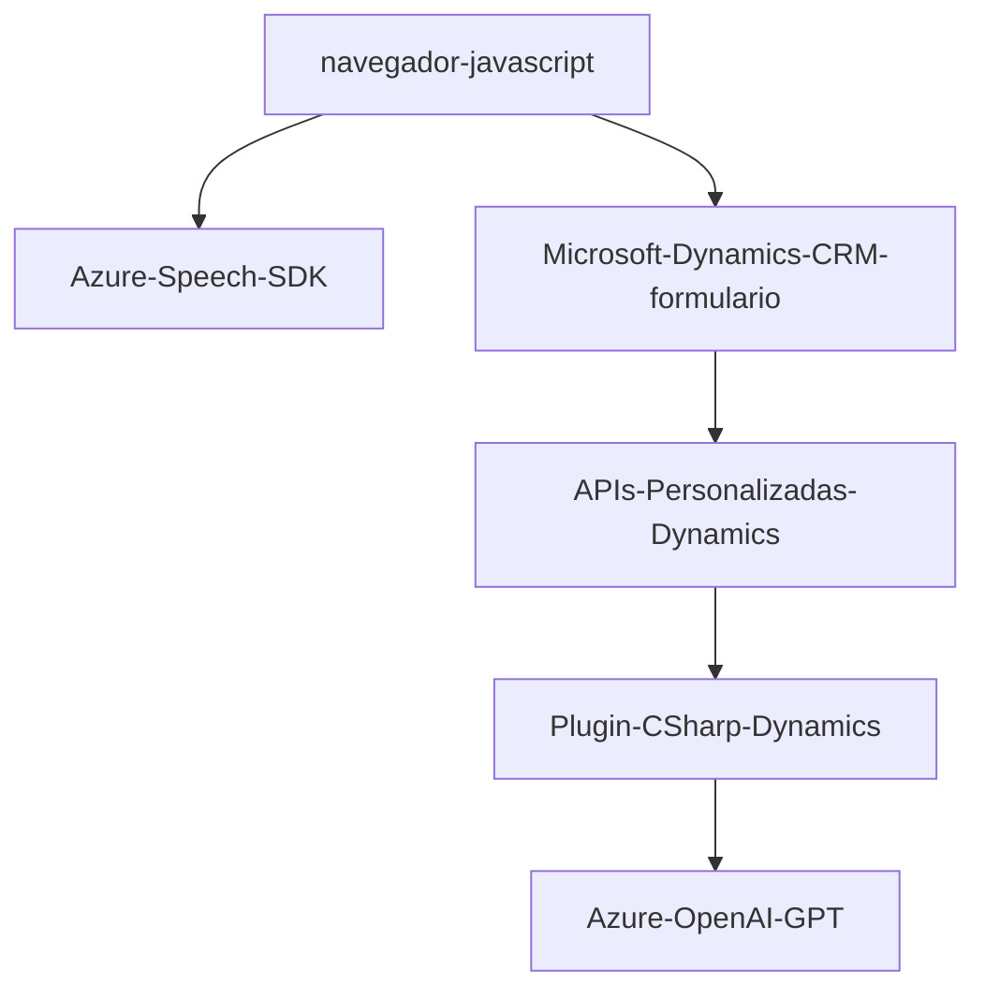

### Breve resumen técnico
Este repositorio contiene componentes de un sistema CRM integrado con funcionalidades avanzadas de procesamiento de voz y texto mediante Azure Speech SDK y Azure OpenAI. Los archivos analizados abarcan módulos JavaScript para la interacción con formularios en Dynamics 365 y un plugin en C# para extender las capacidades del sistema con IA.

---

### Descripción de arquitectura
1. **Tipo de solución:**  
   - Principalmente, una solución híbrida con integración directa en Microsoft Dynamics 365.  
   - Contiene funcionalidades para interacción dinámica con formularios, procesamiento de voz y texto mediante SDKs y APIs externas.  
   - Puede considerarse una extensión a nivel de funciones combinada con plugins nativos en un entorno CRM, en lugar de ser una arquitectura independiente.

2. **Patrón y estilo arquitectónico:**  
   - **Base:`Plugin-based architecture:`** Extensibilidad de Dynamics CRM mediante el uso de plugins y elementos JavaScript adheridos a formularios dinámicos, un modelo típico en ecosistemas como Dynamics 365.  
   - **Modularidad:** Observado en la separación de funcionalidades específicas (procesamiento de voz, síntesis de texto, asignación de valores).  
   - **Capa de integración:** Comunicación entre el front-end y el plugin utiliza APIs externas para delegar parte del procesamiento en Azure.  
   - No sigue patrones sofisticados como hexagonal o microservicios, ya que todo está incrustado en Dynamics CRM.

---

### Tecnologías usadas
1. **Para formularios JavaScript:**
   - **Azure Speech SDK:** Para síntesis y reconocimiento de voz.  
     Cargado dinámicamente desde el link proporcionado (`https://aka.ms/csspeech/jsbrowserpackageraw`).  
   - **API personalizada de Dynamics 365:** Integra reglas específicas y delegación al backend para actualizar formularios.  
   - **ES6 JavaScript:** Utilizado para la modularización y funciones dinámicas.  

2. **Para el plugin en C#:**
   - **Microsoft Dynamics CRM SDK:** Para extender capacidades mediante `IPlugin`.  
   - **Azure OpenAI API:** Se utiliza para procesar texto inteligente basado en IA (GPT).  
   - **.NET Framework:** Para manejo HTTP (`HttpClient`) y JSON (`System.Text.Json`).  
   - **Newtonsoft.Json.Linq** (aunque no utilizado directamente).

---

### Dependencias externas
1. **Azure Speech SDK** para procesamiento de voz.  
2. **Azure OpenAI (GPT)** API para procesar texto.  
3. **Microsoft Dynamics 365 SDK** para interactuar con formularios, entidades y APIs personalizadas.  
4. HTTP Client para llamadas externas con Azure.  

---

### Diagrama Mermaid válido para GitHub Markdown

---

### Conclusión final
Este sistema amplía las capacidades nativas de Dynamics CRM mediante la integración de módulos de voz y procesamiento de texto impulsados por IA en formularios dinámicos. Aunque sigue una estructura modular básica, la implementación técnica cumple con los requerimientos de extensibilidad y delegación a servicios externos como Azure Speech y OpenAI. Para mejorar la arquitectura, podría valerse de abstracciones más claras (por ejemplo, separar responsabilidad de APIs internas y SDK externos) y mejorar la gestión de seguridad relacionada con las claves de acceso de Azure.