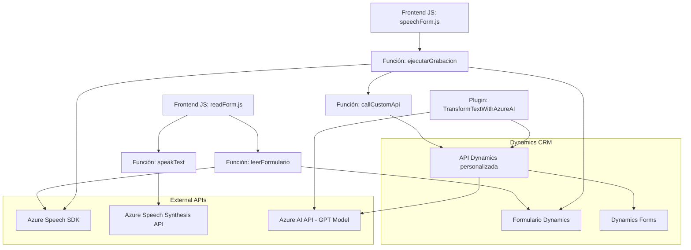

### Breve resumen técnico
El repositorio presenta una solución orientada al reconocimiento de voz, síntesis de texto a voz y transformación de texto empleando tecnologías de Azure Speech SDK y OpenAI. Está configurado para interactuar principalmente con formularios de Microsoft Dynamics CRM y realizar operaciones sobre campos dinámicos mediante voceo y análisis de texto.

---

### Descripción de arquitectura
La solución implementa una **arquitectura de n capas**, con una clara separación de responsabilidades. La funcionalidad se distribuye en tres partes principales:

1. **Frontend**: Archivos integrados en el sistema de formularios (Dynamics) que interactúan directamente con el usuario, manejan entrada/salida y conectan con APIs externas. Predominan módulos JavaScript (por ejemplo, `readForm.js` y `speechForm.js`) que implementan lógica asincrónica para la integración de la entrada/salida de voz y procesamiento de formularios.
2. **Back-End Plugins**: Extensiones en el lado del servidor, desarrolladas como plugins de Dynamics CRM en C#, que se integran con servicios externos (Azure OpenAI) para ejecutar transformaciones avanzadas de texto. Estos plugins utilizan el patrón de diseño de servicios (SOA) al comunicarse con una API de terceros.
3. **Servicios externos**: Comunicaciones mediante HTTP a Azure Cognitive Services (Speech SDK/Synthesis) y Azure OpenAI completan la arquitectura como proveedores de servicios en una arquitectura híbrida basada en n capas.

---

### Tecnologías, frameworks y patrones utilizados
#### Tecnologías: 
- **Azure Cognitive Services (Speech SDK)**: Para reconocimiento y conversión de audio a texto, y síntesis de texto a voz.
- **Dynamics 365 SDK/Web API**: Para acceder y manipular datos de formularios.
- **OpenAI API hospedado en Azure**: Transformación de texto con modelos GPT.
- **JavaScript (Frontend)**: Implementación de lógica cliente en función de formularios y datos.
- **C# (Plugins)**: Extensibilidad de CRM en el lado del servidor.
- **Newtonsoft.Json** y **System.Text.Json**: Para manejar objetos JSON en el plugin.

#### Patrones:
- **Encapsulación modular**: A través de funciones independientes con responsabilidades específicas tanto en el frontend como en el plugin de C#.
- **Plugin Design Pattern**: Utilizado en el archivo `TransformTextWithAzureAI.cs`, para extender la funcionalidad nativa de Dynamics 365.
- **Asincronía (async/await)**: Amplio uso para interactuar con servicios externos en JavaScript y C#.
- **API Gateway Pattern**: Comunicación con servicios de Azure Cognitive Services y Azure OpenAI mediante HTTP en capas de frontal y backend.

---

### Dependencias y componentes externos
1. **Azure Speech Services**: Para tareas de síntesis y reconocimiento de voz.
2. **API OpenAI**: Servicio gestionado desde Azure para transformar texto mediante modelos GPT.
3. **Microsoft Dynamics SDK/Web API**: Para acceder y modificar datos de formularios en CRM.
4. **Bibliotecas de gestión JSON**:
   - `Newtonsoft.Json.Linq`
   - `System.Text.Json`
5. **Framework de cliente `Xrm.WebApi`** en Dynamics: Manipulación de datos en formularios desde JavaScript.
6. **HTTP Client (`System.Net.Http`)**: Para comunicaciones con APIs externas.

---

### Diagrama Mermaid para toda la arquitectura

---

### Conclusión final
La solución descrita utiliza una **arquitectura basada en n capas**, distribuyendo funcionalidades entre el frontend, servidor (CRM Plugins) y servicios externos como Azure Speech SDK y OpenAI. La integración es fluida y modular, empleando tecnologías modernas como asincronía, mapeo dinámico y adecuada encapsulación de dependencias.

Si bien la arquitectura es sólida y eficiente para este caso de uso, es importante garantizar un manejo confiable de las claves y configuraciones de acceso a los servicios externos (Azure e integración con Dynamics), para evitar riesgos de seguridad en todo el flujo de datos.