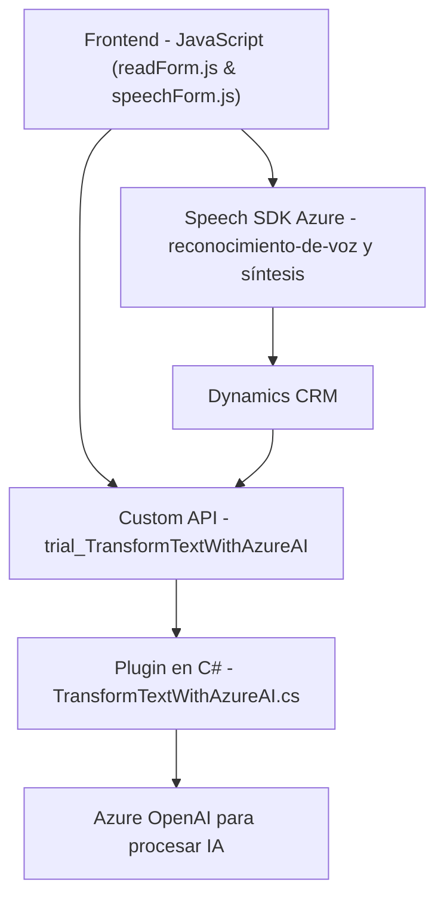

### Resumen técnico

El análisis de los archivos desplegados indica que el proyecto combina funcionalidades de frontend y backend que operan en un entorno CRM, como Dynamics CRM. Está diseñado para aprovechar servicios de Azure, en particular el Speech SDK y Azure OpenAI, para proporcionar capacidades avanzadas como síntesis de voz y procesamiento de datos basados en IA.

---

### Descripción de arquitectura

1. **Tipo de solución:**  
   - Principalmente una integración de servicios utilizando una capa frontend para interacción de usuario y una capa backend para integrar lógica empresarial en un CRM, junto con servicios externos como Azure Speech SDK y Azure OpenAI.
   - Al combinar diferentes componentes (frontend, plugins y servicios externos), la arquitectura se asemeja a un sistema **de n capas** con integración a **microservicios**.

2. **Arquitectura:**  
   - **n capas:** Se implementa separación clara entre la lógica de presentación (archivos frontend como `readForm.js` y `speechForm.js`) y la lógica empresarial/backend (`TransformTextWithAzureAI.cs`).
   - **Service-Oriented:** Hay un modelo de interacción con APIs externas (Azure Speech SDK y Azure OpenAI).
   - **Mixta (monolito + integración con microservicios):** Aunque combina microservicios externos, la base del código parece operar como un complemento único dentro del entorno centralizado de Dynamics CRM.

---

### Tecnologías usadas

- **JavaScript:** Lenguaje principal para la funcionalidad del frontend.
- **Azure SDK:** Uso explícito del Speech SDK y OpenAI para funcionalidades asociadas con voz y procesamiento de texto.
- **Microsoft Dynamics CRM SDK (Backend):** El archivo `TransformTextWithAzureAI.cs` extiende el comportamiento de Dynamics CRM mediante plugins.
- **C#:** Implementación del backend con el plugin.
- **JSON:** Para estructuración y transmisión de datos entre servicios.
- **HTTP Requests:** Utilizados para consumir servicios de Azure.
- **Frontend DOM manipulation:** Esto indica una interacción directa con formularios y campos de entrada en el CRM.

---

### Dependencias o componentes externos

- **Azure Speech SDK:** Procesa síntesis y reconocimiento de voz.
- **Azure OpenAI Service:** Utilizado para la transformación de texto mediante modelos GPT en lógica backend.
- **Microsoft Dynamics CRM API (`Xrm.WebApi`, `IPlugin`)**: Utilizada para manejar datos del sistema CRM.
- **Custom API en Dynamics:** Para lógica adicional utilizando IA (definida en los archivos JS como `trial_TransformTextWithAzureAI`).
- **Librerías estándar .NET Framework:** Para la implementación del plugin en C# posiblemente bajo .NET Framework 4.x, dado el soporte para Dynamics CRM.

---

### Diagrama Mermaid

---

### Conclusión final

Este repositorio implementa una solución rica en integración que añade funcionalidades innovadoras a un CRM empresarial como Dynamics. Con arquitectura de **n capas** y componentes externos, se asegura de utilizar SDKs y servicios modernos como Azure Speech y OpenAI para funcionalidades avanzadas de voz y procesamiento de texto. Sin embargo, dado que los plugins se ejecutan como extensiones, la solución se adapta mejor a plataformas preexistentes en lugar de ser independiente. Es ideal para mejorar la accesibilidad y la entrada de datos de usuarios en sistemas empresariales.