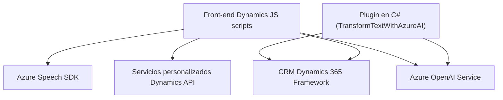

### Breve resumen técnico:
El repositorio contiene varios componentes diseñados para integrar capacidades de reconocimiento y síntesis de voz a través de Azure Speech SDK y de procesamiento de texto mediante Azure OpenAI en formularios Dynamics CRM. Los scripts frontales interactúan directamente con las APIs de Azure y los formularios de Dynamics 365, mientras que el plugin en C# trabaja como una extensión de la lógica de Dynamics CRM.

### Descripción de arquitectura:
La solución tiene una arquitectura híbrida:
1. **Front-end basado en scripts JavaScript**: Diseñado para integrar funcionalidad dinámica en el cliente (formularios de Dynamics CRM).
2. **Plugin en C#**: Opera como un componente privado basado en el paradigma de **eventos** y extensión de CRM para interactuar con datos del sistema.
3. **Servicios externos (Azure)**: Incorporación de Azure Speech SDK para reconocimiento/síntesis de voz y Azure OpenAI para procesamiento avanzado de texto.
La arquitectura se alinea con el patrón **n-capas**, con separación entre el front-end, lógica de negocio (plugins y APIs) y servicios externos.

### Tecnologías usadas:
1. **Lenguajes y frameworks**:
   - Frontend: JavaScript para integraciones con Dynamics CRM.
   - Backend: C# con Dynamics CRM SDK para plugins.
2. **Servicios de Azure**:
   - Azure Speech SDK: Reconocimiento y síntesis de voz.
   - Azure OpenAI: Procesamiento avanzado de texto.
3. **Dependencias adicionales**:
   - `Newtonsoft.Json` para serialización/deserialización en el plugin.
   - `System.Net.Http` para consumir APIs de Azure en el plugin.

### Diagrama Mermaid válido para GitHub:

### Conclusión final:
La solución presentada tiene componentes frontend (JS scripts) y backend (plugin en C#) que interactúan de manera directa con Dynamics CRM y los servicios externos de Azure para potenciar la funcionalidad. El uso de tecnologías como Azure Speech SDK y OpenAI, junto con la integración manual de contexto CRM, hace que la solución sea muy específica para entornos corporativos dependientes de Dynamics 365.

No obstante, se detectan áreas de mejora como la eliminación de claves explícitas (hardcoding) en los scripts y la incorporación de patrones más robustos como DI (Dependency Injection) en el plugin. Es una solución modular, pero en general sigue siendo un diseño de **n-capas** con una fuerte dependencia de la integración externa.