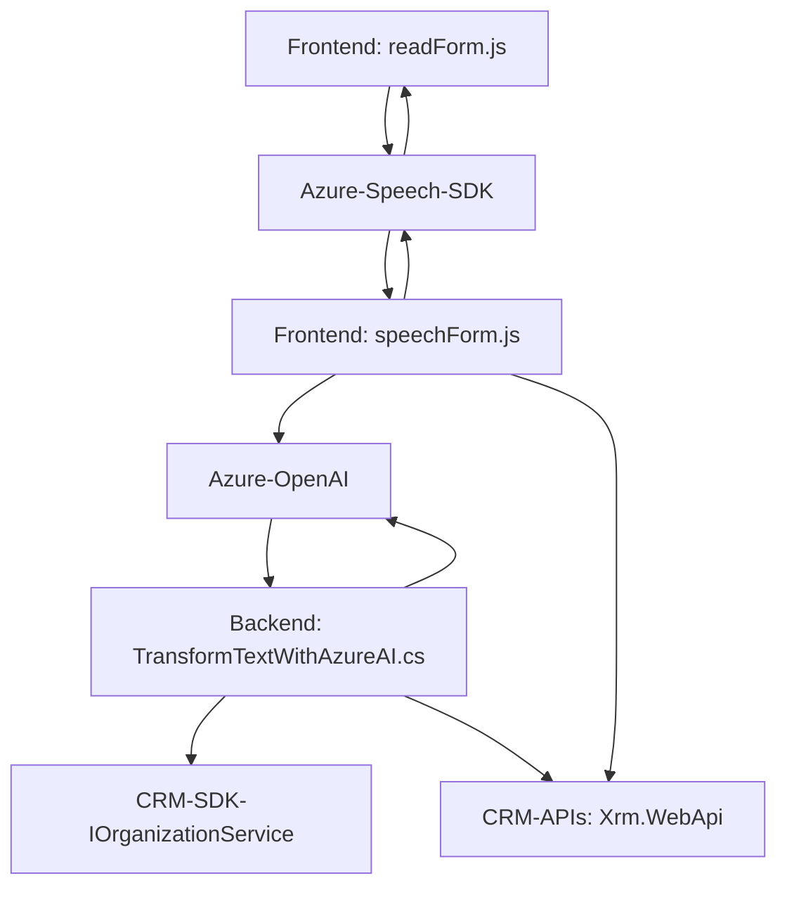

### 🔍 **Análisis Técnico de la Solución**

#### **1. ¿Qué tipo de solución es?**
La solución es un **sistema CRM extendido con funcionalidades de integración de voz y procesamiento de lenguaje natural (NLP)**. Incluye módulos de frontend (JavaScript), servicios en backend (C#), integración con SDKs externos (Azure Speech SDK), y APIs (Azure OpenAI).

#### **2. Tecnologías, Frameworks y Patrones usados**
- **Tecnologías**:
  - Frontend: JavaScript (ejecutado en el contexto del CRM, probablemente Dynamics CRM).
  - Backend: C# (Dynamics CRM plugins).
  - SDKs: Azure Speech SDK para síntesis y reconocimiento de voz; Azure OpenAI para procesamiento avanzado de texto.
- **Frameworks**:
  - Dynamics CRM SDK: Para la integración con el modelo de datos y eventos del CRM.
  - HTTP Client Libraries: Para realizar llamadas a APIs externas.
- **Patrones**:
  - **Modular Design**: Frontend dividido en pequeñas funciones con responsabilidades claras y reutilizables.
  - **External SDK Integration**: Conexión con APIs externas como Azure Speech SDK y OpenAI.
  - **Callback/Event-driven**: SDK y eventos del plugin usan métodos basados en devoluciones de llamada.
  - **Mapping Data**: En frontend, mapea datos entre campos visibles del formulario y valores extraídos para manipulación programática.
  - **Plugin Architecture**: Backend usa la interfaz `IPlugin` para extender la funcionalidad del CRM, reaccionando a eventos del modelo de datos.
  - **Layered Pattern**: Aislamiento de la lógica del negocio y acceso a datos.

#### **3. Arquitectura del Sistema**
La solución usa una arquitectura **híbrida de varias capas** que combina:
- **N capas**: Separación entre frontend (form scripts) y backend (plugins y APIs).
- **Integración de microservicios/API**: Interacción con servicios externos, como SDK de Azure Speech y la API de Azure OpenAI, para ampliar la funcionalidad del sistema central CRM.
- **Event-driven**: Extensión natural en sistemas como Dynamics CRM, basada en eventos del ciclo de vida de datos y servicios.

#### **4. Dependencias o Componentes Externos**
- **Azure Speech SDK**: Reconocimiento de voz y síntesis.
- **Azure OpenAI API**: Procesamiento avanzado del lenguaje natural.
- **Newtonsoft.Json**: Para manipulación de objetos JSON en el plugin.
- **System.Net.Http** y **HttpClient**: Para comunicación con APIs externas.
- **Microsoft.Xrm.Sdk**: Para manipulación de datos y eventos del modelo CRM.
- APIs propias de Dynamics CRM: `Xrm.WebApi.online.execute`, `Xrm.WebApi.retrieveMultipleRecords`.

---

### 🖌️ **Diagrama Mermaid**

---

### **Conclusión Final**
La solución extiende un sistema CRM (Dynamics CRM) con funcionalidades avanzadas basadas en procesamiento de voz (Azure Speech SDK) y lenguaje natural (Azure OpenAI). La arquitectura modular permite integrar tecnologías externas mediante SDKs y APIs REST, asegurando una interacción eficaz y escalabilidad para agregar nuevos servicios. Sin embargo, aspectos de seguridad (como el manejo de claves de API en el código fuente) deben ser abordados para evitar vulnerabilidades. Este sistema representa una integración de frontera, útil para automatización en entornos empresariales.