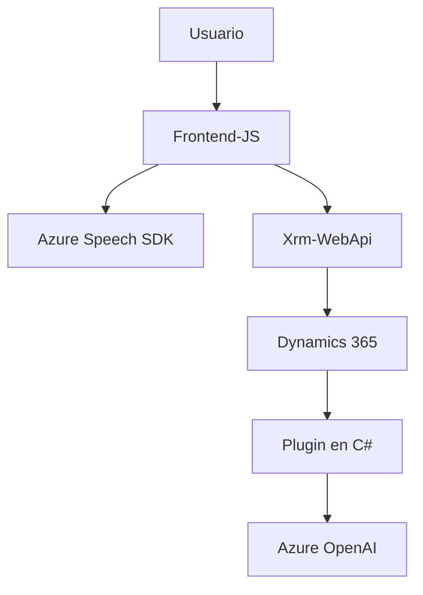

## Breve resumen técnico

El repositorio contiene una solución que implementa funcionalidades para la integración de Microsoft Dynamics CRM con Azure services. Incluye dos módulos principales:
- **Frontend:** Scripts JavaScript que proporcionan integración entre formularios dinámicos de Dynamics 365 y servicios de Azure Speech SDK para síntesis y reconocimiento de voz.
- **Backend Plugin:** Código en C# para un plugin de Dynamics CRM que realiza transformaciones de texto mediante Azure OpenAI.

La solución aborda accesibilidad (mediante voz en formularios) y mejora la experiencia del usuario mediante procesamiento con inteligencia artificial.

---

## Descripción de arquitectura

La solución tiene una arquitectura de **n capas** (multicapa), separando claramente el cliente (Frontend) del servidor (Plugin Backend). La interacción es principalmente en los formularios de Dynamics CRM, que se comunican con el backend mediante APIs y con Azure Services (Speech SDK, OpenAI) para realizar operaciones en tiempo real. Las siguientes capas están identificadas:
1. **Presentación**: Interfaz HTML a través de los formularios de Dynamics 365.
2. **Lógica Cliente**: Scripts JavaScript para gestionar la interacción con formularios, operaciones sobre el DOM y la comunicación con APIs.
3. **Backend**: Plugins en C# que procesan datos y realizan transformaciones mediante servicios externos (Azure OpenAI).

---

## Tecnologías, frameworks y patrones usados

### **Frontend (JavaScript)**
- **Tecnologías:** 
  - Azure Speech SDK.
  - API de Dynamics 365 (`Xrm.WebApi`).
- **Frameworks:** Sin especificación directa, pero interactúa con Dynamics CRM como API.
- **Patrones:**
  - Abstracción: Funciones independientes que resuelven subprocesos específicos como lectura de etiquetas visibles del formulario o mapeo de datos dinámicos.
  - Basado en eventos: SDK y procesamiento asincrónico activado por eventos del navegador o usuario.
  - Integración con servicios externos: Uso del SDK de Azure para voz y IA.

---

### **Backend (Plugin en C#)**
- **Tecnologías:** 
  - .NET Framework (integración con Dynamics CRM).
  - Azure OpenAI Service.
- **Frameworks:** Microsoft Dynamics Plugin Framework.
- **Patrones:**
  - Plugin Architecture: Extensión propia de Dynamics CRM.
  - SOA (Service-Oriented Architecture): Interacción con Azure OpenAI como servicio externo.
  - Facade: Simplificación para llamadas a servicios externos (Azure OpenAI).

---

### **Dependencias o componentes externos**
- **Azure Speech SDK**: Para síntesis y reconocimiento de voz en el frontend.
- **Azure OpenAI**: Para la transformación de texto en el backend plugin.
- **Dynamics CRM APIs**: Para integrar clientes y plugins con los sistemas Dynamics 365.
- **HTTP Client Libraries**: Para llamadas a servicios Node.js (frontera externa) y Azure APIs en C#.

---

## Diagrama Mermaid válido para GitHub

---

## Conclusión final

La solución aplica correctamente principios de buena ingeniería y arquitectura de n capas para habilitar capacidades accesibles (síntesis y texto a voz) y funcionalidades avanzadas (transformación con IA) en formularios dinámicos de Dynamics CRM. Además, la elección de integración con servicios de Azure asegura escalabilidad y robustez, complementando aspectos necesarios para sistemas empresariales modernos. Su diseño basado en complementos y comunicaciones con APIs externas refuerza la modularidad y la capacidad de evolución del sistema.