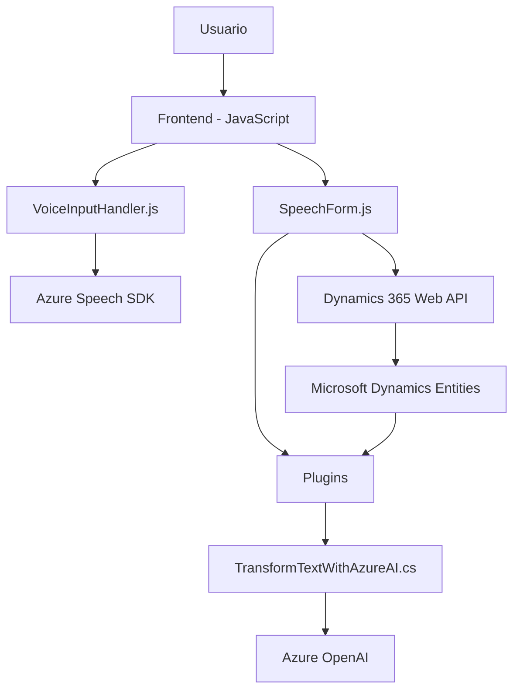

### Breve resumen técnico

La solución es un sistema orientado a la integración de voz y texto con aplicaciones empresariales, específicamente Microsoft Dynamics CRM. Se compone de varios módulos: un **frontend basado en JavaScript** para interacción con formularios, un **plugin en .NET para el CRM** que realiza transformaciones textuales mediante Azure OpenAI, y un fuerte enfoque en integración con servicios externos como **Azure Speech SDK** y **Azure OpenAI**.

---

### Descripción de arquitectura

La arquitectura general de la solución puede clasificarse como **cliente-servidor con capas y servicios externos**:

1. **Frontend**:
   - Maneja la interfaz de usuario, los formularios y las interacciones por voz, centrado en la integración con Dynamics 365.
   - Carga dinámica de SDK y modularización en funciones clave como gestión de formularios, síntesis de voz, y procesamiento de datos.

2. **Backend (Plugin)**:
   - Capas para ejecución de lógica empresarial y comunicación con servicios externos.
   - Utiliza un *Plugin Design Pattern* típico de Dynamics CRM, en el que el plugin actúa como intermediario entre las operaciones de CRM y el procesamiento externo.

3. **Servicios externos**:
   - Azure Speech SDK (para reconocimiento y síntesis de voz) y Azure OpenAI (para transformación compleja de texto).
   - El SDK se carga dinámicamente desde un CDN en el frontend, mientras que el plugin realiza peticiones a Azure OpenAI.

---

### Tecnologías usadas

1. **Frontend**:
   - **JavaScript**: Base tecnológica clave.
   - **Azure Speech SDK**: Síntesis y reconocimiento de voz.
   - **Dynamics 365 Web API (Xrm.WebApi)**: Interacción empresarial mediante REST API en entorno CRM.
   - **CDN (Content Delivery Network)**: Carga dinámica de scripts.

2. **Backend (Plugin)**:
   - **Microsoft Dynamics CRM SDK (`IPlugin`, `IOrganizationService`)**: Estructura estándar para plugins en CRM.
   - **C# (.NET)**: Lenguaje y marco de trabajo para desarrollo empresarial.
   - **System.Net.Http (`HttpClient`)**: Envío de solicitudes REST a Azure OpenAI.
   - **System.Text.Json & Newtonsoft.Json**: Manejo y procesamiento de JSON.
   - **Azure OpenAI Service**: Transformaciones avanzadas de texto (procesamiento mediante IA).

---

### Diagrama Mermaid

A continuación, se presenta un diagrama **Mermaid** para ilustrar cómo las partes del sistema se conectan entre sí:

### Conclusión final

La solución se encuentra bien organizada, con una primera capa de frontend que interactúa directamente con el usuario para captura y síntesis de voz. La segunda capa está compuesta por un plugin que aplica negocios específicos en Dynamics CRM utilizando la interacción con servicios externos (Azure OpenAI). El diseño sigue principios de integración modular y reutilización de componentes clave.

Mejoras sugeridas:
1. Implementar pruebas unitarias para garantizar la robustez de las transformaciones de texto y formularios procesados por los scripts.
2. Incorporar un sistema de manejo de errores más robusto para las dependencias externas (especialmente, en escenarios offline o de tiempo de respuesta larga de los servicios de Azure).
3. Monitorización de las respuestas de Azure OpenAI para asegurar que cumplen con los requisitos específicos definidos por la empresa, adaptándose a posibles cambios en la API.