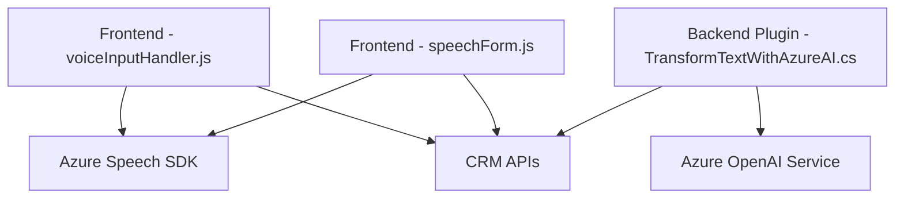

### Breve resumen técnico
El repositorio muestra una solución orientada a la interacción entre formularios en una plataforma CRM (Microsoft Dynamics) y servicios de nube proporcionados por Azure, específicamente el **Azure Speech SDK** y **Azure OpenAI Service**. Se utiliza una combinación de código frontend (JavaScript) para ejecutar procesos de síntesis y reconocimiento de voz, y plugins backend escritos en C# para procesar datos con inteligencia artificial.

---

### Descripción de arquitectura
La arquitectura implementa un enfoque modular con un patrón predominante **n-capas**:
1. **Capa de presentación**: Gestionada en el frontend (`voiceInputHandler.js` y `speechForm.js`), que interactúa directamente con los usuarios mediante formularios dinámicos y maneja la entrada de datos a través de voz.
2. **Capa de negocio**: Representada por el plugin (`TransformTextWithAzureAI.cs`), cuyo propósito es aplicar lógica empresarial mediante reglas específicas para transformar texto y devolverlo como un JSON estructurado.
3. **Capa de integración**: Uso de APIs externas (Azure OpenAI y Azure Speech SDK) facilita funcionalidades avanzadas, como reconocimiento de voz y procesamiento mediante IA.

Se observa también un uso limitado de **programación basada en eventos** para cargar dinámicamente el SDK en el frontend y responder a las entradas del usuario en tiempo real.

---

### Tecnologías usadas
1. **Frontend**:
   - Lenguaje: JavaScript.
   - SDK: **Azure Speech SDK**.
   - Framework CRM: APIs del modelo `executionContext` de Microsoft Dynamics CRM.
2. **Backend**:
   - Lenguaje: C#.
   - Framework: **Microsoft Dynamics CRM SDK**.
   - Librerías adicionales:
     - **Newtonsoft.Json** y `System.Text.Json` para manipulación JSON.
     - **System.Net.Http`** para llamadas a servicios externos.
   - Servicio IA: **Azure OpenAI Service** usado para transformar texto.
3. **Servicios cloud**:
   - Azure Speech SDK para síntesis y reconocimiento de voz en tiempo real.
   - Azure OpenAI Service para generación avanzada de texto.

---

### Diagrama Mermaid válido para GitHub
Este diagrama sintetiza la interacción entre componentes y capas principales:

---

### Conclusión final
La solución representa un sistema híbrido que se integra con un entorno CRM y servicios avanzados en la nube. Utiliza una arquitectura fuerte basada en principios de **n-capas** y módulos. El uso de Azure Speech SDK y OpenAI Service muestra una tendencia hacia la incorporación de inteligencia artificial y capacidades avanzadas en soluciones empresariales. Sin embargo, el enfoque actual puede beneficiarse de mejores prácticas para seguridad (gestión de secretos) y escalabilidad (migración hacia microservicios, si se plantea el crecimiento del sistema).