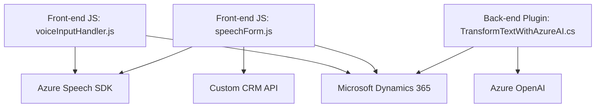

### Breve resumen técnico:
El repositorio contiene la implementación de varias funcionalidades que permiten la integración entre formularios de **Dynamics 365 CRM** y **Azure AI Services**, específicamente, Azure Speech SDK para síntesis y transcripción de voz, y Azure OpenAI para transformación y estructuración de texto. Los archivos indican que la solución es un conjunto de componentes para facilitar interacción basada en voz o texto y generar datos utilizables dentro del entorno ERP/CRM.

---

### Descripción de arquitectura:
La arquitectura general es **orientada a tareas y componentes especializados**, que operan como módulos independientes:
1. **Front-end (JS)**: Dos archivos trabajan con formularios dinámicos en el entorno de Dynamics CRM. Su propósito es habilitar interacción por voz con la ayuda de Azure Speech SDK. 
   - Modularidad: Cada archivo encapsula funciones específicas como procesamiento de transcripciones, síntesis de voz, y asignación de datos a campos del formulario.
2. **Back-end/Plugin (.NET)**: Un plugin desarrollado en C# para Dynamics CRM que utiliza Azure OpenAI para estructuración automatizada de texto. Este archivo utiliza el patrón de extensibilidad del CRM basado en plugins.

La arquitectura puede clasificarse como **microservicios integrados y extensibles para Dynamics CRM**, con componentes distribuidos que se comunican a través de SDKs y APIs de terceros.

---

### Tecnologías usadas:
1. **Front-end**:
   - **JavaScript**: Manejo de lógica cliente para interacciones con formularios dinámicos y APIs externas.
   - **Azure Speech SDK**: Usado para sintetizar texto en audio y transcribir voz en texto.
   - **API REST/HTTP**: Integración con servicios personalizados del CRM y APIs externas.
   - **Document Object Model (DOM)**: Manipula los datos de los formularios de Dynamics CRM.
   
2. **Back-end**:
   - **C#**: Implementación del plugin para Dynamics CRM.
   - **Azure OpenAI Service**: Utilizado para transformación avanzada de texto en formato estructurado JSON.
   - **System.Net.Http**: Para realizar solicitudes HTTP a Azure OpenAI.
   - **Newtonsoft.Json**: Procesamiento y parseo de JSON.

3. **Plataforma**:
   - **Microsoft Dynamics 365**: Es el núcleo de la solución. Sirve como entorno de ejecución para formularios, entidades y plugins.

---

### Diagrama Mermaid válido para GitHub:

---

### Conclusión final:
La solución está diseñada como una integración avanzada entre **Dynamics CRM** y **servicios de Azure AI** (Speech SDK y OpenAI), lo que la convierte en una arquitectura híbrida de front-end y extensiones backend para enriquecer la funcionalidad CRM. Sus patrones resaltan:
1. **Modularidad**: Cada archivo está diseñado para una tarea específica como síntesis de voz, extracción de datos visuales o transformación automatizada de texto.
2. **Escalabilidad basada en APIs**: El uso extensivo de servicios externos como Azure asegura que la solución pueda expandirse utilizando capacidades adicionales de IA.
3. **Desacoplamiento funcional**: Aunque los archivos dependen de Azure y Dynamics, los mismos están organizados como componentes independientes, lo que facilita su mantenimiento y reusabilidad.