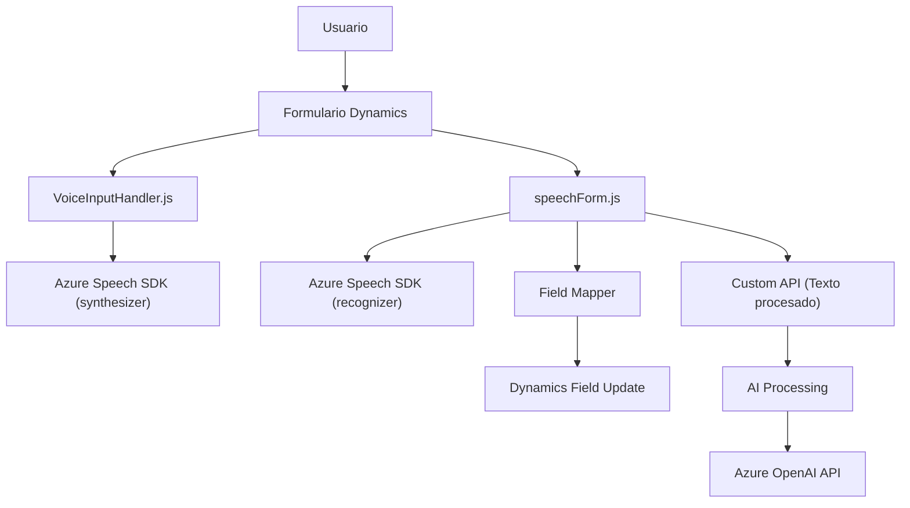

### Breve Resumen Técnico
El repositorio contiene archivos que implementan soluciones integradas principalmente con **Azure Speech SDK**, **Dynamics 365 SDK**, y **Azure OpenAI API**. La funcionalidad gira alrededor de la interacción entre interfaces de usuario de Dynamics (formularios) y servicios externos, como la conversión de voz, el procesamiento de texto con IA y la manipulación de datos en el CRM. La arquitectura es modular y orientada a eventos, con integración profunda entre APIs y servicios externos.

---

### Descripción de la Arquitectura
1. **Tipo de solución**: La solución combina lógica dirigida a un **frontend** (interacción con formularios de Dynamics para síntesis y captura de voz, manipulación de datos) con un **backend tipo plugin** que realiza manejo avanzado de texto basado en reglas predefinidas mediante IA.
2. **Arquitectura usada**:
   - **Frontend**:
     - Arquitectura **modular de funciones**, cada archivo y grupo de métodos tiene un propósito específico independiente.
     - Utiliza el patrón **event-driven** para iniciar procesos, como captura de voz y procesamiento.
   - **Backend**:
     - **Plugin Architecture** de Dynamics 365 para implementar componentes extensibles de negocio.
     - Integración con servicios externos mediante **Azure OpenAI API**.
3. **Dependencias/Componentes externos presentes**:
   - **Azure Speech SDK**: Para síntesis y transcripción de voz.
   - **Azure OpenAI API**: Para transformación avanzada de texto basado en reglas.
   - **Dynamics 365 SDK**: Para manipulación de formularios, entidades y datos internos.
   - **Newtonsoft.Json** y **System.Net.Http**: Para manejo y serialización de JSON en plugins.
   - APIs externas de búsqueda y manipulación DataSource en Dynamics.

---

### Tecnologías Usadas
- **Lenguajes**:
  - JavaScript (Frontend y lógica cliente para Dynamics 365).
  - C# (Backend, implementando Plugins de Dynamics).
- **Frameworks/APIs**:
  - **Dynamics 365 SDK**: `Xrm.WebApi` para manipulación de formularios.
  - **Azure Speech SDK**: Componentes para transcripción y síntesis de voz.
  - **Azure OpenAI API**: Procesamiento de texto basado en modelos de IA.
- **Patrones**:
  - Modularidad funcional (en archivos JS).
  - Carga condicional de dependencias en tiempo de ejecución.
  - Event Listener para flujo frontend.
  - Plugin Architecture y desacoplamiento en C#.

---

### Diagrama Mermaid (Compatible con GitHub Markdown)

---

### Conclusión Final
El repositorio contiene una solución bien diseñada para mejorar la interacción entre usuarios y formularios de **Dynamics 365**, utilizando tecnologías avanzadas como el SDK de Azure Speech y la inteligencia de Azure OpenAI. Destaca por su adecuada separación de responsabilidades (frontend y backend), modularidad, y uso de patrones de integración con APIs externas.