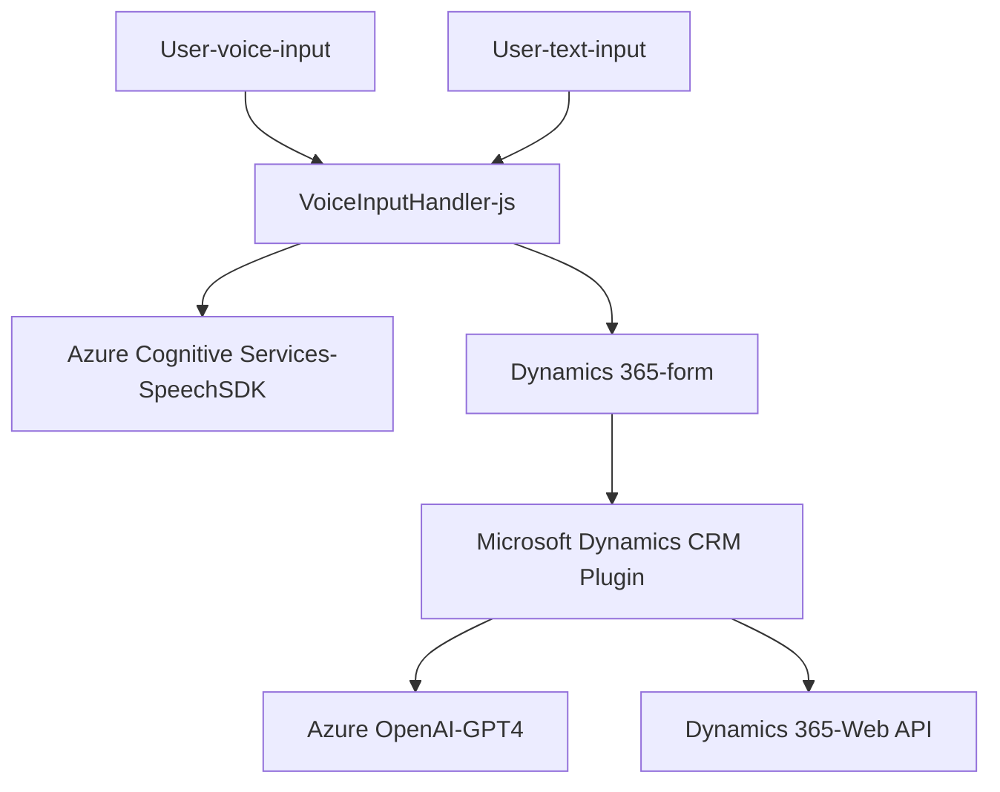

## **Breve resumen técnico**

El repositorio es un sistema híbrido orientado a la integración con formularios de Dynamics 365, utilizando reconocimiento de voz y procesamiento de texto mediante servicios de inteligencia artificial en Azure OpenAI y Azure Cognitive Services Speech SDK.

## **Descripción de la arquitectura**

El sistema tiene tres partes principales:
1. **Frontend**: Una estructura basada en JavaScript que interactúa con los formularios de Dynamics 365 (usando `Xrm.WebApi.online`) y el Azure Cognitive Services Speech SDK para captación de voz, síntesis y entrada de texto.
2. **Middleware API Plugin**: Un plugin en C# llamado `TransformTextWithAzureAI` que utiliza Microsoft Dynamics CRM SDK y Azure OpenAI para transformar texto y devolver datos en un formato JSON.
3. **Nube externa**: Dependencias con Azure Speech SDK y Azure OpenAI para procesamiento de voz e inteligencia artificial.

El diseño parece acercarse a **una arquitectura basada en eventos**, ya que las funciones se desencadenan tras recibir datos o contextos (como la carga del SDK o la captura de entrada de voz), pero también utiliza el patrón de **microservicio localizado** en la API Plugin de Dynamics CRM.

### **Potenciales arquitecturas observadas:**
- **N capas**: En la interacción y modularidad de frontend, plugin y API.
- **Service-Oriented Architecture (SOA)**: Por la dependencia de servicios en la nube (Azure Speech y Azure OpenAI).
- **Integración de eventos**: Adopta patrones de callbacks y asincronismo para manejar eventos relacionados con interacción en tiempo real.

---

## **Tecnologías usadas**
1. **Frontend**:
   - **JavaScript**: Programación dinámica en el navegador.
   - **Dynamics 365 Web API (Xrm.WebApi.online)**: Para manipulación de datos en los formularios de Dynamics 365.
   - **Azure Cognitive Services Speech SDK**: Para captura y síntesis de voz.
   - DOM API para carga de scripts dinámicos.

2. **Backend Plugin**:
   - **C#**: Lenguaje principal utilizado para el desarrollo del plugin.
   - **Microsoft Dynamics CRM SDK**: Para extender Dynamics 365.
   - **Azure OpenAI API**: Procesamiento avanzado de entrada textual.
   - **Newtonsoft.Json** y **System.Text.Json**: Manejo de datos JSON.

3. **Patrones de diseño**:
   - **Wrapper para servicios externos**: Encapsulación en funciones específicas (e.g. `speakText`, `TransformTextWithAzureAI`).
   - **Helper Methods**: Funciones auxiliares como `getReadableValue`, `applyValueToField` o `getFieldMap` contribuyen a la modularidad del código.
   - **Modularización**: Separación lógica de funcionalidades en módulos independientes.

---

## **Dependencias o componentes externos presentes**
1. **Azure Cognitive Services (Speech SDK)**: Para entrada y salida de voz.
2. **Azure OpenAI**: Modelo GPT de OpenAI alojado en Azure para transformación de texto en JSON.
3. **Dynamics 365 Web API**: Uso extensivo en integración con formularios y datos.
4. **HTTP Requests**: Para envío de texto a APIs externas (Azure OpenAI).

---

## **Diagrama Mermaid válido para GitHub**

---

## **Conclusión final**

El repositorio configura una solución híbrida que emplea tecnologías modernas basadas en la nube de Azure. 
1. **Tipo de solución**: Sistema mixto. Mezcla una API localizada (plugin en Dynamics CRM) con una capa frontend interactiva que actúa como intermediaria entre el usuario y servicios externos.
   
2. **Patrones arquitectónicos usados**:
   - Modularización y división de tareas en funciones especializadas.
   - Wrapper para manipulación abstracta de servicios externos (Azure Speech y Azure OpenAI).
   - Composición de eventos: Carga de SDKs y llamada remota a servicios se disparan según necesidades del contexto.

3. **Ventajas**:
   - Elevado nivel de modularidad.
   - Utilización eficiente de servicios en la nube.
   - Integración directa con Dynamics 365.

4. **Aspectos a mejorar**:
   - Mejor manejo de errores en las llamadas a APIs externas.
   - Externalización de claves API por seguridad (e.g. usando Azure Key Vault).

En resumen, es una solución robusta diseñada para cubrir necesidades específicas en entornos dinámicos como Dynamics CRM, pero requiere refinamientos en cuanto a seguridad y extensibilidad.