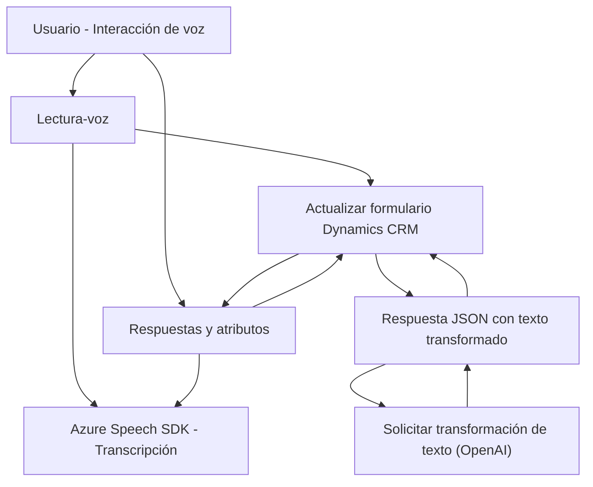

## Breve resumen técnico

La estructura y funcionalidad descrita en los archivos del repositorio indican que estamos frente a un sistema orientado a formularios interactivos que integra reconocimiento y síntesis de voz. Esto se realiza mediante el Azure Speech SDK y se complementa con la API de Dynamics CRM para el manejo de datos. Además, hay un plugin desarrollado en C# que amplía las capacidades del sistema al transformar texto utilizando Azure OpenAI API.

---

## Descripción de arquitectura

### Tipo de solución
La solución parece ser un **sistema de gestión de formularios interactivos** con funcionalidades de entrada y salida de voz. Se integra con **Microsoft Dynamics CRM** para la gestión de datos y puede clasificarse como parte de una **middleware** que intermedia entre la capa de presentación y la lógica empresarial.

### Arquitectura
La arquitectura del sistema se puede describir como **multicapa**. Las capas principales identificadas son:

1. **Frontend (JavaScript)**: Responsable de la interacción del usuario y las operaciones relacionadas con el formulario (lectura de datos, dictado, síntesis de voz).
2. **Middleware (JavaScript, Azure Speech SDK)**: Maneja la transcripción de voz a texto, síntesis de texto a audio, y actualizaciones de campos del formulario.
3. **Backend Plugins (C#)**: Ejecuta lógica adicional en el servidor de Dynamics CRM, integrando normas específicas y capacidades de IA basadas en Azure OpenAI.

El uso de varios servicios externos como el Azure Speech SDK y OpenAI denota un enfoque **integrado** y **orientado a servicios**, complementado por potenciales características de **event-driven** en Dynamics CRM.

### Patrones
Se identifican los siguientes patrones arquitectónicos:
1. **Lazy Loading** para cargar el SDK de Azure Speech solo cuando se necesita.
2. **Encapsulación modular**: Cada función tiene un propósito único y específico.
3. **Dependencia de servicios externos**: Integración con Azure Speech SDK y Azure OpenAI para funciones avanzadas.
4. **Plugin-Based Architecture**: En el backend, los plugins extienden la funcionalidad estándar del sistema Dynamics CRM.

---

## Tecnologías usadas

1. **Frontend**:
   - Lenguaje: JavaScript.
   - Framework de interacción: API de formularios de Dynamics CRM (`formContext`, `Xrm.WebApi`).

2. **Integración de voz**:
   - SDK de Azure Speech (voz a texto y síntesis de texto a voz).

3. **Backend**:
   - Lenguaje: C#.
   - Framework: Microsoft Dynamics CRM Plugin API.
   - Azure OpenAI API para el procesamiento de texto avanzado.

4. **JSON Handling**:
   - Bibliotecas de C#: `Newtonsoft.Json`, `System.Text.Json`.

5. **Conexiones externas**:
   - `System.Net.Http` para enviar solicitudes HTTP a Azure OpenAI API.
   - SDK de Azure Speech directamente desde una URL.

---

## Diagrama Mermaid

A continuación se muestra el diagrama de interacción entre los componentes del sistema.

---

## Conclusión final

La solución presentada integra tecnología avanzada de reconocimiento/síntesis de voz y procesamiento de texto con capacidades de inteligencia artificial. La arquitectura multicapa y los patrones de diseño en el frontend y backend aseguran flexibilidad, modularidad, y capacidad de ampliación.

Además, la integración de servicios externos como Azure Speech SDK y OpenAI muestran una fuerte dependencia de servicios en la nube, construyendo así una solución que aprovecha tecnologías de punta. Esto le permite abordar casos como la accesibilidad y el manejo eficiente de los formularios en el contexto empresarial mediante la fusión de voz, texto y procesamiento basado en normas.

Se recomienda realizar pruebas extensivas en entornos de Dynamics CRM para garantizar la integridad y consistencia de los datos durante las transcripciones.