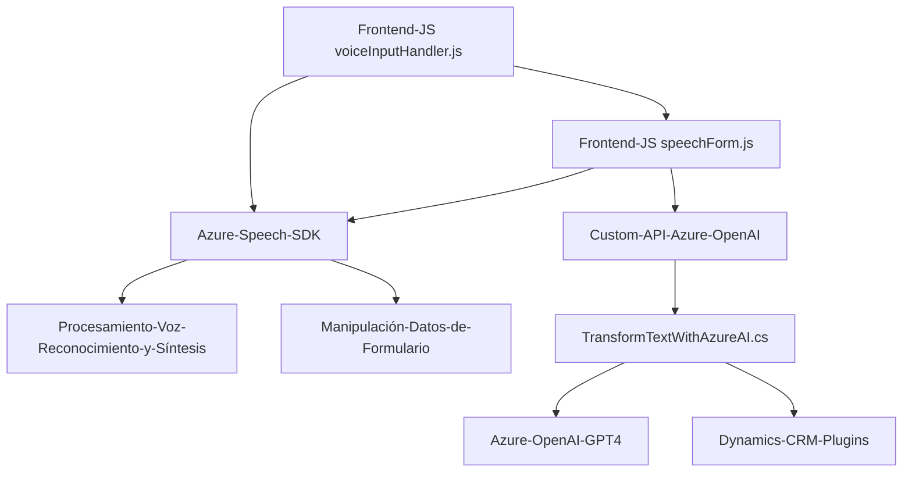

# Breve resumen técnico:
El repositorio contiene tres archivos principales que trabajan juntos para proporcionar funcionalidades de interacción con formularios y síntesis de voz, reconocimiento de comandos de voz, y procesamiento avanzado de texto mediante inteligencia artificial (Azure OpenAI). Está diseñado para integrarse con Dynamics CRM y utiliza Azure Speech SDK para capacidades de voz y una API personalizada para procesamiento avanzado.

---

# Descripción de arquitectura:
La solución es una mezcla conformada por un sistema distribuido y un cliente enriquecido que combina:
1. **Frontend**: Gestión de voz a texto y texto a voz para la manipulación de formularios dinámicos en aplicaciones de Dynamics 365.
2. **Backend/plugin**: Procesamiento avanzado de texto a datos estructurados mediante Azure OpenAI desde Dynamics CRM.

Patrones arquitectónicos:
- **Arquitectura por capas (n-capas)**: El sistema tiene separación entre frontend, servicios externos de Azure Speech SDK, y lógica backend implementada mediante plugins de Dynamics CRM.
- **Modularización funcional**: Cada componente (frontend y backend) distribuye sus responsabilidades en módulos separados.
- **SDK y servicio externo (API)**: Aprovecha servicios en la nube (Azure Speech SDK y Azure OpenAI API) para funcionalidad avanzada.

---

# Tecnologías usadas:
1. **Frontend**:
   - `JavaScript`: Lenguaje principal en los archivos del frontend.
   - **Azure Speech SDK**: Para síntesis de voz y reconocimiento de voz.
   - DOM Manipulation: Se asegura que los SDK se carguen dinámicamente.

2. **Backend/plugin**:
   - `C#`: Lenguaje de desarrollo backend para el plugin de Dynamics CRM.
   - **Azure OpenAI**: Utilización del modelo GPT-4 para procesamiento avanzado de texto.
   - **Dynamics CRM SDK**: Para interactuar con los servicios CRM.

3. **API externas y servicios**:
   - Custom API `TransformTextWithAzureAI`.
   - Servicios REST de Azure OpenAI para procesamiento de texto avanzado.
   - Pedidos HTTP (`System.Net.Http`) con manejo de JSON.

---

# Diagrama Mermaid:

---

# Conclusión final:
Esta solución combina capacidades avanzadas de frontend (interacción vía voz y manipulación de datos locales) con la integración de servicios en la nube como Azure Speech SDK y Azure OpenAI. La arquitectura es n-capas y se basa en módulos funcionales desacoplados. Es ideal para entornos como Dynamics CRM, donde las interacciones con el usuario y el procesamiento de datos requieren adaptaciones fluidas e inteligentes.