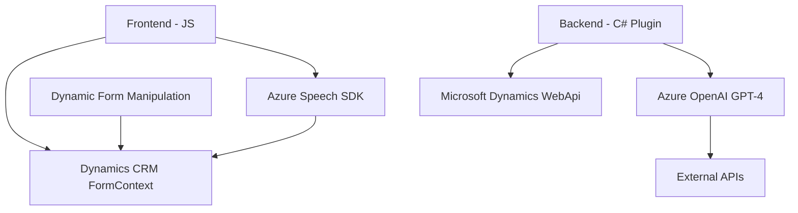

### Resumen técnico
El repositorio contiene múltiples archivos que implementan la integración de Microsoft Dynamics CRM con APIs y servicios de Azure. Principalmente, se trata de una solución mixta que combina elementos de frontend y plugins backend para crear una experiencia que utiliza voz e inteligencia artificial. La funcionalidad incluye capturar comandos de voz, transformar texto con inteligencia artificial (GPT-4/ChatGPT), y manipular formularios dinámicos en CRM.

---

### Descripción de arquitectura
#### **Tipo de solución**:
La solución consta de varias partes:  
1. **Frontend**: Archivos basados en JavaScript integrados con Dynamics CRM para manipular formularios dinámicos y utilizar APIs como Azure Speech SDK y OpenAI.  
2. **Backend (plugins)**: Integración a nivel de servidor con Dynamics CRM mediante plugins .NET que ejecutan lógica avanzada como transformación de texto usando Azure OpenAI.

#### **Arquitectura utilizada**:
1. **n capas**: La solución sigue una arquitectura **n capas** divida en las siguientes partes:
   - **Frontend**: JavaScript que interactúa directamente con Dynamics CRM UI y recibe/captura datos mediante voz.
   - **Backend Plugins**: Lógica ejecutada en el servidor de Dynamics CRM para procesamiento avanzado (p. ej., texto a JSON, integración con servicios externos).
   - **Servicios externos**: Conexión con APIs (Azure Speech SDK & Azure OpenAI) para habilitar capacidades de IA y voz.
2. **Integración de servicios externos**: Mediante APIs (Azure Speech SDK y Azure OpenAI GPT) se realiza el procesamiento fuera del entorno local de Dynamics CRM, en una arquitectura orientada a servicios (SOA).

---

### Tecnologías usadas
- **Frontend**:
  - **JavaScript/ES6+**: Funcionalidad modular y asincrónica.
  - **Azure Speech SDK**: Text-to-Speech y reconocimiento de voz.
  - **Microsoft Dynamics Form APIs**: Manipulación de formularios dinámicos en CRM.
  - **Xrm.WebApi**: Para integración directa con datos en Dynamics CRM.
  
- **Backend**:
  - **C# .NET Framework**: Implementación de plugins en el entorno de Dynamics CRM.
  - **IPlugin Interface**: Utilizada para crear extensiones para Dynamics CRM.
  - **Entity Framework Dynamics SDK**: Gestión de datos en el Model View Controller (MVC) del sistema CRM.
  - **Newtonsoft.Json** / **System.Text.Json**: Para serialización y manejo de JSON.
  - **HTTP Client API**: Llamadas HTTP hacia Azure OpenAI.
  
- **Servicios externos**:
  - **Azure Speech SDK**: Captura de audio, síntesis de voz en tiempo real y reconocimiento de voz.
  - **Azure OpenAI GPT-4**: Inteligencia artificial para transformación de texto.

#### **Patrones utilizados**:
- **Modularidad**: Organización mediante funciones independientes para realizar tareas específicas y reutilizables.
- **Event-Driven Architecture**: Uso extensivo de eventos y callbacks para manejar flujos asincrónicos y detección de estados.
- **Service-Oriented/Plugin-Based Architecture**: Integración de servicios (Azure APIs) con Dynamics CRM y lógica basada en plugins del servidor.
- **Dynamic Binding**: Asociación de datos con formularios y generación dinámica de configuraciones (p. ej., AudioConfig, SpeechConfig).
- **Error Handling**: Aunque básica, la solución implementa manejo de errores para las llamadas de API externas.

---

### Dependencias o componentes externos
La solución hace uso de las siguientes dependencias y servicios externos:
1. **Azure Speech SDK**:
   - Reconocimiento de voz a texto.
   - Transformación de texto en audio (síntesis de voz).
   - Carga dinámica del SDK mediante URL (`https://aka.ms/csspeech/jsbrowserpackageraw`).
2. **Azure OpenAI**:
   - Llamadas al endpoint configurado en `TransformTextWithAzureAI.cs` para transformar texto según reglas personalizadas.
3. **Microsoft Dynamics CRM SDK**:
   - Manipulación de formularios dinámicos (atributos, campos, validaciones).
   - Uso de servicios como `Xrm.WebApi` y `Microsoft.Xrm.Sdk` en plugins.
4. **Librerías externas**:
   - `Newtonsoft.Json` (manejo de objetos JSON).
   - `System.Net.Http` (realización de solicitudes HTTP hacia APIs externas).

---

### Diagrama Mermaid

---

### Conclusión final
La solución muestra una integración avanzada entre Microsoft Dynamics CRM, Azure Speech SDK y Azure OpenAI GPT, proporcionando capacidades de interacción mediante voz y procesamiento de datos con inteligencia artificial. Su arquitectura modular y basada en servicios permite flexibilidad y escalabilidad, aunque hay áreas como gestión de errores, seguridad de claves API, y abordaje de dependencias externas que podrían optimizarse para mejorar su resiliencia y adaptabilidad. Además, destaca el uso de plugins backend y JavaScript frontend para orquestar una experiencia completa entre el usuario, los datos y los servicios de terceros.