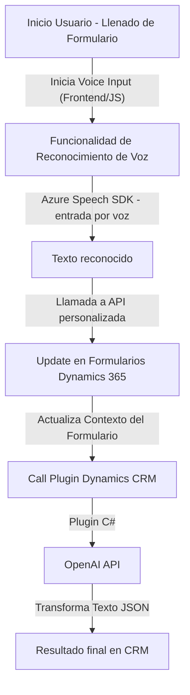

### Breve Resumen Técnico
El repositorio contiene artefactos que implementan una solución híbrida basada en varios componentes integrados. Tenemos:
- **Frontend**: Implementado en JavaScript, enfocado en la interacción con formularios y síntesis/reconocimiento de voz utilizando el Azure Speech SDK.
- **Back-end (Plugin)**: C# plugin para Microsoft Dynamics CRM que realiza transformaciones avanzadas de texto en un JSON siguiendo reglas predeterminadas, integrándose con la API de Azure OpenAI.

### Descripción de Arquitectura
La arquitectura es una mezcla de **n capas** y **microservicios**, dado que la solución combina:
1. **Frontend**:
   - Una capa de presentación implementada en JavaScript, que interactúa directamente con el usuario mediante formularios, entradas de texto y voz.
   - Esta capa utiliza el SDK de Azure Speech para procesar voz.
   - Se puede considerar como una aplicación cliente que actúa como entrada de datos y salida de experiencias auditivas.
   
2. **Backend**:
   - Una capa de lógica de negocio implementada como un plugin (observador/event listener) en Microsoft Dynamics CRM.
   - El plugin responde a eventos del sistema (como actualizaciones de entidades) con integración directa a Azure OpenAI.

3. **Servicios externos**:
   - Azure Speech SDK y Azure OpenAI API sirven como microservicios externos para ofrecer capacidades avanzadas de síntesis y reconocimiento de voz, así como transformación de texto mediante IA.

Esta solución destaca por ser **integrable con una arquitectura altamente escalable**, ideal para el entorno empresarial proporcionado por Microsoft Dynamics CRM.

### Tecnologías, Frameworks y Patrones
1. **Frontend**:
   - **Lenguaje**: JavaScript.
   - **Frameworks/Librerías**:
     - Azure Speech SDK para síntesis y reconocimiento de voz.
     - Microsoft Dynamics 365 APIs para la manipulación de formularios en un sistema CRM.
   - **Patrones**:
     - Modularización funcional para lógica separada y reutilización.
     - Asincronía y callbacks para mejorar la experiencia de usuario en cargas de SDK y respuestas de servicios.
     - Data Mapping: Asigna transcripciones de voz a los campos del formulario que necesitan ser actualizados.

2. **Backend (Plugin)**:
   - **Lenguaje**: C#.
   - **Frameworks/Librerías**:
     - Microsoft Dynamics 365 CRM SDK.
     - System.Net.Http para consumo de APIs REST.
     - System.Text.Json y Newtonsoft.Json.Linq para manipulación de datos JSON.
     - Azure OpenAI API para conversión de texto en objetos JSON estructurados.
   - **Patrones**:
     - Observer/Listener (propio del modelo de eventos en Dynamics CRM).
     - Facade: Simplifica la interacción con Azure OpenAI mediante encapsulación de lógica en una función centralizada.

### Dependencias Externas
1. **Azure Speech SDK** (JavaScript):
   - API y SDK para síntesis de texto a audio y reconocimiento de voz.
   - Requiere una clave API y configuración de región para acceder al servicio.
   
2. **Azure OpenAI (REST API)** (C#):
   - Utiliza el servicio OpenAI en Azure para transformar texto en JSON estructurado.
   - Configuración de endpoint y autorización basada en clave API.

3. **Microsoft Dynamics 365 APIs**:
   - APIs para manejo de entidades de formularios y ejecución de transcripciones.
   - Integración profunda con el CRM para trabajar con campos personalizados.

4. **JSON Libraries (C#)**:
   - *System.Text.Json* y, potencialmente, *Newtonsoft.Json.Linq* para manipulación de datos estructurados JSON.

### Diagrama Mermaid 100% Compatible con GitHub Markdown

### Conclusión Final
Esta solución representa una integración robusta entre una capa de frontend (interacción mediante voz y manejo de formularios) y una capa de backend (plugin CRM para gestionar datos y realizar transformaciones utilizando IA). Aprovecha servicios externos de Microsoft Azure para ofrecer funcionalidades avanzadas como síntesis y reconocimiento de voz, así como la capacidad de estructurar datos mediante inteligencia artificial.

La arquitectura permite un diseño flexible que combina:
- **Modularidad funcional** en el frontend para facilitar mantenimiento y escalabilidad.
- **Event-driven architecture** en el backend, alineada con los principios de Dynamics CRM.
- **Servicios externos/microservicios**, como Azure Speech SDK y Azure OpenAI API, para operaciones especializadas.

Esto lo convierte en una solución dirigida a empresas que buscan implementar tecnologías avanzadas para la interacción y gestión de datos en sistemas de CRM.