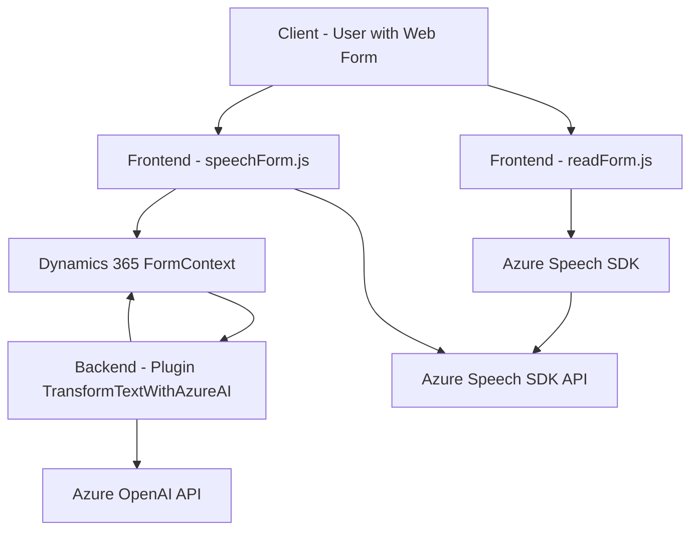

### Breve resumen técnico

El repositorio presenta una solución con componentes interconectados que trabajan para integración entre formularios dinámicos (e.g., Dynamics 365) y servicios avanzados de Microsoft Azure, particularmente los servicios de Azure Speech SDK y Azure OpenAI. Los archivos de JavaScript facilitan la interacción entre formularios web y servicios de voz/transcripción, mientras que el archivo de C# extiende funcionalidad mediante plugins en Dynamics CRM para procesamiento de texto con Inteligencia Artificial.

---

### Descripción de arquitectura

1. **Tipo de solución**
   - Esta solución integra un sistema basado en formularios web (Dynamics 365) con servicios Azure.
   - Componentes como `readForm.js` y `speechForm.js` son partes del frontend JavaScript, mientras que el plugin de C# extiende las capacidades server-side de Dynamics CRM.

2. **Capas de arquitectura**
   - **Frontend dinámico** (JavaScript)
   - **Backend server-side plugin** (C# con Dynamics CRM SDK y Azure OpenAI)
   - **API externa** (Azure Speech SDK y la API de Azure OpenAI)
   - **Integración CRM** (Dynamics 365)

3. **Arquitectura global**
   - **Cliente/API Gateway**: Los formularios actúan como clientes que envían datos hacia servicios de voz/transcripción.
   - **Servicios externos**: Azure Speech SDK para manejo de voz en frontend y Azure OpenAI (mediante plugin) para procesamiento avanzado de texto en backend.
   - **Dinámica basada en eventos**: Flujo y operaciones dependen de triggers contextuales según interacción del usuario.

4. **Patrones utilizados**
   - **Eventos y callbacks:** Uso intensivo de eventos en la capa JavaScript para cargar SDKs externos.
   - **Gestión de dependencias:** API externas (Azure Speech y OpenAI) están desacopladas, permite escalabilidad.
   - **Plugin pattern del CRM:** Siguen diseño estándar de Dynamics CRM para extensibilidad de funcionalidades.
   - **Single responsibility principle (SRP):** Cada función tiene un propósito claro, tanto en frontend como backend.

---

### Tecnologías usadas

1. **Frontend**
   - **Azure Speech SDK** (Javascript para manejo de texto a voz)
   - **Dynamic 365 Xrm.WebApi** para acceso contextual del formulario

2. **Backend**
   - **C# Plugin** compatible con Dynamics CRM
   - **Libraries**: Newtonsoft.Json, System.Net.Http, Microsoft.Xrm.Sdk
   - **Azure OpenAI**

3. **API externas**
   - Microsoft Azure Speech SDK (texto a voz y voz a texto)
   - Microsoft Azure GPT/OpenAI API

---

### Diagrama **Mermaid**

---

### Conclusión final

El repositorio destaca por su enfoque en la integración de formularios web dinámicos con servicios avanzados en la nube (Azure). Es una solución que refleja un enfoque híbrido, fusionando procesamiento local y comunicación con APIs externas de nube (Azure Speech, Azure OpenAI). Su arquitectura modular y el uso de eventos/patrones de plugin la hacen extensible. Sin embargo, puede beneficiarse de optimizaciones en el manejo de errores y en la seguridad para manejar las claves de API. Es ideal para aplicaciones CRM que buscan ampliar funcionalidad con herramientas modernas de IA y análisis de voz.