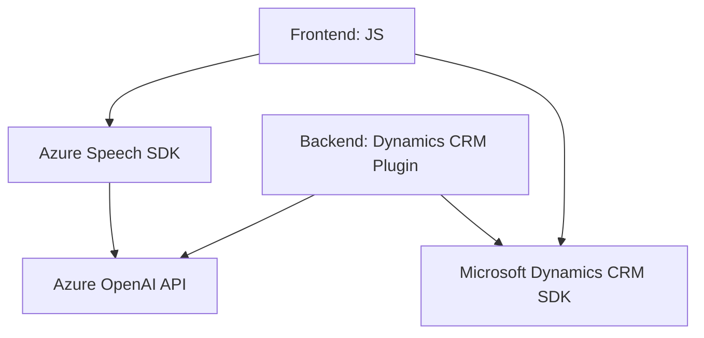

### Análisis de la solución

#### Resumen técnico:
El repositorio muestra una solución tecnológica que combina interfaces frontend para interacción de usuarios y plugins backend destinados a integraciones avanzadas con Dynamics CRM. Principalmente, la solución busca facilitar el procesamiento de datos en lenguaje natural mediante Azure Speech SDK y Azure OpenAI, aplicando patrones de arquitectura modular y orientada a servicios.

---

### **Descripción de la arquitectura**

Esta solución demuestra un modelo híbrido con base en una **arquitectura de capas**:
1. **Capa de presentación (frontend)**: Se encuentra en los archivos JavaScript para gestionar la interacción de usuarios con formularios dinámicos y realizar acciones, como entrada y salida de voz utilizando el Azure Speech SDK.
2. **Capa lógica de negocio (backend)**: Incluye un plugin `.cs` (TransformTextWithAzureAI) para ejecutar transformaciones complejas de texto mediante integración con Azure OpenAI y Dynamics CRM SDK.
3. **Integración con servicios externos**:
   - **Azure Speech SDK**: Para síntesis y reconocimiento de voz.
   - **Azure OpenAI API**: Para transformación y análisis avanzado de texto.
   - **Dynamics CRM SDK**: Para interacción directa con bases de datos relacionadas con formularios CRM.

En específico:
- El **frontend** sigue el patrón MVC (Modelo-Vista-Controlador), con una fuerte separación entre la lógica del control de flujo (ejecutada por funciones como `startVoiceInput`, `ejecutarGrabacion`, etc.) y las operaciones de transformación de datos.
- El **backend** (plugin de Dynamics CRM) utiliza la arquitectura basada en plugins, modularidad y separación de servicios.

---

### **Tecnologías y patrones usados**
1. **Tecnologías frontend**:
   - **JavaScript**: Desarrollo de componentes secundarios y lógicos para la interacción con formularios y Azure Speech SDK.
   - Azure Speech SDK: Procesamiento de entrada y salida de voz en tiempo real.
2. **Tecnologías backend**:
   - **.NET Framework/ASP.NET**: Implementación de plugins de Dynamics CRM en C#.
   - **Azure OpenAI API**: Procesamiento de texto avanzado.
   - **Microsoft Dynamics CRM SDK**: Para la extensión del sistema CRM mediante plugins y API personalizada.
3. **Patrones identificados**:
   - Delegación: Cada función se encarga de tareas específicas, con pasos bien estructurados y desacoplados.
   - Adaptador: Traducción de datos entre servicios externos y el modelo de dominio CRM.
   - Plugin-Based architecture: Implementación de extensiones mediante la interfaz `IPlugin` en Dynamics CRM.
   - Modularización: Separación de responsabilidades y funciones.
   - S.O.L.I.D Principles (especialmente Single Responsibility y Dependency Injection): Código organizado con buen nivel de especialización.
   - Modelo orientado a servicios: Conexión clara y eficiente con APIs externas como Azure.

---

### **Dependencias y componentes externos**
1. **Azure Speech SDK**:
   - Síntesis y reconocimiento de voz.
   - Requiere `azureRegion` y `azureSpeechKey`.
2. **Azure OpenAI API**:
   - Transformación avanzada de texto (GPT models).
   - Necesita configuración de claves de API y endpoint.
3. **Dynamics CRM SDK & APIs**:
   - Extensión para procesamiento de datos y sincronización con CRM.
4. **HTTP Communication Libraries**:
   - Herramientas como `System.Net.Http` y `Newtonsoft.Json` para gestionar peticiones externas y manipular datos JSON.

---

### **Diagrama Mermaid**

---

### Conclusión final

La solución es un sistema modular que emplea una organización de **n capas**, diferenciando claramente la lógica de presentación (frontend), negocio (plugin backend) e integración con servicios externos. Usa tecnologías modernas como **Azure Speech SDK** para entrada/salida de voz y **Azure OpenAI** para transformación avanzada de texto. Su arquitectura y diseño son adecuados para la tarea y compatible con la extensibilidad del sistema Dynamics CRM.

La solución está bien encaminada desde un punto de vista técnico, aunque, conforme crezca, puede ser conveniente analizar la transición hacia microservicios más desacoplados para reducir la dependencia en estructuras monolíticas del CRM y fomentar una mayor capacidad de escalar.