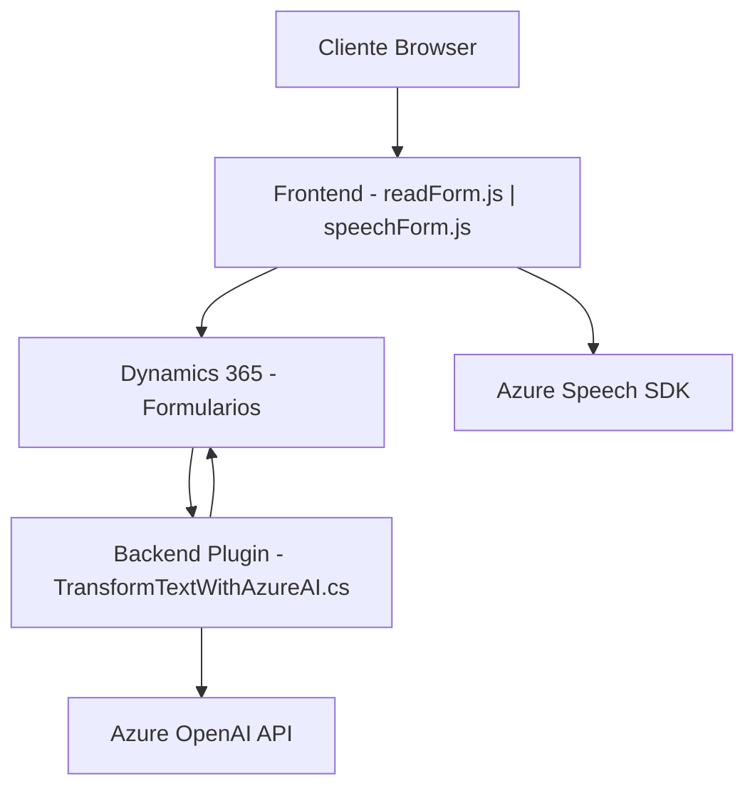

### Breve resumen técnico

El repositorio implementa una solución que combina procesamiento de voz y texto para formularios en Microsoft Dynamics CRM, interactuando con servicios de Azure Speech SDK y OpenAI. Esta solución asiste en la interacción automatizada con formularios al leer, procesar y transcribir datos mediante síntesis de voz e inteligencia artificial. Los archivos se dividen en frontend (JavaScript para el navegador) y backend (C# para la ejecución de plugins en Dynamics).

---

### Descripción de arquitectura

La arquitectura es una mezcla de capas y servicios. Se utilizan los siguientes elementos clave:

1. **Frontend**:
   - Implementación de lógica cliente mediante JavaScript:
     - Procesamiento de voz (sintetización y captura de audio).
     - Manipulación del DOM y API externa local (Azure Speech SDK).
   - Arquitectura de capa de presentación directamente integrada con Dynamics, accediendo al modelo de datos del formulario y servicios externos.

2. **Backend**:
   - Microservicio integrado: El plugin `TransformTextWithAzureAI.cs` actúa como una extensión de Dynamics CRM, comunicándose con Azure OpenAI API para transformar datos mediante reglas predefinidas.
   - Client-API Architecture: Importante dependencia de servicios externos como Azure.

Patrón predominante: **Arquitectura modular con integración a servicios externos**, utilizando eventos y procesamiento dirigido tanto en frontend como en el backend. No adopta una arquitectura avanzada como hexagonal, pues sus interacciones dependen fuertemente de Dynamics y Azure.

---

### Tecnologías y frameworks utilizados

1. **Frontend**:
   - **JavaScript**:
     - Procesamiento de voz (Azure Speech SDK).
     - DOM manipulation para formularios visibles.
   - **Dynamismo dependiente de contexto**:
     - Relaciones y datos del modelo de Dynamics CRM.

2. **Backend**:
   - **C#** sobre **Microsoft Dynamics CRM SDK** para plugins.
   - **Azure OpenAI Service**:
     - Llamadas REST usando `System.Net.Http` en C#.
     - Serialización de JSON usando `System.Text.Json` y `Newtonsoft.Json.Linq`.

3. **Dependencias adicionales**:
   - **Azure Speech SDK**: Reconocimiento y síntesis de voz.
   - **Microsoft Dynamics Xrm.WebApi**: Interacción directa con entidades en CRM.

---

### Diagrama Mermaid válido para GitHub

---

### Conclusión final

Este repositorio se centra en la creación de una solución enriquecida para Microsoft Dynamics CRM que utiliza reconocimiento de voz, síntesis de texto y transformación inteligente. 

1. **Tipo de solución:** Integración de servicios de Azure con formularios de Dynamics utilizando paradigmas cliente-servidor y plugin.
2. **Tecnologías/claves:**
   - Frontend: JavaScript y Azure Speech SDK.
   - Backend: C#, Dynamics SDK, Azure OpenAI.
3. **Tipo de arquitectura:** Mezcla de capas y servicios con integración directa a servicios externos; no es puramente desacoplada como en patrones avanzados (por ejemplo, hexagonal).
4. **Entorno que facilita:** Procesos automatizados de interacción con formularios y manejo de datos en ambientes corporativos. Ideal para tareas rutinarias en Dynamics.

Esta solución sigue principios modernos, pero se limita a la interoperabilidad directa con Dynamics y Azure, sin abstracción avanzada entre componentes.