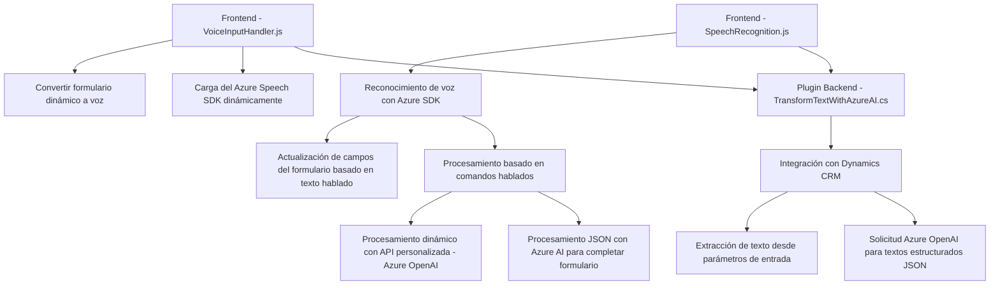

### Breve resumen técnico

El repositorio parece ser parte de un sistema que utiliza reconocimiento de voz y conversión de texto a habla, especialmente enfocado en la interacción con formularios dinámicos en una plataforma CRM (Dynamics 365). Se integra estrechamente con servicios de Azure, principalmente **Azure Speech SDK** y **Azure OpenAI**, para implementar funcionalidades de accesibilidad y procesamiento inteligente de datos.

---

### Descripción de arquitectura

La arquitectura refleja un **n capas** centrado en servicios de Microsoft Dynamics CRM y Azure. A nivel alto, la arquitectura probablemente se ve de la siguiente manera:
1. **Frontend:** JavaScript para interacción de voz con el usuario utilizando Speech SDK.
2. **Backend:** Plugins .NET utilizando Dynamics CRM SDK para lógica empresarial y transformación de datos con Azure AI.
3. **Servicios Externos:** APIs de Azure Speech SDK y OpenAI para funcionalidad avanzada de reconocimiento de voz y procesamiento de texto.

Patrones dominantes:
- **Integración de servicios:** Uso extensivo de SDKs y APIs de Azure.
- **Plug-in Architecture:** Modularidad y separación de lógica en el backend de Dynamics CRM.
- **Event-Driven Programming:** El frontend depende de eventos como las acciones del usuario o sincronización con Azure Speech SDK.
- **Transformación de datos:** Uso de reglas y AI para convertir entrada de voz/texto en formatos estructurados JSON.

---

### Tecnologías usadas

- **Frontend (JS):**
  - **JavaScript**: Organización modular con funciones para cada tarea (reconocimiento de voz, síntesis, carga dinámica de SDKs).
  - **Azure Speech SDK**: Para reconocimiento de voz y síntesis de texto.

- **Backend (C#):**
  - **Microsoft Dynamics CRM SDK**: Proporciona acceso al contexto y datos del CRM.
  - **Azure OpenAI**: Para transformación inteligente de texto.
  - **Newtonsoft.Json**: Para manipulación de JSON recibido y enviado a Azure OpenAI.
  - **ASP.NET Framework**: Base para la lógica del plugin.

---

### Diagram Mermaid

---

### Conclusión Final

El repositorio parece ser parte de una solución integral para mejorar la accesibilidad y la interacción entre los usuarios finales y una plataforma CRM (Dynamics 365), utilizando tecnologías modernas de Azure (Speech SDK y OpenAI). Tiene una arquitectura **n capas**, con una clara separación entre frontend (interacción del usuario) y backend (procesamiento en Dynamics CRM). Además, el uso dinámico de SDKs y APIs demuestra un diseño flexible y orientado a servicios.

Es necesario atender la seguridad de las credenciales expuestas en el plugin y asegurar un manejo de excepciones más robusto en caso de errores de los servicios externos.