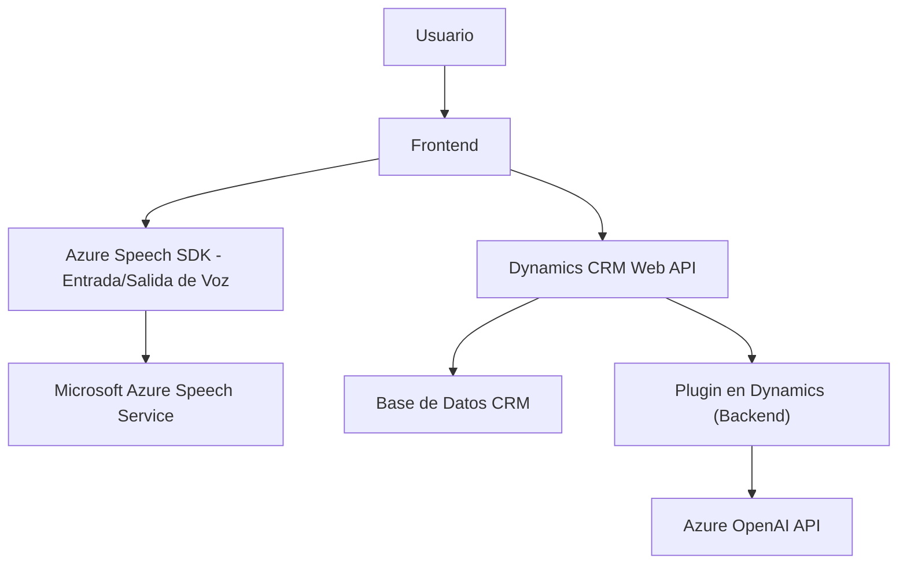

### Breve Resumen Técnico

El repositorio parece estar compuesto por **tres módulos** principales:
1. **Frontend (JS)**: Con funcionalidades para captura y síntesis de voz usando el SDK de Azure Speech y aplicación de datos procesados en formularios de Dynamics CRM.
2. **Integración Backend (CS)**: Un plugin de Dynamics CRM para transformar texto usando Azure OpenAI y aplicarlo como JSON a formularios.
3. **Servicios Externos**: Integración con **Azure Speech SDK**, **Azure OpenAI**, y **Dynamics CRM API**.

### Descripción de Arquitectura

La arquitectura del repositorio corresponde a una **n-capas** expandida con integración de servicios externos. Aunque el frontend y el backend operan de forma desacoplada, ambos dependen en gran medida de los servicios de **Azure**. El sistema está compuesto de:
1. **Capa de interfaz de usuario** (Frontend): Hace uso de SDKs y APIs de síntesis de voz para interactuar con usuarios finales.
2. **Capa de procesamiento en formularios** (Frontend/CRM API): Procesa información recibida desde la interfaz.
3. **Capa de lógica del negocio** (Plugin): Implementa transformación de datos más avanzada (texto -> JSON estructurado con IA).
4. **Servicios/Integraciones externas**: Azure Speech SDK para funcionalidades de voz y Azure OpenAI para procesamiento semántico.

### Tecnologías y Patrones Usados
1. **Frontend (JS)**
   - **Azure Speech SDK**: Captura de voz y síntesis.
   - **Promises/Event-driven programming**: Llamadas en flujo reactivo.
   - **Modularidad**: Funciones separadas y especializadas.

2. **Backend (CS)**
   - **Azure OpenAI API**: Transformación de texto.
   - **Plugin Architecture**: Modelo basado en eventos y dependencias de Dynamics CRM.
   - **Builder Pattern**: Para generar solicitudes HTTP específicas.
   - **Error Handling**: Manejo de respuestas de APIs externas.

### Dependencias/Componentes Externos
1. **Servicios Azure**:
   - Speech SDK para integración de captura/síntesis de voz.
   - OpenAI para procesamiento avanzado mediante inteligencia artificial.
   
2. **Dynamics CRM**:
   API para administrar datos en formularios del CRM, realizar búsquedas y aplicar valores.

3. **Bibliotecas estándares**:
   - JSON y HttpClient en .NET para comunicación y manejo de APIs.
   - Métodos auxiliares internos en JavaScript (parseo de datos, manejo dinámico de SDK).

### Diagrama **Mermaid**

### Conclusión Final

El repositorio es una solución orientada a **automatización avanzada** en el ecosistema Dynamics CRM usando tecnologías de Azure. Su arquitectura n-capas con integración directa de servicios REST (Azure Speech/OpenAI) lo hace versátil y modular, aunque dependiente de la infraestructura de Azure. Como recomendación adicional, podría incluir documentación sobre la gestión de claves de API y seguridad para garantizar el correcto manejo de los servicios de Azure.