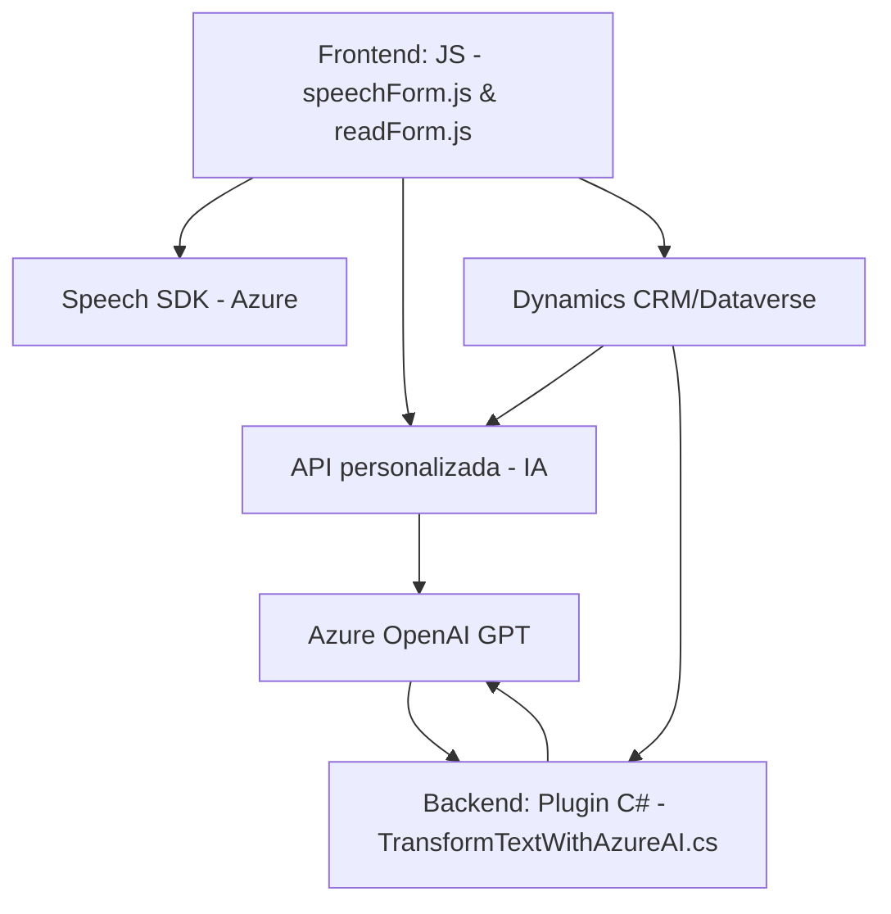

### Breve resumen técnico
El repositorio incluye el desarrollo de un sistema integrado formado por componentes de frontend y backend que interactúan con Dynamics CRM/Dataverse y servicios avanzados en la nube (Azure Speech SDK y Azure OpenAI). Este diseño está orientado a la captura y procesamiento de datos mediante voz y la transcripción automática, con capacidad adicional de transformar texto basado en reglas mediante IA.

---

### Descripción de arquitectura
1. **Tipo de solución:**  
   - **Multicomponente:** El repositorio incluye un frontend para capturar datos de formularios web e interactuar con usuarios vía voz (lectura y reconocimiento) y un backend basado en plugins de Dynamics CRM para el procesamiento avanzado de texto con IA.

2. **Arquitectura:**  
   - **Orientada a eventos:** Detecta interacciones específicas (e.g., voz iniciada, contenido en formulario) y reacciona mediante desencadenantes como el contexto del formulario o APIs externas.  
   - **Modelo de n capas:** Integración del frontend con un backend de Dynamics CRM que actúa como capa intermedia entre el cliente y los servicios externos (Azure Speech y OpenAI).  
   - **También se observa la arquitectura de plugin específica para Dynamics CRM**, donde cada plugin actúa como un componente encargado de manejar eventos.

3. **Componentes y dependencias externos:**  
   - **Azure Speech SDK:** Para reconocimiento de voz y síntesis de texto a voz.  
   - **Azure OpenAI GPT:** Para procesamiento avanzado de texto en el backend.  
   - **Dynamics CRM/Dataverse:** Plataforma CRM utilizada para captura y gestión de datos de formulario.  
   - **API personalizada:** Posiblemente desarrollada en el propio equipo, conectada mediante Azure y utilizada en los scripts de frontend y backend.  

---

### Tecnologías usadas
1. Lenguajes y frameworks:
   - **JavaScript:** Para lógica de frontend en los scripts de interacciones de formularios y voz.  
   - **C# (.NET):** Para el desarrollo del plugin que interactúa con Dynamics CRM.  

2. Frameworks y SDKs clave:
   - **Azure Speech SDK** en JavaScript para síntesis y reconocimiento de voz.  
   - **Microsoft Dynamics CRM SDK** en C# para la arquitectura de plugins.  
   - **Newtonsoft.Json** y **System.Text.Json** para manejo de JSON en el backend.  

3. Patrones de diseño:
   - **Encapsulación de servicios con funciones:** En frontend, cada función encapsula un aspecto específico de la interacción con el SDK de Azure Speech o la API personalizada.  
   - **Integración basada en eventos:** Plugins diseñados para activarse como respuesta a eventos generados por usuarios en el CRM.  
   - **Orientación a servicios externos:** Comunicación HTTP con API externas, con uso de promesas y asincronía en JavaScript y C#.  
   - **Modelo por composición:** Modularidad en la implementación de funciones, tanto en frontend como en el plugin.

---

### Diagrama Mermaid

---

### Conclusión final
El repositorio constituye un sistema modular altamente integrado que permite capturar datos mediante voz en el frontend, procesarlos en tiempo real y transformarlos en el backend mediante servicios de inteligencia artificial. Su arquitectura está distribuida entre componentes independientes que siguen la filosofía de n capas, optimizada para servicios en la nube y dependencias dinámicas. Aunque es funcional y especializado, presenta algunas limitaciones de escalabilidad debido a su acoplamiento estricto con tecnologías como Dynamics CRM y Azure.