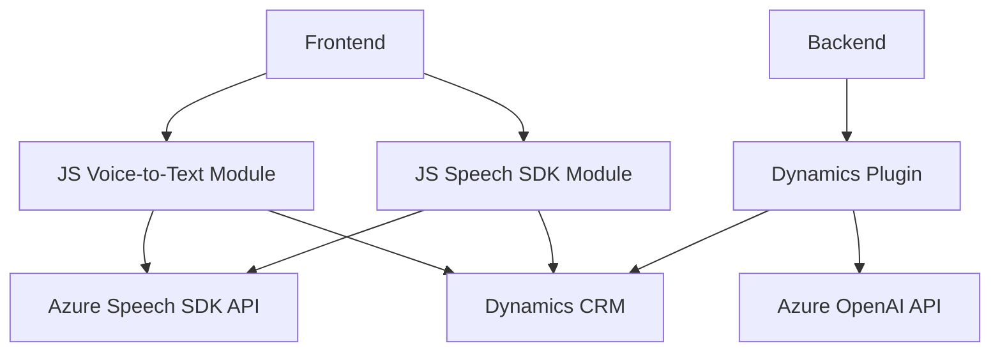

### Breve resumen técnico

El repositorio descrito contiene una solución modular que integra funcionalidades avanzadas basadas en servicios externos como Azure Speech SDK y Azure OpenAI API. Los componentes principales incluyen archivos para un frontend destinado al procesamiento de voz (transcripción de voz a texto y texto a voz), así como un plugin para Dynamics CRM que transforma texto usando IA. La arquitectura refleja una solución distribuida con una separación clara de capas y módulos.

---

### Descripción de arquitectura

La arquitectura de la solución puede clasificarse como **microservices-oriented** y modular:

1. **Frontend (Speech SDK):**
   - Implementa lógica cliente para la interacción con Azure Speech SDK, apoyándose en Dynamics 365 SDK para extraer datos y manipular formularios.
   - Los archivos en la carpeta `FRONTEND/JS` presentan un diseño modular y separado por responsabilidades, evidenciando patrones como **separación de preocupaciones** y **dinámico basado en eventos**.

2. **Backend Plugin (Azure OpenAI):**
   - Define un plugin de Dynamics CRM integrado con Azure OpenAI API.
   - Implementa patrones de **adapter**, traduciendo el texto de entrada en un comportamiento esperado por la API de Azure, y retornando el resultado procesado como un JSON.
   - Dependiente de servicios HTTP (API REST) y de bibliotecas específicas de Dynamics CRM.

Dado que los componentes trabajan en conjunto mediante integraciones jerárquicas y servicios gestionados, la solución refleja una **arquitectura en capas distribuida**. Además, la integración con tecnologías externas introduce elementos típicos de una **arquitectura hexagonal** al usar puertos y adaptadores para conectar servicios externos (Azure Speech SDK, OpenAI API).

---

### Tecnologías usadas

1. **Frontend:**
   - Lenguaje: JavaScript.
   - Framework: Dynamics 365 SDK.
   - Servicio externo: Azure Speech SDK.

2. **Backend:**
   - Lenguaje: C# (.NET Framework).
   - Framework: Dynamics CRM SDK.
   - Servicio externo: Azure OpenAI API.
   - Bibliotecas: 
     - `System.Text.Json` y `System.Net.Http` para manejo y envío de solicitudes HTTP.
   
3. **Integraciones externas:**
   - Azure Speech SDK para transcripción y síntesis de voz.
   - Azure OpenAI API para procesamiento de texto mediante IA.

---

### Diagrama **Mermaid** compatible con **GitHub Markdown**

---

### Conclusión Final

La solución presentada es una integración avanzada de servicios de accesibilidad (voz y texto) con un sistema de gestión empresarial como Dynamics CRM. La arquitectura:

- Utiliza patrones modernos como separación de responsabilidades y modularidad, aumentando la extensibilidad y mantenibilidad del código.
- Implementa una arquitectura hexagonal adaptativa para interactuar con servicios externos como Azure Speech SDK y Azure OpenAI API.
- Es adecuada para entornos empresariales donde la accesibilidad y el manejo avanzado de datos son prioritarios.

Finalmente, se recomienda seguir buenas prácticas de seguridad (como ocultar claves sensibles) y optimizar las llamadas API asincrónicas para mejorar la escalabilidad general del sistema.