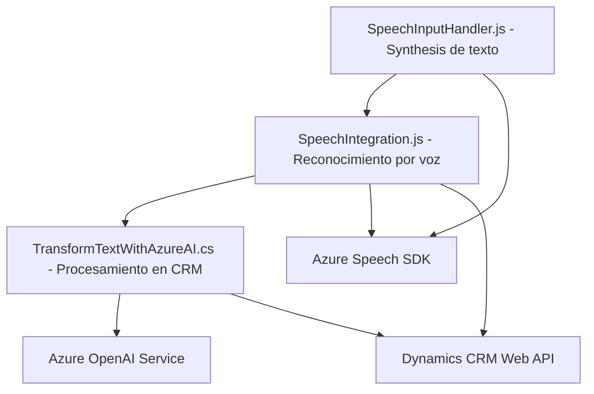

### Breve resumen técnico
Este repositorio define tres componentes principales que están interconectados para ofrecer funcionalidades avanzadas en el área de reconocimiento de voz, interacción con formularios y transformación de texto mediante inteligencia artificial. Usa tecnologías modernas como Azure Speech SDK, Dynamics CRM Web API y Azure OpenAI para implementar una solución de interacción con interfaz de voz en sistemas basados en formularios CRM.

---

### Descripción de la arquitectura
#### Tipo de solución:
- Una **solución híbrida** compuesta por frontend JavaScript, extensiones backend en Dynamics CRM (`Plugins`) y la integración de servicios externos (Azure Speech, OpenAI, y Dynamics Web API).

#### Componentes principales:
1. **Frontend (JavaScript)**:
   - Permite interacción de voz con formularios CRM, utilizando SDK de reconocimiento y síntesis de voz.
2. **Backend (C#, Dynamics CRM Plugin)**:
   - Extiende la funcionalidad del CRM para transformar texto con Azure OpenAI en un contexto estructurado y específico.
3. **Servicios externos**:
   - Azure Speech SDK: Procesamiento de voz.
   - Dynamics CRM Web API: Manejador de datos de CRM.
   - Azure OpenAI API: Inteligencia artificial para estructurar texto según reglas predefinidas.

#### Patrones arquitectónicos:
- **Arquitectura en n capas**:
  - Capa de presentación: JavaScript (frontend).
  - Capa lógica de negocio: Plugins (.NET).
  - Capa de servicios: Integración con APIs externas (Azure Speech & OpenAI).
- **Hexagonal Architecture** (adaptativa):
  - El sistema interactúa con servicios externos, permitiendo realizar operaciones específicas sin afectar la lógica interna principal.
- **Component-based design** en el frontend, organizando las tareas en funciones especializadas.
- **Plugin extensible** en el backend, para integrar y ampliar capacidades del CRM.

---

### Tecnologías usadas
1. **Frontend**:
   - **JavaScript**: Procesamiento de datos y manipulación DOM.
   - **Azure Speech SDK**: Para reconocimiento y síntesis de voz.
   - **Dynamics CRM Web API**: Para interacción con los datos del CRM.

2. **Backend**:
   - **C# (.NET framework)**: Implementación de plugins integrados en Dynamics CRM.
   - **Microsoft.Xrm.Sdk**: Para trabajar con el modelo de datos del CRM.
   - **Newtonsoft.Json / System.Text.Json**: Manejo de objetos JSON.
   - **System.Net.Http**: Comunicación con Azure OpenAI.

3. **Servicios externo**:
   - **Azure Speech**: Reconocimiento y síntesis de voz.
   - **Azure OpenAI (GPT)**: Transformación de texto en JSON estructurado.

---

### Diagrama Mermaid

---

### Conclusión final
Este repositorio proporciona una solución robusta para interactuar con formularios CRM utilizando tecnologías avanzadas de reconocimiento de voz y procesamiento de texto con inteligencia artificial. La arquitectura y los componentes están diseñados para ser modulares, escalables y fáciles de integrar con otros sistemas. La combinación de frontend y backend, junto con servicios de nube, lo hace ideal para aplicaciones modernas orientadas a la productividad y automatización empresarial.