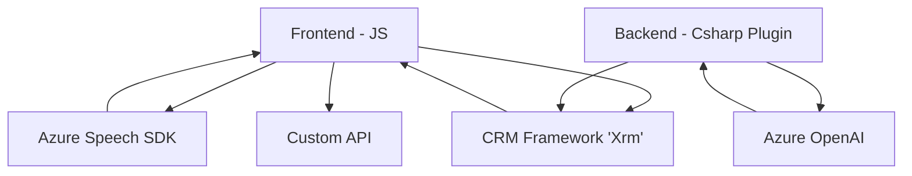

### Breve resumen técnico
El repositorio presentado abarca múltiples componentes que interactúan con formularios web y servicios externos de inteligencia artificial y voz. Incluye módulos de frontend desarrollados en JavaScript que se integran con el **Azure Speech SDK** y un plugin del backend en C# que explota capacidades de **Azure OpenAI** en un entorno **Microsoft Dynamics CRM**. 

### Descripción de arquitectura
La arquitectura es **n capas orientada a servicios**, donde el frontend y backend interactúan para proporcionar funcionalidades específicas como síntesis de voz y procesamiento de datos mediante inteligencias artificiales. Cada capa tiene responsabilidades claramente definidas:
- **Frontend**: Captura datos del formulario, habilita interacciones vía comandos de voz y puede consumir APIs personalizadas para mayor funcionalidad.
- **Backend**: Implementa un plugin en CRM para transformar texto en JSON utilizando reglas específicas y el servicio Azure OpenAI.

### Tecnologías usadas
1. **Frontend**:
   - Lenguaje: JavaScript.
   - Frameworks/SDKs: Azure Speech SDK, Microsoft Dynamics Framework (`Xrm`).
   - Patrones:
     - Modularidad.
     - Event-driven programming.
     - Consumo de APIs REST en un entorno cliente-servidor.
   
2. **Backend**:
   - Lenguaje: C# con entorno .NET.
   - Frameworks: Microsoft Dynamics CRM SDK.
   - Servicios externos: Azure OpenAI (modelo GPT-4o).
   - Patrones:
     - Extensión CRM mediante `IPlugin`.
     - Consumo de APIs REST (Azure OpenAI).
     - Microservicio backend integrado.

### Dependencias y componentes externos presentes
1. **Azure Speech SDK**: Procesa comandos de voz desde el micrófono y sintetiza datos en texto hablado.
2. **Azure OpenAI**: Convierte texto en JSON estructurado usando modelos de inteligencia artificial.
3. **Microsoft Dynamics CRM Framework** (`Xrm`): Facilita interacciones con datos de formularios en un entorno corporativo CRM.
4. **API personalizada**: Usada desde el frontend para enviar y procesar datos como comandos o texto mediante Azure AI.

### Diagrama Mermaid (estructural)

### Conclusión final
Este repositorio implementa una solución híbrida que combina frontend dinámico y extensibilidad en backend para CRM, con una clara división de responsabilidades y dependencias de servicios como Azure Speech SDK y Azure OpenAI. La arquitectura modular permite el uso de eventos y APIs para implementar funcionalidades avanzadas, como interacción por voz y procesamiento IA robusto. La separación del frontend y los plugins del backend sugiere una estructura **n capas orientada a servicios**. Esta implementación es adecuada para sistemas corporativos centrados en accesibilidad, automatización y transformación de datos asistida por inteligencia artificial.