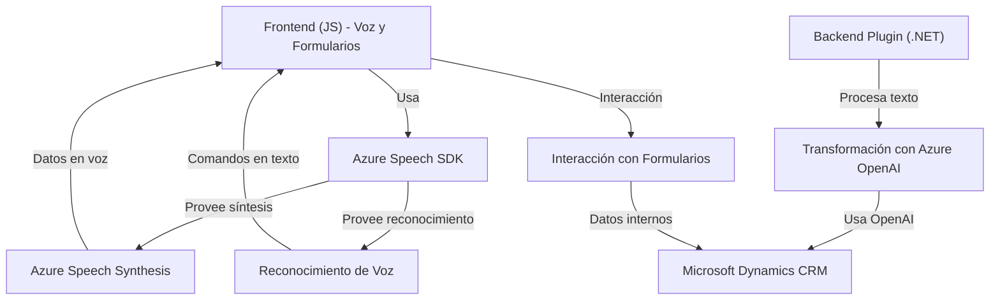

### Breve resumen técnico

El repositorio contiene múltiples archivos dirigidos a la integración de capacidades de voz y texto procesado por servicios de Azure (como **Azure Speech SDK** y **Azure OpenAI**) en una solución que interactúa con formularios de Microsoft Dynamics. Se usa un enfoque modular basado en funciones y plugins que optimizan el procesamiento de voz, reconocimiento de campo en formularios, y transformación de texto mediante APIs externas.

---

### Descripción de arquitectura

Este proyecto combina **frontend** y **backend** con una arquitectura basada en la separación de responsabilidades:

1. **Frontend (JS)**:
   - Se implementa lógica de interacción con el DOM de formularios y síntesis/reconocimiento de voz usando el **Azure Speech SDK**, con capacidades de carga dinámica del SDK y procesamiento avanzado de comandos hablados.

2. **Backend (.NET)**:
   - Un **plugin basado en Dynamics CRM** se encarga de procesar texto desde los formularios usando **Azure OpenAI API**, produciendo un JSON estructurado que sigue reglas específicas. Se integra con servicios internos de Dynamics para manipulación de datos y operaciones asincrónicas.

3. **Arquitectura General**:
   - Predominan los patrones modulares y desacoplamiento lógico. Aunque el frontend tiene una estructura de **n capas**, el sistema completo se apoya en prácticas que indican una tendencia a **arquitectura basada en servicios**, donde servicios externos (Azure) complementan las tareas internas.

---

### Tecnologías usadas

#### **Frontend (JavaScript):**
- **SDKs y APIs:**
  - **Azure Speech SDK** para reconocimiento y síntesis de voz.
  - Dinámica de carga de SDK usando DOM Manipulation.

- **Patrones Aplicados:**
  - Modularidad (cada tarea aislada en funciones).
  - Asincronía mediante callbacks y manejo gradual de dependencias externas.

#### **Backend (.NET/C#):**
- **Frameworks y Bibliotecas:**
  - Microsoft Dynamics SDK (`IPlugin`, `Microsoft.Xrm.Sdk`).
  - **HttpClient API** para solicitudes HTTP hacia Azure OpenAI.
  - JSON Manejo con `System.Text.Json` y `Newtonsoft.Json`.

- **Servicios Externos:**
  - **Azure OpenAI API** para procesamiento de texto estructurado.

---

### Diagrama Mermaid válido para GitHub

---

### Conclusión final

Esta solución combina procesamiento de lenguaje en dos áreas principales: síntesis/reconocimiento de voz (frontend) y transformación de texto (backend). La arquitectura, aunque basada en **modularidad**, tiene características de un sistema basado en servicios (aprovechando APIs de Azure). Es una integración robusta y escalable que podría evolucionar hacia microservicios si se desea desacoplar aún más los procesos entre frontend, backend y servicios externos.