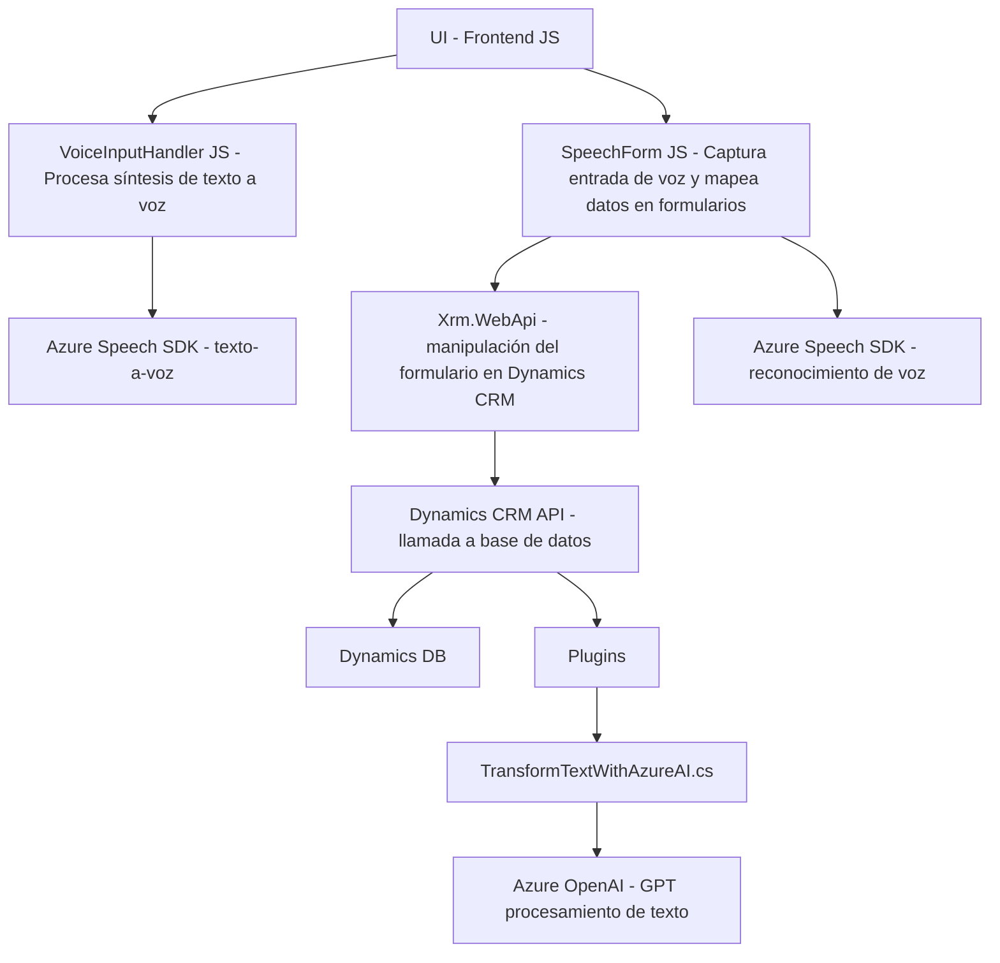

# Análisis técnico y arquitectónico

### Breve resumen técnico
El repositorio parece ser parte de una solución empresarial que implementa funcionalidades inteligentes basadas en voz y texto, diseñadas para una interfaz de usuario (frontend en JS) y un ecosistema basado en Dynamics CRM. Utiliza tecnologías como el **Azure Speech SDK** para gestionar síntesis y reconocimiento de voz, así como **Azure OpenAI** (GPT) integrado en un **plugin de Dynamics CRM** para transformación avanzada de datos.

---

### Descripción de arquitectura
La arquitectura de esta solución combina enfoques API y microservicios para integrarse directamente con servicios de Azure y Dynamics CRM. Los archivos de los módulos JS tienen una estructura más funcional, mientras que el plugin en .NET utiliza una arquitectura basada en **event-driven callbacks** y **dependency injection**. Toda la solución está diseñada para trabajar como una extensión **de n capas**, con las siguientes características:

- **Frontend (Presentación):** Manejo de formularios y captura de entrada de voz en el navegador. Los módulos de frontend están en JavaScript.
- **Backend (Integración):** Uso de plugins (.NET) con integraciones externas a servicios de inteligencia artificial basada en Azure OpenAI y APIs para transformar datos.
- **Servicio en la nube:** Conexión directa con **Azure Speech SDK** y **Azure OpenAI Service** asegura la capacidad de interactuar con IA y datos externos en tiempo real.

---

### Tecnologías, frameworks y patrones usados
**A nivel del frontend (JS):**
1. **JavaScript API:** Para capturar y procesar datos de voz y manipular formularios.
2. **Azure Speech SDK:** Para síntesis y reconocimiento de voz.
3. **CRM Dynamics API:** Realiza llamadas usando `Xrm.WebApi` para actualizar campos en el formulario.

**A nivel del plugin (.NET):**
1. **Dynamics CRM SDK:** Arquitectura basada en la interfaz `IPlugin`.
2. **Azure OpenAI:** Uso de APIs HTTP para integrar GPT-4 o modelos generativos.
3. **C#:** Para lógica empresarial y transformación de datos.
4. **JSON (Newtonsoft.Json, System.Text.Json):** Para estructuración y análisis de respuestas de la API de Azure OpenAI.

**Patrones:**
- **Event-based architecture:** Los módulos de JS usan listeners (callbacks) para disparar procesos basados en eventos de usuario como entradas de voz o interacción con formularios. Los plugins emplean el patrón `IServiceProvider`.
- **Dynamic dependencies:** Carga de SDK (speech) y API externa (CRM) solo cuando es necesario.
- **Normalización de datos:** Usa funciones de conversión de datos (ej. `palabrasANumeros`) y mapeo de campos (e.g., `getFieldMap`).
- **Service-Oriented Architecture (SOA):** Integración con servicios externos (Azure Speech y OpenAI) delega funcionalidades específicas al entorno de microservicios en la nube.

---

### Dependencias externas o componentes adicionales potenciales
1. **Azure Speech SDK:** Para la funcionalidad de texto a voz y reconocimiento de voz.
2. **Azure OpenAI API:** Interacción con modelos generativos (GPT).
3. **CRM Dynamics Web API:** Para conectar los formularios con servicios específicos del sistema CRM.
4. **Libraries:** 
   - `Newtonsoft.Json` y APIs nativas para manejar serialización/deserialización JSON.
   - `System.Net.Http` para realizar llamadas HTTP a servicios de Azure.
5. **Environment configurations (Azure keys/regions):** Al estar totalmente basado en servicios en la nube, requiere claves de acceso y configuraciones como regiones del servicio.

---

### Diagrama Mermaid

---

### Conclusión final
La solución aborda un caso empresarial en CRM Dynamics con un enfoque en la interacción por voz y capacidades de inteligencia artificial. Su arquitectura combina elementos de n capas y SOA (orientación a servicios). Los módulos de JavaScript constituyen el frontend y conectan con servicios en la nube, mientras que el plugin en .NET amplía la funcionalidad dentro del sistema CRM. Su diseño es escalable y flexible, habilitando integración con múltiples servicios de Microsoft Azure.