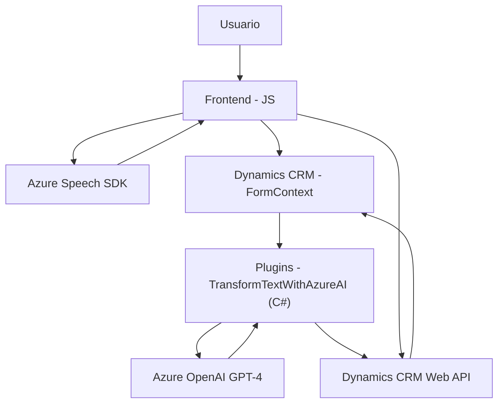

## Breve resumen técnico

El repositorio expuesto presenta un software que integra tres componentes principales: un frontend basado en JavaScript, un sistema de plugins basado en C#, y una interacción con servicios de Azure (Speech SDK y OpenAI). Su objetivo es mejorar la experiencia del usuario mediante captura de voz, reconocimiento de texto y la actualización de formularios en Dynamics CRM, junto con el uso de inteligencia artificial para transformar texto en JSON estructurado.

---

## Arquitectura

La solución implementa **arquitectura cliente-servidor de dos capas**:
1. **Frontend (JavaScript)**: Diseñado principalmente para interactuar con usuarios finales. Utiliza el navegador como cliente principal para capturar voz y actualizar formularios.
2. **Servidor y servicios (Dynamics CRM + Plugin en C# + Azure APIs)**: Aquí opera la lógica que transforma datos y gestiona la actualización de recursos dentro de Dynamics CRM, incluyendo el uso de plugins y SDK.

La combinación de servicios externos como **Azure Speech SDK** y **Azure OpenAI API** sugiere que la solución tiene algunas características de **arquitectura basada en microservicios** para integrar funciones, pero predominan las características monolíticas debido al acoplamiento con Dynamics CRM.

---

## Tecnologías, frameworks y patrones utilizados

### Tecnologías:
1. **Frontend:**
   - JavaScript (Vanilla)
   - Azure Speech SDK
   - DOM Manipulación

2. **Backend/Plugins:**
   - C# (para Dynamics CRM plugins)
   - Microsoft.Xrm.Sdk
   - Newtonsoft.Json.Linq
   - System.Text.Json
   - System.Net.Http
   - Azure OpenAI API (GPT-4 Framework)

---

### Patrones:
1. **Event-driven programming**: Reconocimiento de voz activado mediante eventos y secuencia de callbacks.
2. **Microservicio y API Integration**: Interacción entre sistemas CRM y Azure APIs, simulando una comunicación entre servicios independientes.
3. **Separation of Concerns**: Funciones especializadas, cada una cumpliendo un objetivo claro.
4. **Single Responsibility Principle** (SRP): Código modular, particularmente en lógica de obtención, parsing y actualización de datos.

---

## Diagrama Mermaid

El siguiente diagrama muestra una representación general de la interacción entre elementos de la solución.

---

## Conclusión final

Este sistema implementa una integración entre un interfaz frontend personalizado y Dynamics CRM con capacidades de inteligencia artificial y reconocimiento de voz utilizando el **Azure Speech SDK** y **Azure OpenAI GPT-4 API**. La arquitectura tiene un enfoque de cliente-servidor, pero también utiliza microservicios siempre que sea necesario para interactuar con las APIs de Azure. Aunque el código está estructurado de manera modular y siguiendo patrones fundamentales como el principio de responsabilidad única, es importante optimizar el manejo de latencia y excepciones para asegurar una experiencia robusta en producción.