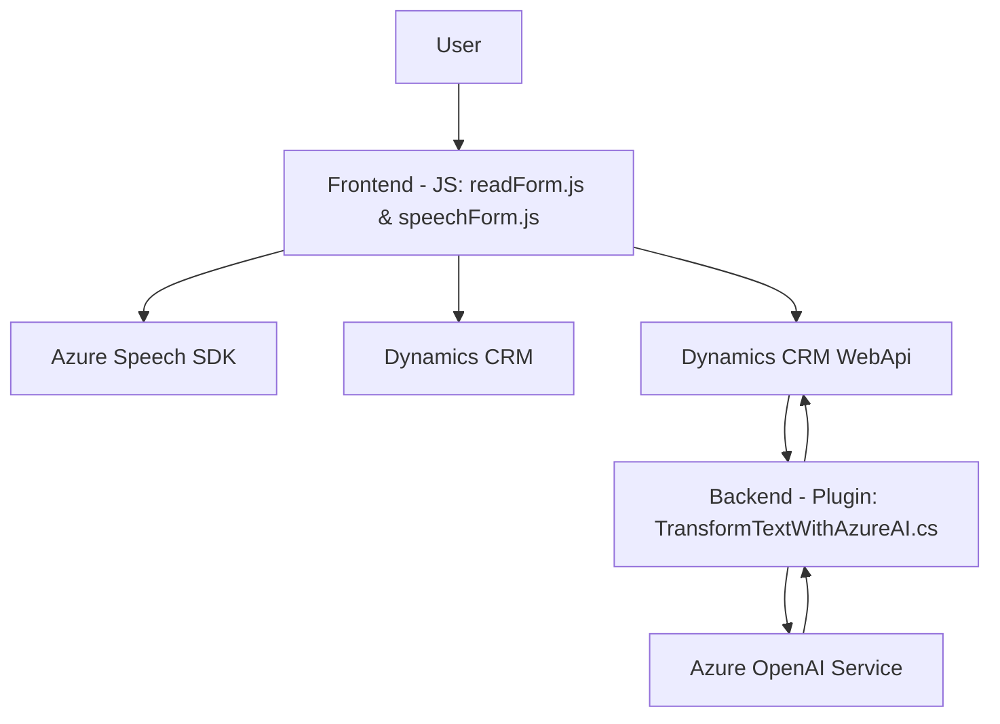

### Breve resumen técnico
La solución analizada corresponde a un sistema que integra capacidades de texto a voz y transcripción de voz a texto en Dynamics CRM. Se compone de un frontend basado en JavaScript y un backend que emplea plugins en .NET para comunicarse con servicios como Azure OpenAI. Está diseñado para mejorar la experiencia del usuario al interactuar con formularios y sistemas CRM mediante la conversión de voz en comandos que manipulan datos del formulario.

---

### Descripción de arquitectura
La solución presenta una arquitectura modular basada en MVC para el frontend, y una arquitectura de plugin extensible para el backend. El frontend está diseñado para interactuar con el navegador, mientras que el backend aprovecha la flexibilidad de Microsoft Dynamics CRM y la integración de servicios externos (Azure). Aunque no es completamente aislada como los microservicios, la separación lógica y modularización recuerda patrones de arquitectura hexagonal: los plugins actúan como adaptadores al interactuar con servicios externos y la lógica de negocio del CRM.

---

### Tecnologías usadas
1. **Frontend**:
   - **JavaScript**: Para implementar funcionalidades como lectura de formularios y síntesis/reconocimiento de voz.
   - **Azure Speech SDK**: Para características de texto a voz y reconocimiento de voz.
   - **Dynamics CRM JavaScript API**: Para interactuar dinámicamente con formularios en el sistema CRM.

2. **Backend**:
   - **C# y .NET Framework**: Base para el desarrollo del plugin.
   - **Microsoft Dynamics SDK**: Comunicación con Microsoft CRM y sus objetos organizacionales.
   - **Azure OpenAI**: Integración con servicios de lenguaje natural.
   - **System.Net.Http**: Para realizar las solicitudes al servicio Azure OpenAI.
   - **Newtonsoft.Json**: Para manejar y crear estructuras JSON en la lógica del plugin.

3. **Patrones implementados**:
   - Delegate/Callback Pattern en el frontend para manejar el flujo de eventos.
   - Microservicio externo mediante integraciones API (Azure Speech y Azure OpenAI).
   - Modularización funcional tanto en JavaScript como en C#.

---

### Diagrama Mermaid válido para GitHub

---

### Conclusión final
Esta solución combina un frontend ligero con capacidades de texto a voz/reconocimiento de voz y un backend extensible basado en plugins de Dynamics CRM y servicios de inteligencia artificial en la nube. Su diseño modular permite adaptarse a una arquitectura extensible tipo hexagonal, donde los plugins actúan como puntos de entrada de servicios. La solución ofrece un flujo optimizado para mejorar la experiencia del usuario, haciéndolo ideal para escenarios de accesibilidad y automatización. Sin embargo, la seguridad en el manejo de claves de API y la robustez ante diferentes situaciones de red deben considerarse para garantizar su eficacia y confiabilidad.