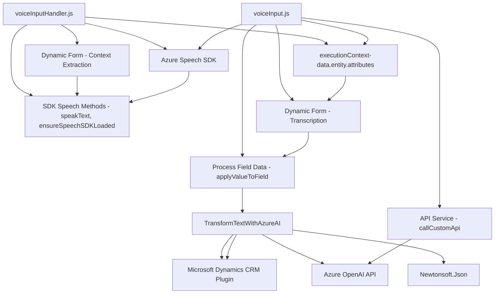

### Breve resumen técnico

La solución en el repositorio utiliza diferentes archivos y tecnologías para interactuar con Microsoft Dynamics CRM, implementando dos principales funciones: 
1. **Transformación de texto mediante Azure OpenAI API** en un plugin para extender la funcionalidad de Dynamics CRM.
2. **Captura de voz, reconocimiento, síntesis de texto a voz, procesamiento y actualización de formularios CRM** en archivos JavaScript utilizando el Azure Speech SDK.

---

### Descripción de Arquitectura

1. **Tipo de solución:** Se trata de una solución híbrida compuesta por:
   - Una **capa frontend** escrita en JavaScript, destinada a trabajar en interfaces dinámicas de CRM (Dynamics 365).
   - Un **plugin backend** desarrollado en C#, integrado en el entorno de Dynamics CRM para procesar datos enviados por los usuarios con soporte de Azure OpenAI API.

2. **Arquitectura:** 
   - **Monolito extensible**: La solución utiliza Microsoft Dynamics CRM como base monolítica, extendida mediante un plugin customizado y código JavaScript del lado del cliente.
   - **Capas orientadas a servicios**: Para comunicarse con Azure APIs (OpenAI y Speech).

3. **Principales patrones identificados:**
   - **Plugin Design Pattern:** El backend extiende funcionalidad CRM con un plugin modular (TransformTextWithAzureAI.cs).
   - **Service Integration Pattern:** Se integra con servicios como Azure OpenAI y Azure Speech SDK.
   - **Event-Driven Architecture:** Comportamiento desencadenado por eventos contextuales dentro de Dynamics CRM.
   - **declaración callback** en el frontend para la carga/espera de SDKs dinámicamente.

---

### Tecnologías usadas

- **Microsoft Dynamics CRM SDK:** Para extender funcionalidad y gestionar objetos del contexto CRM.
- **Azure Speech SDK:** Requiere la integración directa con `https://aka.ms/csspeech/jsbrowserpackageraw` para captura/reconocimiento/síntesis de voz desde el frontend.
- **Azure OpenAI REST API:** Consumida mediante `HttpClient` en .NET para procesamiento avanzado de texto.
- **Newtonsoft.Json.Linq:** Para manipulación de JSON estructurados en el backend.
- **Microsoft.Xrm.Sdk:** Para implementar el plugin de Dynamics CRM.
- **JavaScript en el frontend**: Para interacción dinámica en formularios de CRM, procesamiento lingüístico de texto, intercambio de datos y diseño modular.

---

### Diagrama Mermaid válido para GitHub

---

### Conclusión final

La solución presentada es una integración personalizada para Microsoft Dynamics CRM, enfocada principalmente en enriquecer la experiencia de los usuarios en formularios dinámicos. Con el uso de tecnologías como Azure Speech SDK en el frontend y Azure OpenAI en el backend, el sistema se beneficia de capacidades avanzadas de procesamiento de texto, síntesis de voz, y transcripción inteligente. 

La arquitectura está basada en un monolito extensible de Dynamics CRM con complementos en el frontend y un plugin para lógica más avanzada en el backend. El diseño modular y claro de los archivos garantiza una separación de responsabilidades y escalabilidad para futuras implementaciones que usen servicios modernos como los proporcionados por Azure.