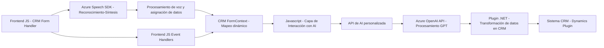

### Breve Resumen Técnico
El repositorio contiene archivos que implementan funcionalidad relacionada con la interacción de voz y texto en sistemas CRM, utilizando Azure como proveedor de servicios externos (Azure Speech SDK y Azure OpenAI). Está diseñada para facilitar la integración entre el reconocimiento/síntesis de voz, procesamiento AI y manejo de datos en formularios CRM.

### Descripción de Arquitectura
La arquitectura es **n capas** con integración de servicios externos. Incluye capas específicas como:
1. **Capa de interfaz**, que procesa eventos del formulario CRM o interacción del usuario.
2. **Capa lógica/servicios**, que maneja la interacción con el SDK de Azure Speech y llama APIs externas.
3. **Capa de integración**, que conecta directamente con APIs de Azure OpenAI para procesamiento de texto.

El diseño modular permite desacoplar las funcionalidades de síntesis/reconocimiento de voz, procesamiento AI y manipulación de formularios CRM. El uso de dependencias externas y patrones de carga dinámica permite gran adaptabilidad y optimización de recursos.

### Tecnologías y Frameworks Usados
1. **Frontend (JavaScript):**
   - **Azure Speech SDK**: Reconocimiento y síntesis de voz.
   - **DOM API**: Para manipulación dinámica de scripts y formularios.
   - **Promises y callbacks**: Para controlar procesos asincrónicos como el SDK.
   - **Microsoft CRM FormContext**: Uso de atributos y campos en formularios.

2. **Backend (.NET, C#):**
   - **Azure OpenAI**: Procesamiento avanzado de texto con GPT (Modelo como `gpt-4o`).
   - **Microsoft Dynamics SDK (`Microsoft.Xrm.Sdk`)**: Gestión del contexto CRM y ejecución de plugins.
   - **Newtonsoft.Json / System.Text.Json**: Manipulación de datos JSON.
   - **System.Net.Http**: Comunicación con servicios externos.

### Dependencias Externas o Componentes
- **Azure Speech SDK**: Para reconocimiento y síntesis de voz en tiempo real.
- **Azure OpenAI API**: Procesamiento de texto con GPT.
- **Microsoft Dynamics CRM**: Manipulación de formularios y datos.
- **APIs internas o personalizadas**: Utilizadas en llamadas AI (presente en el JavaScript).

### Diagrama Mermaid (GitHub Markdown Compatible)

### Conclusión Final
La solución es un sistema híbrido diseñado para **interacción de voz y procesamiento AI en formularios CRM**. Su arquitectura sigue un paradigma **n capas**, con integración de servicios externos como Azure Speech SDK y Azure OpenAI. Este diseño es ideal para entornos dinámicos y orientados a servicios, permitiendo desacoplamiento entre cliente/servidor y servicios externos, facilitando escalabilidad y mantenibilidad. El manejo de eventos asincrónicos y funciones dinámicas fortalece la modularidad y eficiencia del sistema.