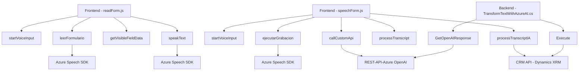

### Breve resumen técnico
Este repositorio parece implementar una solución orientada a la integración entre servicios de reconocimiento de voz, síntesis de audio y procesamiento mediante IA, específicamente en el contexto de Microsoft Dynamics CRM. Los archivos detallan la interacción con formularios CRM, utilizando Azure Speech SDK y OpenAI GPT-4 para manejar voz, texto y transformaciones basadas en reglas.

---

### Descripción de arquitectura
- **Tipo de solución**: La solución tiene módulos para frontend, lógica de plugins y servicios externos. Es una integración de frontend/javascript con servicios CRM y APIs externas (Azure Speech SDK y OpenAI).
- **Arquitectura general**:
  - **N-capas**: Cada archivo representa una capa de la arquitectura. Los archivos de frontend elaboran sobre la captura de datos, síntesis y entrada por voz, mientras que los plugins actúan como lógica en el backend de Dynamics CRM.
  - **Integración con microservicios**: El plugin depende del servicio Azure OpenAI, lo cual introduce un patrón de interacción cliente-servidor más propio de microservicios.
  - **Separación de preocupaciones**: Cada archivo tiene funciones específicas para manejar voz, formularios o procesamiento con IA.

---

### Tecnologías usadas
1. **Frontend**:
   - **JavaScript** (Vanilla): Para lógica específica de captura de voz, procesamiento de formularios y comunicación con Azure APIs.
   - **Azure Speech SDK**: Para convertir texto a voz y voz a texto.
   - **Promesas / JSON**: Para manejar solicitudes asíncronas y datos estructurados.

2. **Backend**:
   - **Microsoft Dynamics CRM SDK**: Para plugins que interactúan directamente con el CRM.
   - **Azure OpenAI**:
     - Modelo GPT-4o: Para transformar texto en base a normas.
   - **Newtonsoft.Json**: Para parseo y manipulación de JSON en el backend.
   - **System.Net.Http**: Para interacción con APIs externas.

---

### Patrones de diseño aplicados
1. **Modularidad**: Cada función y archivo tiene responsabilidades específicas claramente desglosadas.
2. **Carga en demanda**: El SDK de Azure Speech se carga dinámicamente para optimizar recursos del cliente.
3. **Façade Pattern**: El método `startVoiceInput` simplifica la interacción de múltiples funciones internas, ocultando la complejidad al usuario.
4. **Strategy Pattern**: Diferentes flujos para el manejo de entrada de voz estándar y avanzada.
5. **Plugin Pattern**: Implementación en el backend mediante `IPlugin`.
6. **Repository Pattern**: Mapeo y transformación de datos en el contexto de formularios evidencian este patrón.

---

### Diagrama Mermaid

### Conclusión final
Esta solución utiliza una arquitectura basada en n capas con fuerte modularización y soporte para integración con microservicios externos. Mientras que los archivos frontend gestionan la interacción con usuarios y servicios basados en voz, el plugin en el backend trabaja como intermediario entre Dynamics CRM y el modelo GPT en Azure OpenAI para llevar a cabo transformaciones específicas en los datos. La solución tiene alta cohesión en sus componentes, pero presenta una dependencia considerable de los servicios de Azure, lo que podría limitar su compatibilidad fuera del ecosistema de Microsoft.