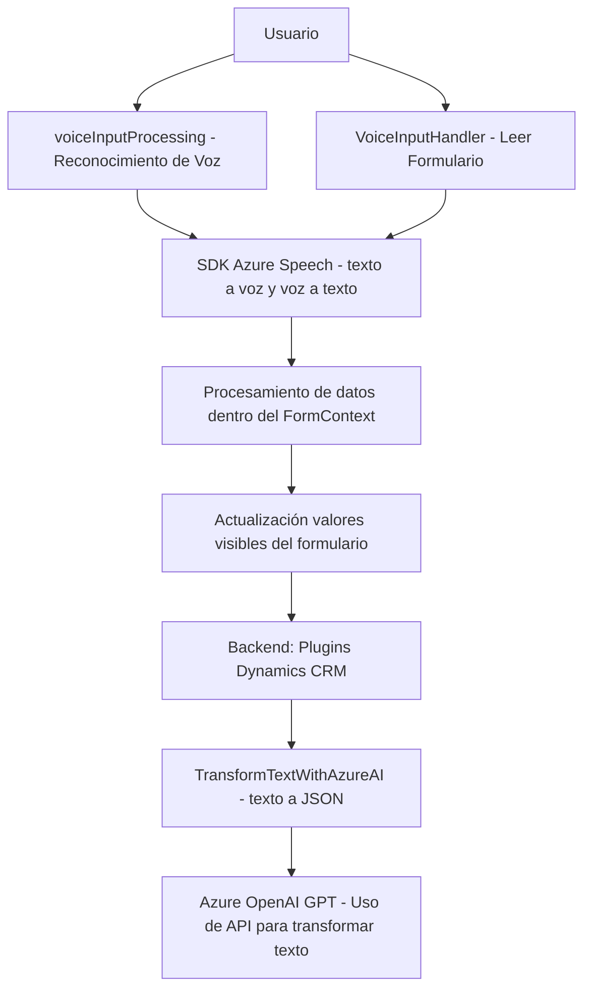

# Análisis y Resumen Técnico del Repositorio

## Resumen Técnico
El repositorio contiene archivos relacionados con el procesamiento de formularios interactivos mediante voz y la integración con servicios de Azure, incluyendo **Azure Speech SDK**, **Azure OpenAI**, y herramientas de Dynamics 365. Los archivos indican un sistema distribuido que mezcla componentes frontend y backend para lograr accesibilidad, reconocimiento de voz, y transformación textual basada en inteligencia artificial.

---

## Descripción de Arquitectura

### Tipo de Solución
La solución está orientada a una **plataforma de formularios interactivos** usada en **entornos Dynamics CRM**. Combina capacidades de frontend (interacción por voz) con integración de backend basada en plugins (transformación AI mediante Azure OpenAI). 

### Tipo de Arquitectura
La arquitectura general puede describirse como **modular orientada a servicios**, destacando:
1. **Frontend de N capas**:
   - Interfaz que facilita reconocimiento de voz y procesamiento de formularios con Azure Speech SDK.
   - Maneja interacción entre el usuario y los servicios de backend.
   
2. **Backend basado en Plugins**:
   - Dinámico y extensible dentro de Dynamics CRM para integrar funcionalidades avanzadas como transformación mediante IA.
   
3. **Dependencias Externas**:
   - Servicios externos como Azure Speech, Azure OpenAI, y Dynamics Web API.

### Componentes Principales
- **Frontend (JavaScript):**
  - **VoiceInputHandler.js**: Para síntesis de voz desde formularios visibles.
  - **voiceInputProcessing.js**: Para el reconocimiento de voz y su uso en formularios dinámicos.
  
- **Backend (C# Plugin):**
  - **TransformTextWithAzureAI.cs**: Plugin para transformar la entrada textual mediante un modelo GPT en Azure OpenAI.

---

## Tecnologías y Frameworks Usados
### Stack Tecnológico
#### Frontend
1. **JavaScript**:
   - Manejo de eventos en el navegador para carga dinámica y procesamiento.
   - Modificación de formularios interactivos.
2. **Azure Speech SDK**:
   - Utilizado para síntesis y reconocimiento de voz.
   - Funcionalidades para texto a voz y voz a texto.
3. **Dynamics Web API**:
   - Acceso a datos del CRM para actualizar formularios en tiempo real.

#### Backend
1. **C# (Plugins en Dynamics CRM)**:
   - Interfaces como `IServiceProvider` y `IPlugin` para extender la funcionalidad del sistema.
   - Uso de JSON con `System.Text.Json` y `Newtonsoft.Json.Linq` para procesar estructuras avanzadas.
2. **Azure OpenAI**:
   - Modelo GPT para procesamiento NLP (Natural Language Processing).
3. **HTTP REST Client**:
   - Comunicación con endpoints de Azure mediante el cliente HTTP.

---

## Dependencias y Componentes Externos
1. **Microsoft Azure**
   - **Azure Speech Service**:
     - Para reconocimiento de voz y síntesis texto a voz.
     - Endpoint: `https://aka.ms/csspeech/jsbrowserpackageraw`.
   - **Azure OpenAI**:
     - Uso del modelo GPT para transformación textual.
     - Proveedor **API REST**.
2. **Dynamics 365 Web API**:
   - Manejo de formularios y datos dentro del entorno CRM.
3. **Microsoft.Xrm.Sdk**:
   - Contexto de ejecución del plugin en Dynamics CRM.
4. **Bibliotecas C# estándar**:
   - Serialización JSON (`System.Text.Json`, Newtonsoft.Json`).
   - `System.Net.Http` para solicitudes REST.

---

## Diagrama **Mermaid**

---

## Conclusión Final
La solución está diseñada para mejorar la **interactividad y accesibilidad** de formularios dinámicos dentro de un entorno **Dynamics CRM**, utilizando servicios avanzados de Microsoft Azure. La arquitectura sigue principios de modularidad con una orientación a **n capas** en el frontend y **extensibilidad mediante plugins** en el backend.

- Este diseño es ideal para aplicaciones que necesitan integrar **inteligencia artificial** y **procesamiento de voz**, manteniendo una clara separación de responsabilidades entre frontend y backend.
- La inclusión de Azure OpenAI y Azure Speech SDK proporciona escalabilidad y capacidades avanzadas basadas en aprendizaje automático.