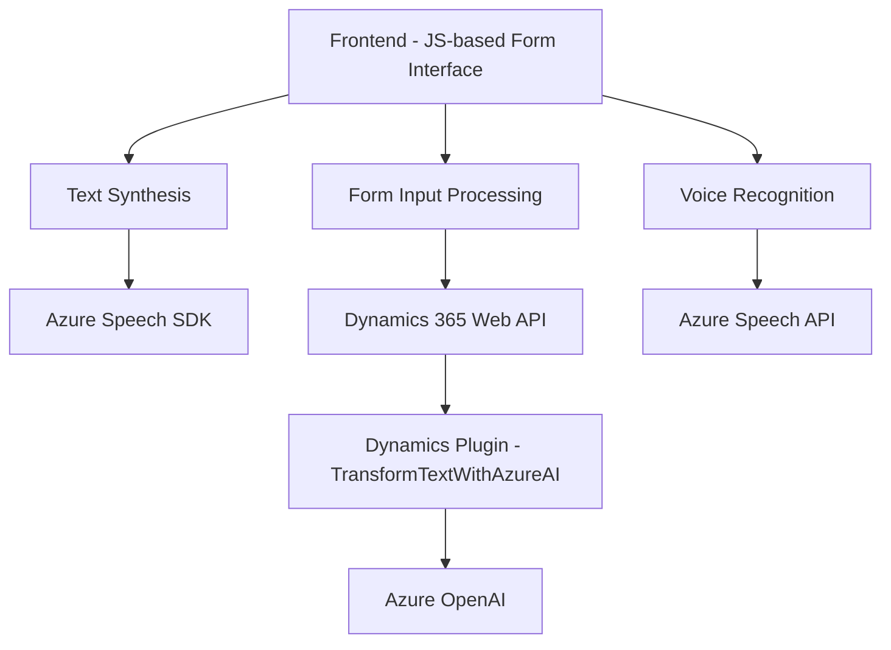

### Breve resumen técnico
El repositorio describe una solución que combina tres capas principales: un **frontend** basado en JavaScript para intérpretes de texto y voz, un **API** en Dynamics 365 para procesamiento de texto con Azure OpenAI, y **servicios externos** de Azure para reconocimiento/producción de voz y transformación de textos. Esta arquitectura usa tanto un **plugin de sistema CRM** como la interacción directa con APIs externas (Azure Speech SDK y Azure OpenAI).

### Descripción de arquitectura
La solución usa una arquitectura **n capas** (multicapa) para dividir claramente las funciones:
1. **Frontend:** Facilita la interacción con el usuario a través de un formulario y maneja la entrada/salida de voz/texto. Opera en el cliente (navegador web). Además, incluye habilidad dinámica para cargar el Azure Speech SDK.
2. **Capa lógica del CRM:** Plugins ubicados en Dynamics CRM que convierten texto de usuarios en formatos específicos utilizando un sistema basado en Azure OpenAI.
3. **Servicios externos:** Integración con Azure Speech SDK y OpenAI para funcionalidad avanzada, como síntesis de voz y procesamiento de texto configurable.

Este enfoque fomenta modularidad y escalabilidad, siendo compatible con una arquitectura **herramienta y servicios en capas**, con un patrón de procesamiento similar al **hexagonal** para incluir dependencias externas (Azure).

### Tecnologías usadas
1. **Frontend:**  
   - Vanilla JS con funciones dinámicas.
   - Azure Speech SDK cargado dinámicamente desde el navegador.

2. **Backend:**  
   - Microsoft Dynamics CRM plugin (C#).
   - Azure Speech SDK y Azure OpenAI API para voz y procesamiento de texto.

3. **Dependencias:**  
   - Servicio HTTP (`HttpClient` en C#) para integraciones con APIs.
   - Dynamics Web API para manipulación de formularios y registros.

### Diagrama Mermaid válido para GitHub

### Conclusión Final
Esta solución combina un **frontend web** modular basado en JavaScript para reconocimiento y generación de voz, una capa de servidor en **Microsoft Dynamics CRM** (plugin en C#), y servicios externos de **Azure Speech SDK** y **Azure OpenAI API** para agregar capacidades como síntesis y procesamiento del lenguaje natural. 

La arquitectura puede clasificarse como una solución **n capas** donde el frontend, la lógica CRM y los servicios externos están bien definidos. Además, usa conceptos como **lazy loading** (para SDK dinámicos) y **API cliente-servidor**, asegurando uso eficiente de dependencias externas como Azure Speech y OpenAI. Sin embargo, persisten áreas de mejora como la gestión segura de claves directamente embebidas en código fuente y aumento en manejo de errores.

