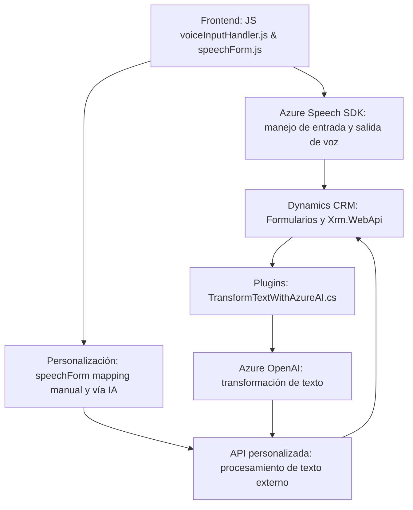

### Breve resumen técnico:

El repositorio contiene una solución basada en componentes que integran tecnologías como el **Azure Speech SDK** para entrada y salida de voz, procesamiento de datos a través de **APIs personalizadas** en Dynamics 365, y extensiones personalizadas mediante plugins en CRM utilizando **Azure OpenAI**. Está orientado a mejorar la accesibilidad y la interacción fluida mediante entradas verbales en formularios y transformaciones avanzadas de texto.

---

### Descripción de arquitectura:

La solución combina las siguientes capas de arquitectura:

- **Frontend:** Archivos JavaScript gestionan la interacción directa con el usuario en los formularios de Dynamics 365, usando Azure Speech SDK para reconocimiento y síntesis de voz, y ajustando los datos de entrada en los formularios del CRM.
- **Servicios:** Incluye integración con APIs personalizadas para procesamiento de datos (como reconocimiento avanzado y transformación de texto) y Azure OpenAI para generación de JSON como respuesta.
- **Backend:** Implementa plugins personalizados (en C#) en Dynamics CRM que encapsulan lógica específica para transformar texto y responder mediante JSON con reglas definidas.

La arquitectura general es **estilo n-capas con integración de servicios externos**, donde cada componente tiene independencia en la lógica de negocios y las integraciones.

---

### Tecnologías usadas:

1. **Lenguajes de programación**:
   - **JavaScript**: Para el manejo del frontend y scripts asociados a Dynamics 365 (procesamiento y síntesis de voz).
   - **C# (.NET Framework)**: Para la lógica de negocio personalizada dentro de plugins de Dynamics CRM.

2. **Frameworks y SDKs**:
   - **Azure Speech SDK**: Para manejo de voz (entrada y salida) en los formularios.
   - **Dynamics CRM SDK**: Dinámicas específicas para la manipulación de datos en formularios y automatización de procesos dentro del CRM.
   - **Azure OpenAI GPT**: Procesamiento avanzado de texto para transformaciones.

3. **Bibliotecas**:
   - **Newtonsoft.Json.Linq**: Manejo de JSON en plugins.

4. **Integraciones externas**:
   - **APIs personalizadas**: Meter datos transformados por IA en formularios.
   - **Azure Services**: Utilización de los endpoints de Speech y OpenAI (Azure ecosystem).

---

### Diagrama **Mermaid** válido para GitHub:

---

### Conclusión final:

La solución en el repositorio combina elementos de una arquitectura **n-capas** con claras responsabilidades y capas diferenciadas:

- **Presentación (Frontend)**: Manejo de formularios de Dynamics 365 con reconocimiento de voz y integración directa con el SDK de Azure Speech.
- **Lógica (Servicios)**: API personalizada y plugins en Dynamics CRM. Usan Azure OpenAI para la transformación de texto en respuesta estructurada.
- **Persistencia**: Interacción con los datos de Dynamics CRM se realiza mediante las herramientas estándar (`Xrm.WebApi`, mapeos de campos y atributos).

Se siguen buenas prácticas como la modularidad, encapsulación y carga dinámica de dependencias. Sin embargo, se observa una dependencia significativa de servicios de Azure, lo que puede ser un riesgo en términos de costos y escalabilidad si no se gestiona adecuadamente.