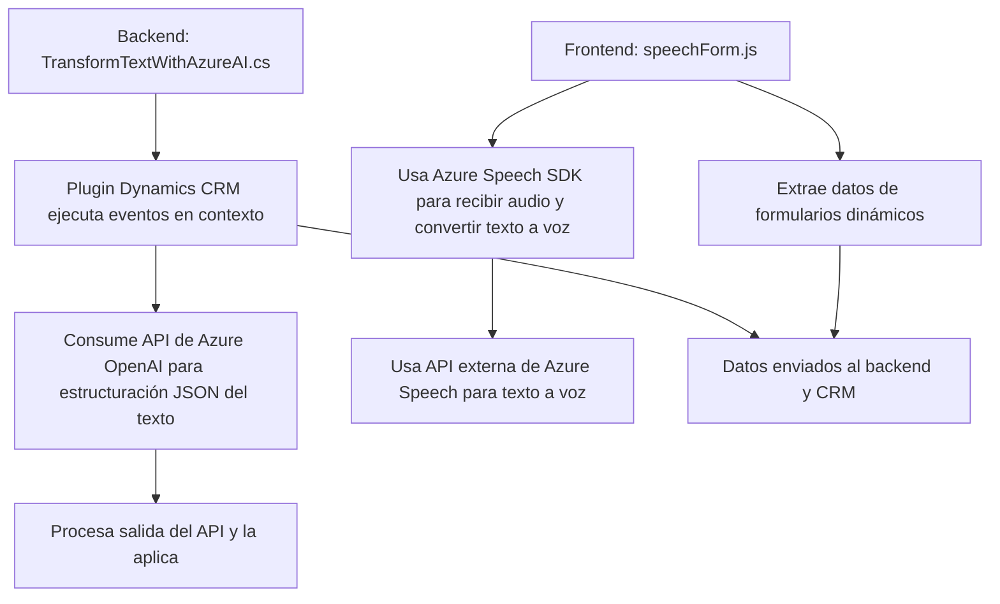

### Breve resumen técnico
El repositorio revela una solución centrada en la integración del reconocimiento de voz, la síntesis de audio y la transformación de texto mediada por inteligencia artificial con un sistema CRM basado en Microsoft Dynamics 365. Utiliza Azure SDKs y APIs para sus funcionalidades principales, tales como Azure Speech SDK para el manejo de voz y Azure OpenAI para la estructuración de texto. La solución muestra características de una arquitectura modular, con patrones como API Gateway, modularidad y servicios externos para funciones clave.

---

### Descripción de arquitectura
La arquitectura de esta solución puede clasificarse como **n capas**, donde cada capa tiene una responsabilidad clara y diferenciada:
1. **Frontend:** Implementado en JavaScript, interactúa con el usuario y con el formulario visible.
2. **Backend:** Plug-in basado en .NET para Dynamics 365 que utiliza APIs externas (Azure OpenAI).
3. **Servicios externos:** Comunicación con APIs de reconocimiento y síntesis de voz (Azure Speech SDK) y transformación de texto (Azure OpenAI).

Adicionalmente se observan patrones aplicados:
- **Modularidad**: Código bien estructurado por responsabilidad en los componentes, como manejo de voz, procesamiento de formulario, y transformación de texto.
- **Event-Driven**: El sistema opera en función de eventos generados dentro del CRM (ejecución de plugin) o de interacciones de usuario (frontend).

Esta solución no puede considerarse completamente una arquitectura de **microservicios**, ya que los componentes no están desacoplados a nivel de despliegue ni se ejecutan como servicios autónomos.

---

### Tecnologías usadas
1. **Frontend:**
   - Lenguaje: JavaScript
   - Libraries: Azure Speech SDK (https://aka.ms/csspeech/jsbrowserpackageraw)
   - Contexto de ejecución: Funcionalidades integradas dentro de formularios de Dynamics 365.

2. **Backend:**
   - Lenguaje: C#
   - Frameworks: Dynamics CRM SDK (`Microsoft.Xrm.Sdk`), HTTP APIs
   - Servicios externos:
     - Azure OpenAI (GPT-4)

3. **Patrones arquitectónicos:**
   - Modularidad: Funciones y clases bien organizadas por responsabilidades.
   - Integración de servicios externos: Uso de Azure API y SDKs en distintos puntos del sistema.
   - Decorator/Adapter: Métodos adaptadores entre entrada de usuario (audio/texto) y campos del formulario en el CRM.
   - API Gateway: Interacciones para delegar operaciones de síntesis o transformación de texto hacia Azure.

---

### Diagrama Mermaid válido para GitHub

---

### Conclusión final
La solución presentada logra integrar herramientas de procesamiento de voz y de texto con Dynamics 365 de una manera modular y eficiente. Aunque no alcanza el nivel de arquitectura de microservicios, debido a que las partes no están completamente desacopladas, sí utiliza una arquitectura **n capas** con fuertes dependencias en servicios externos de Azure. Esto permite delegar tareas críticas como síntesis de voz o estructuración de texto a APIs especializadas, evitando procesos complejos y haciendo el sistema más escalable y funcional. La implementación abre amplias oportunidades para aplicaciones orientadas a automatización y manejo de datos en sistemas CRM.