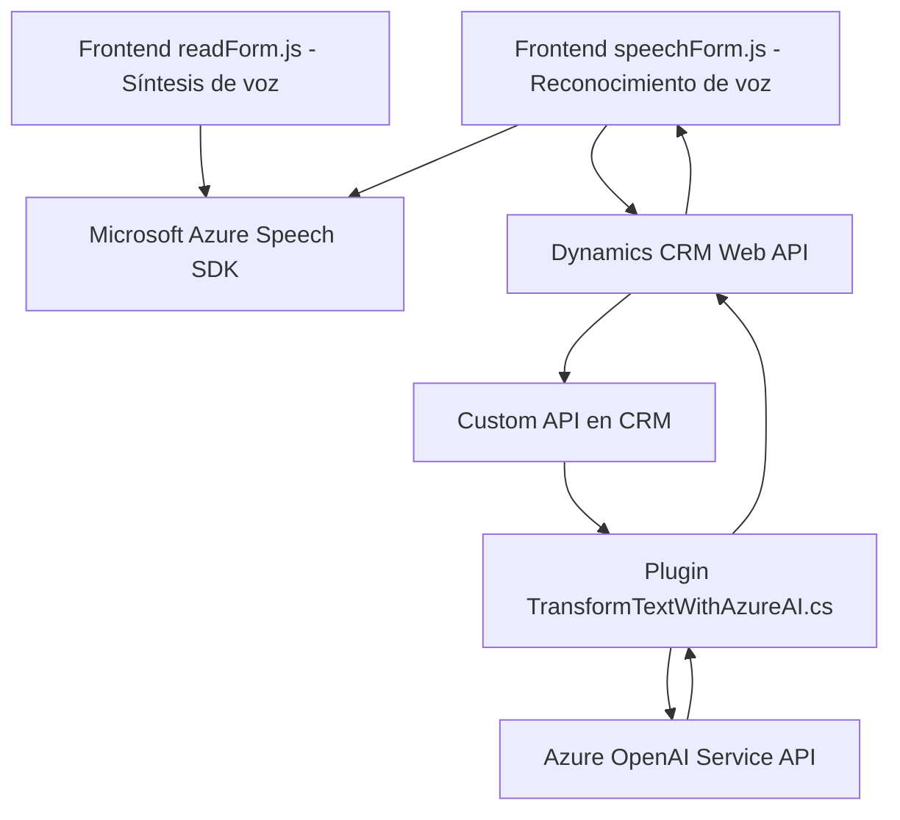

### Breve Resumen Técnico
La solución presentada parece ser un sistema basado en integraciones, orientado hacia la interacción mediante reconocimiento y síntesis de voz integrado a un formulario en Dynamics CRM. Tres archivos clave delinean funcionalidades distintas que se conectan entre sí: lectura por síntesis de voz, ingreso por reconocimiento de voz, y procesamiento avanzado mediante un plugin conectado a un servicio de IA. Está diseñado para llevar datos entre un formulario CRM y servicios de Azure, permitiendo funcionalidades enriquecidas como transformación de textos con IA y conexión a APIs externas.

---

### Descripción de Arquitectura
La arquitectura utiliza una combinación **cliente-servidor** y patrones **basados en servicios**. El frontend actúa como el cliente, utilizando un conjunto de funciones JavaScript para interactuar con formularios de Dynamics CRM, mientras que hay un backend proporcionado por el plugin que funciona como un puente para integrar servicios avanzados de procesamiento de IA. Esta estructura muestra una arquitectura **modular de cliente-servidor con integración de servicios**.

- **Frontend**: Dos archivos JavaScript proveen las funcionalidades de síntesis de voz vía Azure Speech SDK y reconocimiento, con soporte para flujos básicos y avanzados con IA. Las funciones están bien segmentadas, manejando tareas específicas como mapeo de campos visuales del formulario, carga de SDK, validación y ejecución de servicios.
- **Backend** (Plugin): Programado en C#, este plugin está diseñado como una extensión para Microsoft Dynamics CRM. Implementa la interfaz `IPlugin` y utiliza `Microsoft.Xrm.Sdk` para interactuar con los datos del CRM. El plugin también se conecta a Azure AI mediante API REST.

El archivo muestra un diseño basado en **event-driven architecture** (mediante la ejecución de plugins al invocar operaciones en el CRM), y un enfoque modular donde cada componente se conecta con servicios independientes.

---

### Tecnologías Usadas
**Frontend**:
1. **JavaScript**
   - Modularización basada en funciones.
2. **Microsoft Azure Speech SDK**
   - Síntesis y reconocimiento de voz.
3. **Dynamics CRM Web API** 
   - Operaciones CRUD en CRM, como `retrieveMultipleRecords` y Custom APIs (`trial_TransformTextWithAzureAI`).

**Backend**:
1. **C#**:
   - Plugins en Microsoft Dynamics CRM.
2. **Libraries**:
   - `System.Net.Http` para conexión HTTP.
   - `Newtonsoft.Json.Linq` para manejar datos JSON.
3. **Azure OpenAI Service via REST API**:
   - Procesamiento de texto utilizando GPT-4.

### Dependencias o Componentes Externos
1. **Microsoft Azure Speech SDK**: Para síntesis y reconocimiento de voz.
2. **Dynamics CRM Web API**: Permite que el sistema interactúe con los datos del formulario.
3. **Plugin para Dynamics CRM**: Desarrollado en C#, procesa datos usando el servicio Azure OpenAI.
4. **Microsoft Azure OpenAI Service**: Utiliza GPT-4 para interpretar y transformar el texto según las normas.
5. **Otros frameworks y patrones**: Uso de objetos JSON para procesar respuestas de APIs y HTTP para conectar servicios.

---

### Diagrama Mermaid válido para GitHub

---

### Conclusión Final
La solución integra un sistema para trabajo en formularios CRM mediante capacidades extendidas de Microsoft Dynamics CRM con Azure Speech y OpenAI. Su arquitectura modular permite separar las responsabilidades de síntesis, reconocimiento y procesamiento, manteniendo claridad y escalabilidad en el diseño. La dependencia de APIs externas como Azure Speech SDK y OpenAI asegura que el sistema aproveche servicios avanzados en la nube. Sin embargo, también implica que la solución requiere una conexión estable a Internet y que los costos de las licencias o servicios de Azure podrían ser limitantes en su implementación a gran escala.