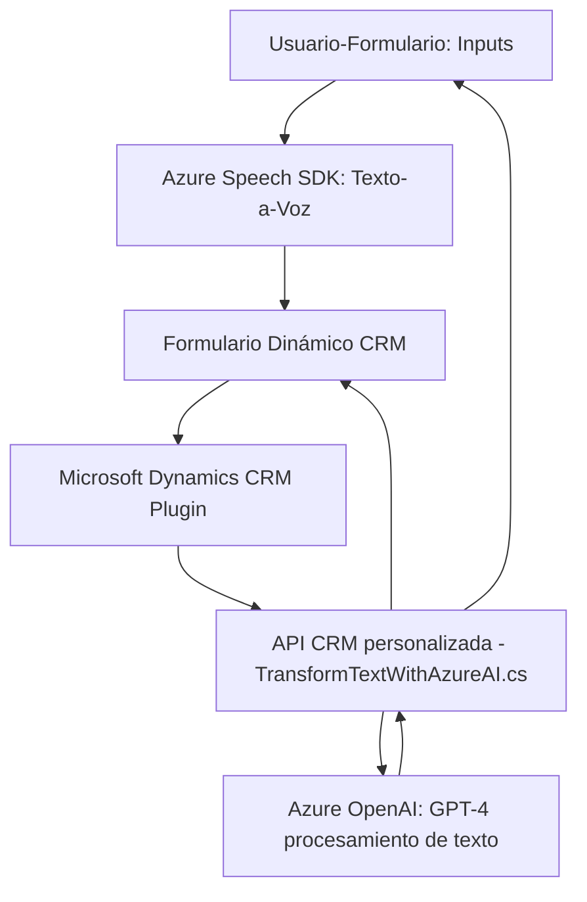

### Breve Resumen Técnico
El repositorio parece estar orientado hacia la integración de funcionalidades avanzadas de inteligencia artificial y análisis de datos textuales en un sistema CRM (Microsoft Dynamics). Utiliza el Azure Speech SDK para la síntesis de voz y el reconocimiento de voz en el frontend, y un plugin basado en C# que invoca la API de Azure OpenAI para procesamiento de texto en el backend CRM.

---

### Descripción de Arquitectura
La arquitectura combina dos tipos de aplicaciones:
1. **Frontend:** Un sistema basado en JavaScript que gestiona la interacción entre el usuario y los formularios del CRM con capacidades avanzadas de síntesis y reconocimiento de voz.
2. **Core Plugin Backend:** Un núcleo en C# implementando el patrón **Plugin** para interactuar directamente con reglas empresariales de Dynamics CRM y extendiendo su funcionalidad.

La arquitectura global podría ser clasificada como **n-capas** con elementos de integración API y arquitectura basada en eventos, adaptándose bien al modelo SAAS usado por Microsoft Dynamics.

---

### Tecnologías Usadas
1. **Frontend:**
   - **Base Framework:** JavaScript (posiblemente VanillaJS).
   - **Azure Speech SDK:** Para síntesis y reconocimiento de voz.
   - **DOM Manipulation:** Para cargar dinámicamente recursos como SDK de Azure.
   - **REST API:** Comunicaciones con la API creada en la capa backend y otros servicios externos.

2. **Backend:**
   - **Microsoft Dynamics CRM Plugin:** Gestión y procesamiento integrado al modelo de datos del CRM.
   - **Azure OpenAI gpt-4** mediante invocaciones HTTP (REST API).
   - **.NET Framework (C#):** Base para la implementación del plugin CRM.
   - **System.Net.Http:** Comunicación HTTP con Azure API.
   - **System.Text.Json:** Serialización de objetos en formato JSON.
   - **Newtonsoft.Json:** Manejo de estructuras JSON con más flexibilidad.
   - Dependencias de Dynamics SDK (`IServiceProvider`).

3. **Patrones:** 
   - Plugin design pattern (para integración con CRM).
   - Modular Pattern en el frontend y el backend para funciones bien delimitadas.
   - Pipeline de procesamiento: Procesamiento de datos mediante flujos secuenciales.

---

### Diagrama Mermaid

---

### Conclusión Final
El repositorio es una solución altamente integrada entre frontend, backend y servicios externos. Combina procesamiento de voz y capacidades avanzadas de inteligencia artificial con Microsoft Dynamics CRM para formularios inteligentes y dinámicos. La arquitectura de n-capas junto con la conectividad a APIs externas (Azure Speech SDK y OpenAI) garantiza modularidad y extensibilidad. 

Aspectos relevantes que podrían mejorarse incluyen:
1. **Seguridad:** Gestión más robusta de las claves API y autenticaciones.
2. **Monitorización:** Costos asociados a las operaciones de Azure API y Speech SDK.
3. **Estructuración del código:** Establecer un patrón MVVM/MVC en el frontend y simplificar el uso de recursos dinámicos.

Es una solución moderna que podría ser utilizada en aplicaciones de negocio con un enfoque en automatización e inteligencia artificial.