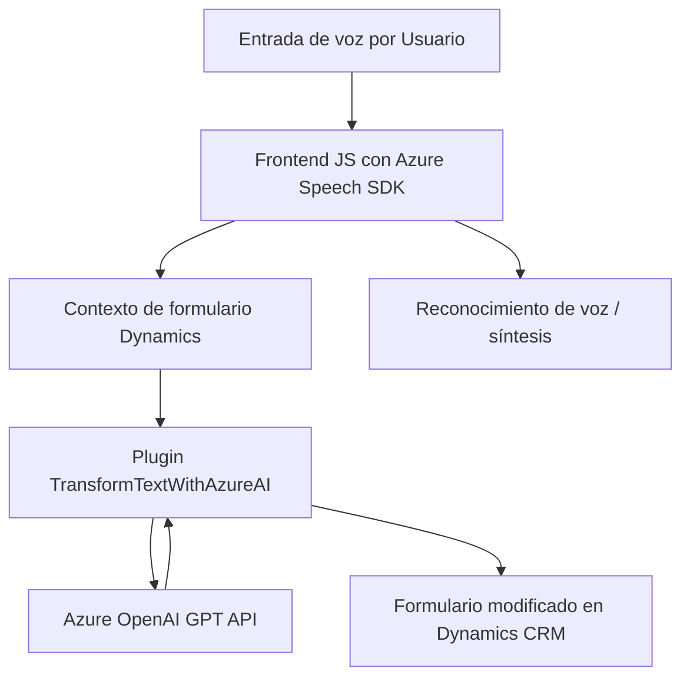

### Breve resumen técnico:
El repositorio parece ser una solución que integra funcionalidades de voz, inteligencia artificial y procesamiento de datos como parte de un sistema CRM, particularmente Dynamics 365. Incluye tres componentes principales:
- **Frontend JavaScript files** para entrada/salida de voz con Azure SDK.
- **Backend plugin** (`TransformTextWithAzureAI.cs`) que interactúa con Azure OpenAI para manipulación avanzada de texto.

Esta solución está diseñada para mejorar la experiencia de usuario mediante entrada de voz interactiva y capacidades de AI integradas.

---

### Descripción de arquitectura:
La arquitectura del sistema muestra patrones de **arquitectura por capas** y **integración de servicios**.  

**Niveles destacados:**
1. **Capa de presentación:** Implementada con los archivos de JavaScript (`readForm.js`, `speechForm.js`), cuya funcionalidad incluye interacción con APIs externas (Azure Speech SDK) y manipulación de formularios y datos visibles en Dynamics 365.
2. **Capa de negocio/backend:** A través del plugin `TransformTextWithAzureAI.cs`, que interactúa con Dynamics CRM y el servicio de Azure OpenAI para transformación de texto.
3. **Servicios externos integrados:** Dependencia fuerte con SDKs y APIs de Azure (Azure Speech y Azure OpenAI).

---

### Tecnologías usadas:
1. **Frontend:**
   - **JavaScript ES6:** Encapsulación funcional y lógica de eventos.
   - **Azure Speech SDK:** Lógica de síntesis y reconocimiento de voz.
   - **Dynamics 365 Web APIs (Xrm):** Manipulación de formularios en Dynamics CRM.

2. **Backend:**
   - **C#:** Implementación del plugin para Dynamics.
   - **Microsoft.Xrm.Sdk:** Framework para el desarrollo sobre Dynamics CRM.
   - **Newtonsoft.Json:** Manejo de datos en formatos JSON.  
   - **System.Net.Http:** Para solicitudes a servicios externos como Azure OpenAI.
   - **Azure OpenAI API:** Procesamiento de texto con OpenAI modelos, por ejemplo, GPT-like APIs.

---

### Diagrama Mermaid válido para GitHub:

---

### Conclusión final:
Esta solución encapsula una integración avanzada entre entrada de voz interactiva y procesamiento con inteligencia artificial en un sistema basado en Dynamics 365 CRM. La arquitectura se organiza en capas:
- **Frontend** con JavaScript para manejo de voz y formularios visibles.
- **Backend plugin** que extiende la lógica mediante Azure OpenAI.

El uso de patrones como `Event-driven`, integración con APIs externas y la modularidad funcional permite escalabilidad y adaptación dentro de un contexto de CRM. Aunque parece estar bien estructurado, una mejora sería desacoplar configuraciones sensibles como claves de API o endpoints a través de un archivo de configuración externo o sistema de variables de entorno para mayor seguridad y flexibilidad.