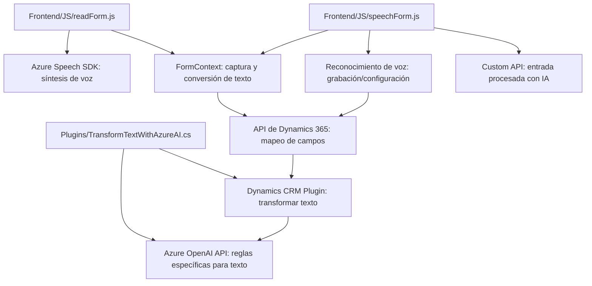

### Breve resumen técnico
El repositorio contiene tres componentes principales:
1. **Frontend**: Archivos JavaScript que interactúan con formularios dinámicos de Dynamics 365, procesan datos con Azure Speech SDK y sintetizan textos en voz o procesan con IA.
2. **Backend (Plugin)**: Un plugin en C# para Dynamics CRM que integra Azure OpenAI API para transformar texto según reglas específicas.
3. **Dependencia en servicios en la nube**: Incluyen integración con Azure Speech SDK y Azure OpenAI API para procesamiento de voz y generación de texto.

---

### Descripción de arquitectura
La solución implementa una arquitectura **multicapa**, que separa la interfaz de usuario (Frontend), la lógica de negocios (Plugin de Dynamics CRM), y la integración con servicios externos (Azure Speech SDK y Azure OpenAI API). La comunicación sigue los principios de una **arquitectura basada en servicios** (Service-Oriented Architecture, SOA), donde cada componente utiliza APIs definidas para consumir servicios de terceros.

---

### Tecnologías usadas
1. **Frontend**:
   - **JavaScript**: Manipulación de formularios y lógica client-side.
   - **Azure Speech SDK**: Para síntesis de voz y reconocimiento del habla.
   - **Promises y callbacks**: Patrones para programación asíncrona y eventos.

2. **Backend (Plugin)**:
   - Implementación en **C#** para Dynamics CRM.
   - **Microsoft Dynamics SDK**: Manipulación de datos en el contexto CRM.
   - **HTTP Client**: Comunicación con Azure OpenAI API.
   - **JSON libraries**: Manipulación de datos JSON con `System.Text.Json` y `Newtonsoft.Json.Linq`.

3. **Servicios en la nube**:
   - **Azure Speech SDK**: Entrada y salida de voz.
   - **Azure OpenAI API**: Transformación de texto utilizando IA.

---

### Diagrama Mermaid válido para GitHub

---

### Conclusión final
Este proyecto está orientado a una solución integrada para aplicaciones empresariales basadas en Dynamics 365. Se utiliza una arquitectura modular con separación de responsabilidades entre frontend, plugins backend y servicios externos. La presencia de patrones como **Delegate**, **Observer**, y **Service Integration** asegura que las funcionalidades estén correctamente organizadas y puedan extenderse a otras aplicaciones. El uso de Azure Speech SDK y Azure OpenAI API resalta un enfoque dirigido hacia soluciones **inteligentes y basadas en IA**, integrando servicios en la nube de manera eficiente.