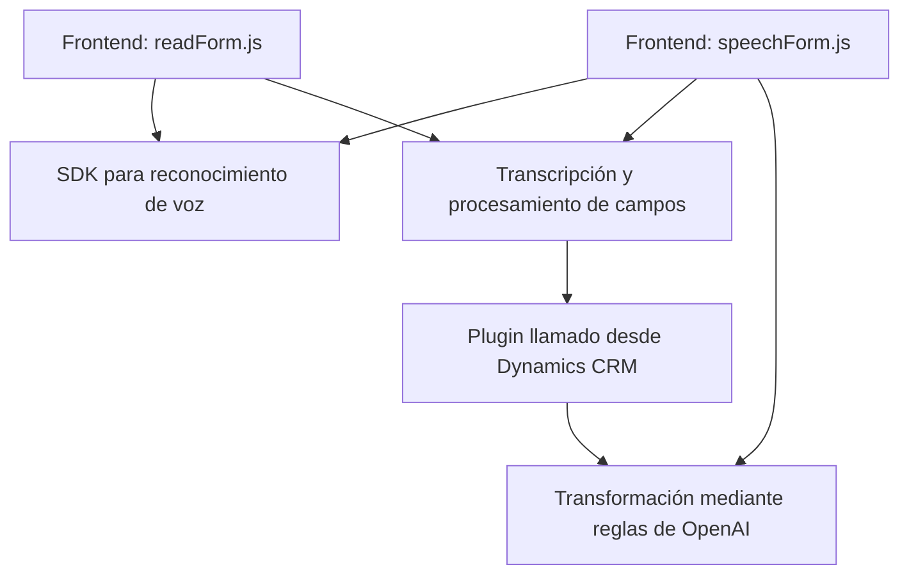

### Análisis Técnico Completo

---

#### Breve Resumen Técnico:
El repositorio contiene una solución que integra funcionalidad de reconocimiento y síntesis de voz con formularios contextuales basados en Dynamics 365. También utiliza un plugin para transformar texto usando Azure OpenAI. Se emplean tanto desarrollos frontend en JavaScript como backend en C# para Dynamics CRM. La solución está orientada a mejorar la interacción entre usuarios y la plataforma, enfocándose en accesibilidad y automatización mediante tecnologías de Microsoft Azure (Speech SDK y OpenAI).

---

#### Descripción de Arquitectura:
La arquitectura del sistema puede clasificarse de la siguiente manera:
1. **Frontend (JavaScript):**
   - Interactúa con formularios del usuario en un navegador.
   - Implementa reconocimiento de voz y síntesis mediante Azure Speech SDK.
   - Proporciona dos modalidades: manual (procesamiento directo de texto) o IA (procesamiento con Azure OpenAI).

2. **Backend (C# Plugin):**
   - Ejecuta lógica desde Microsoft Dynamics CRM.
   - Procesa texto mediante reglas específicas con Azure OpenAI.
   - Utiliza patrones de integración externos (servicios cognitivos de Azure).

3. **Arquitectura:**
   - **Estilo Modular:** El código se organiza entre módulos independientes tanto en el frontend como en el plugin. Las responsabilidades están separadas por funcionalidad: interacción con el Speech SDK, procesamiento de transcripciones con IA y asignación de valores a formularios.
   - **Patrón Plugin:** El archivo backend sigue el patrón clásico de plugins en Dynamics CRM para extender la funcionalidad del sistema.
   - **N Capas:** El sistema emplea múltiples capas:
     - **Capa de Interfaz:** Usuarios interactúan con formularios en el frontend.
     - **Capa de Lógica:** El frontend procesa voz y texto en conjunto con el plugin que maneja encapsulación para transformación avanzada.
     - **Capa de Servidores Externos:** Se conecta con Azure Speech y Azure OpenAI.

---

#### Tecnologías Usadas:
1. **Frontend:**
   - **JavaScript:** Código ejecutado en navegador.
   - **Azure Speech SDK:** Para reconocimiento y síntesis de voz.
   - **Dynamics CRM API (`Xrm.WebApi`)**: Para comunicación con formularios contextuales.

2. **Backend:**
   - **C#:** Código para ejecutar lógica del plugin en Dynamics CRM.
   - **Microsoft Dynamics SDK:** Para manipulación de entidades y formularios de CRM.
   - **Azure OpenAI SDK / REST API:** Procesamiento avanzado de texto.

3. **Patrones:**
   - **Modularidad:** Funciones y métodos divididos según su responsabilidad.
   - **Integración de servicios:** Uso del SDK de Azure Speech y OpenAI.
   - **Callbacks:** Mecanismo de eventos para cargar SDK dinámico en frontend.
   - **Transformación de datos:** Flujo de datos estructurado desde entrada hasta salida.

---

#### Dependencias o Componentes Externos:
1. **Azure Speech SDK:**
   - Usado en el frontend para lectura y síntesis de voz.
   - Cargado dinámicamente desde un CDN público.

2. **Azure OpenAI:**
   - Procesa datos y transcripciones en el backend mediante un HTTP Client.

3. **Dynamics 365 API:**
   - Maneja los formularios y entidades contextuales.

4. **Libraries:**
   - **System.Net.Http:** Realiza peticiones HTTP al servicio de Azure OpenAI.
   - **System.Text.Json** / **Newtonsoft.Json.Linq:** Trabaja con JSON en los plugins.

---

#### Diagrama Mermaid:

---

#### Conclusión Final:
La solución combina tecnologías de Microsoft Azure y Dynamics CRM para crear una arquitectura modular enfocada en accesibilidad y automatización de procesos con voz y texto. El frontend se apoya en SDKs de Azure para la colaboración directa con formularios en navegadores, mientras que el backend extiende la funcionalidad de Dynamics con un plugin para transformar datos mediante inteligencia artificial. Esta arquitectura optimiza la interacción entre servicios y mejora la experiencia del usuario con tecnologías avanzadas como síntesis y reconocimiento de voz junto con inteligencia artificial. Es una solución robusta y escalable.