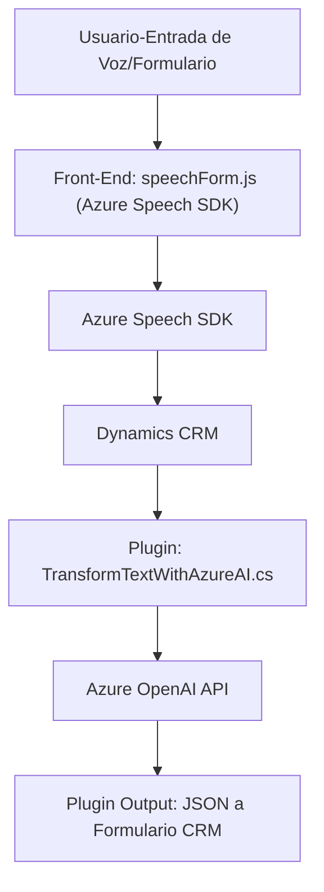

### Breve resumen técnico
El repositorio contiene módulos dedicados a la integración entre formularios en dinámicas empresariales—como los de Dynamics CRM—y servicios Azure, específicamente Azure Speech SDK y Azure OpenAI API. Los archivos están organizados en dos categorías principales: frontend (interfaz en JavaScript) y backend (.NET para el plugin en Dynamics). El código muestra un enfoque nítido hacia el procesamiento de texto desde y hacia formularios, con apoyo de tecnologías Azure.

---

### Descripción de arquitectura
La solución adopta un enfoque **en capas**, donde el frontend gestiona las interacciones del usuario (voz, texto), el backend realiza la transformación avanzada de datos mediante Azure OpenAI, y los datos pasan entre ambos con ayuda de APIs. Además, se integra directamente con Dynamics CRM utilizando plugins en el backend (.NET).

- **Frontend**: Interacción con el usuario, SDK de Azure Speech para síntesis y capturación de datos. Modularización clara con funciones dedicadas para manejar el SDK y asociar datos con formularios.
- **Backend**: Usa un plugin (Dynamics CRM) como mediador para llamar a Azure OpenAI y transformar texto en JSON altamente estructurado. Utiliza dependencias específicas de Dynamics para ejecutar el código como respuesta a ciertos eventos/acciones.
- **Patrones de Arquitectura**:
  - Modular Design para funciones individuales.
  - Cliente-Servidor (separación entre frontend y backend).
  - Integración de servicios externos (Azure Speech y OpenAI).
  - Plugin Pattern para extender la lógica de Dynamics CRM.
  - Event-Driven Architecture: Manejo de flujos asincrónicos y basada en contexto.

---

### Tecnologías usadas
1. **Frontend**:
   - **JavaScript**:
     - Modular code structure.
     - Azure Speech SDK: "aka.ms/csspeech/jsbrowserpackageraw".
     - Speech synthesis and recognition.

2. **Backend**:
   - **.NET (C#)**:
     - Microsoft Dynamics CRM Plugin framework (`IPlugin`, `IServiceProvider`).
     - HTTP-based integration with Azure OpenAI.
     - Libraries like `Newtonsoft.Json` for handling JSON data.
     - Dependency injection (`IOrganizationService`).

3. **Servicios Externos**:
   - Azure Speech SDK for voice input/output in the frontend.
   - Azure OpenAI API for text processing and generating structured JSON.
   - Microsoft Dynamics CRM services for interacting with form data.
   - Potential integration with APIs through `Xrm.WebApi`.

---

### Diagrama Mermaid válido para GitHub Markdown

---

### Conclusión final
La solución está diseñada para interpretar entrada de voz, procesarla y reenviar los datos a un formulario en Dynamics CRM, donde se transforman según reglas predeterminadas mediante servicios avanzados como Azure OpenAI. Arquitectónicamente, el proyecto presenta una estructura **en capas con integración de servicios externos**, lo cual permite mantener la independencia entre la capa de interacción y el núcleo de procesamiento backend. Es una implementación escalable que combina prácticas modernas como modularización, callbacks, y el uso eficiente de plugins y APIs.

La documentación y estructura de código son profesionales, bien organizadas, y destacan el uso de servicios en la nube junto con SDKs especializados. Esta solución sería óptima en contextos empresariales donde se desee automatizar y optimizar procesos relacionados con datos textuales y de voz, integrándolos con herramientas como Microsoft Dynamics CRM.