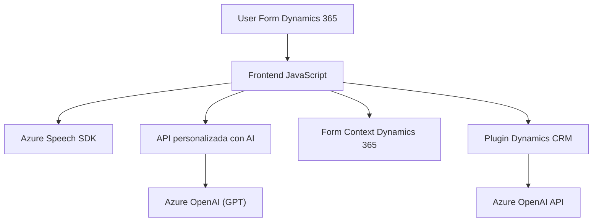

### Breve resumen técnico

El repositorio refleja una solución híbrida compuesta por un frontend en JavaScript y un backend especializado en extensiones para Microsoft Dynamics CRM. El sistema se basa en la integración con servicios externos como Azure Speech SDK y Azure OpenAI para funcionalidades avanzadas como síntesis de voz, transcripción de comandos, gestión dinámica de formularios y procesamiento de texto basado en inteligencia artificial.

---

### Descripción de arquitectura

Este proyecto sigue una **arquitectura en n capas** con integración de servicios externos. Las capas principales incluyen:

1. **Frontend**: Implementado en JavaScript, interactúa directamente con formularios en Dynamics 365, procesando datos visibles y manejando comandos de voz. Utiliza patrones como `Event-driven` y `Facade` para reducir la complejidad de la integración con Azure Speech SDK.
2. **Backend**: Basado en extensiones de Dynamics CRM (plugins escritos en C#). Los plugins procesan texto utilizando Azure OpenAI, transformándolo en estructuras adecuadas para integrarse con los datos del sistema.
3. **Servicios Externos**:
   - **Azure Speech SDK**: Para síntesis y transcripción de voz.
   - **Azure OpenAI (GPT)**: Para procesamiento avanzado de texto.
   - **Dynamics CRM**: Para gestión de formularios y datos.

La arquitectura refleja una separación clara entre interacción con el usuario (frontend) y procesamiento complejo de datos (backend).

---

### Tecnologías usadas

1. **Frontend**:
   - JavaScript (ES6+)
   - Azure Speech SDK (`window.SpeechSDK`)
   - Manipulación del DOM (API nativa del navegador)

2. **Backend**:
   - C# sobre .NET Framework
   - Microsoft Dynamics CRM SDK (`IPlugin`, `IOrganizationService`)
   - Azure OpenAI (GPT)

3. **Servicios Externos**:
   - Comunicación REST con endpoints de Azure (Speech SDK y OpenAI)
   - API personalizada para integración AI
   - Dynamics 365 Web API (`Xrm.WebApi.online`)

4. **Patrones de software**:
   - `Facade Pattern`: Simplifica la interacción con los servicios externos desde el frontend.
   - `Event-driven Programming`: Uso de callbacks en el frontend para manejar dinámicamente eventos del SDK.
   - `Service-oriented Plugin`: El backend actúa como intermediario para procesar datos con OpenAI.

---

### Diagrama Mermaid válido

---

### Conclusión final

El repositorio presenta un sistema diseñado para complementar y extender las capacidades de Dynamics CRM mediante el uso de tecnologías de inteligencia artificial y síntesis de voz. La arquitectura está optimizada para maximizar su modularidad e integración con servicios externos, permitiendo la escalabilidad. Aunque sigue una estructura clásica en n capas, utiliza tecnologías modernas como Azure Speech SDK y OpenAI GPT para abordar retos complejos como la interacción vocal y el procesamiento avanzado de texto.