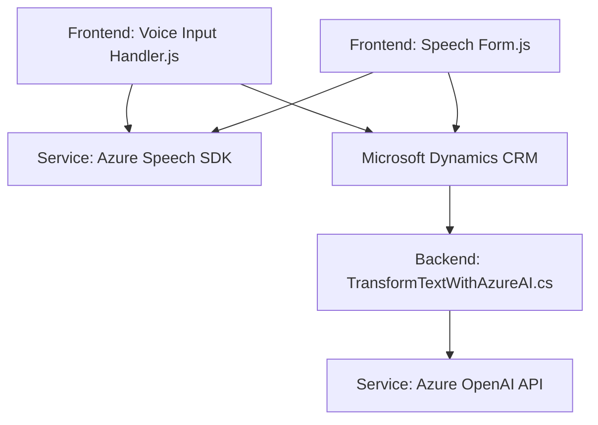

### Breve resumen técnico

El repositorio describe tres componentes principales que interactúan entre sí:
1. **Front-end en JavaScript:** Funcionalidades para captura, síntesis y procesamiento de voz utilizando Azure Speech SDK en formularios (Dynamics 365).
2. **Plugin para Dynamics:** Extiende las capacidades de Dynamics CRM usando Azure OpenAI para transformar texto según reglas específicas.
3. **Dependencia de servicios Azure:** Los archivos hacen uso intensivo de Azure Speech SDK y Azure OpenAI API, integrándose con Dynamics CRM.

Las funcionalidades están orientadas principalmente a mejorar la **accesibilidad** y promover la **automatización** en formularios.

---

### Descripción de arquitectura

- **Arquitectura**: El sistema describe una arquitectura **n capas** que separa responsabilidades en tres niveles principales:
   1. **Presentación (frontend):** JavaScript como controlador del cliente, interactuando directamente con datos de los formularios de Dynamics 365.
   2. **Lógica de negocio (plugin):** Implementación de la lógica compleja que delega procesos a servicios externos como Azure OpenAI.
   3. **Acceso e integración con servicios externos:** Uso de SDKs de Azure para comunicación a nivel de nube.

- **Tecnología y patrones**:
   - **Modularización:** Código organizado en funciones descritas por responsabilidades específicas.
   - **Patrón adaptador:** El plugin convierte datos de Dynamics en formatos reconocidos por Azure OpenAI.
   - **Sincronización basada en eventos:** Plugins en Dynamics CRM que interactúan con entradas de usuarios en tiempo de ejecución del CRM.
   - **API orchestration:** Enfoque de middleware que usa Azure Speech SDK y OpenAI.

---

### Tecnologías usadas

1. **Lenguajes y Frameworks:**
   - **Frontend:** JavaScript (vanilla).
   - **Backend:** C# para integración del plugin.
   - **Dynamics 365 SDK:** Xrm.SDK para manipulación de datos y la capa CRM.
   
2. **Terceros:**
   - **Azure Speech SDK:** Capacidad para síntesis y reconocimiento de voz.
   - **Azure OpenAI API:** Procesamientos avanzados de texto a nivel de IA.

3. **Dependencias:**
   - **Microsoft Dynamics CRM WebAPI:** Manipulación de formularios.
   - **Newtonsoft.Json** para manipulación de datos JSON.

---

### Diagrama Mermaid válido para GitHub

---

### Conclusión final

El repositorio presenta un sistema **n capas** enfocado en la integración entre una capa de presentación, un plugin que actúa como capa de lógica de negocio en Dynamics 365, y servicios de la nube (Azure Speech y OpenAI). Es una solución robusta para procesamiento de voz y texto en el contexto de formularios digitales donde se prioriza la accesibilidad y la inteligencia artificial.

Si bien el diseño es modular y sigue patrones estándar como adaptadores y desacoplamiento, existen riesgos en la gestión estática de claves de acceso a servicios externos (por ejemplo, la clave de Azure en los diferentes archivos). Es recomendable implementar una estrategia de seguridad adecuada para proteger estas credenciales y cumplir con estándares modernos.