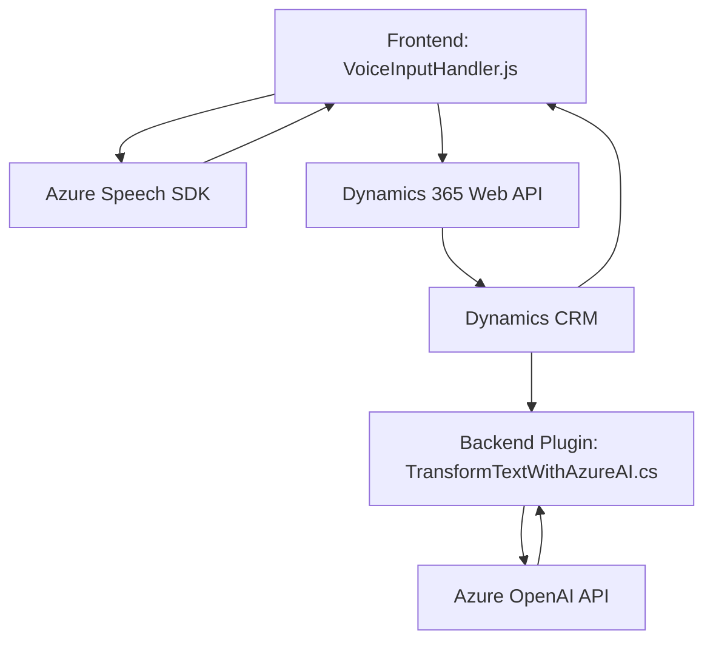

## Breve resumen técnico

El repositorio presenta una solución compuesta principalmente por dos componentes: un **frontend integrado con Dynamics 365** para el manejo de formularios dinámicos usando entrada de voz (y salida por síntesis de voz) y un **plugin para Dynamics 365**, que utiliza Azure OpenAI para transformar texto en JSON estructurado. Estas herramientas están diseñadas para enriquecer las funcionalidades de Dynamics 365 con capacidades de inteligencia artificial y análisis de voz.

---

## Descripción de arquitectura

La arquitectura es híbrida:

1. **Frontend (Voice Input Module)**: 
   - Se trata de un cliente basado en JavaScript que interactúa con Dynamics 365 mediante su API. Integra servicios externos como Azure Speech SDK para reconocimiento y síntesis de voz.
   - Estructura modular con funciones bien separadas por responsabilidad.
   - Principales patrones:
     - *Delegación*: Para dividir la lógica entre reconocimiento de voz, procesamiento de datos y actualización del formulario.
     - *Integración por servicio*: Uso de servicios externos como Azure Speech y Dynamics 365 para funcionalidad específica.

2. **Backend (Dynamics Plugin)**:
   - Un plugin en .NET C# que funciona como un middleware entre un usuario de Dynamics y Azure OpenAI. Este plugin transforma texto en objetos JSON estructurados y los retorna al sistema.
   - Principales patrones:
     - *Dependencia Inversa*: Uso de `IServiceProvider` para desacoplamiento y acceso dinámico al contexto de ejecución.
     - *Stateless Integration*: Integra servicios externos sin mantener estado persistente.

La solución general utiliza una arquitectura de **n capas**, con las siguientes capas típicas:
- **Frontend**: Entrada y procesamiento inicial.
- **API/SDK Externo**: Azure Speech para los servicios de voz.
- **Backend Plugin**: Computación avanzada vía Azure OpenAI y Dynamics 365 API, basada en peticiones stateless.

---

## Tecnologías usadas

### Frontend
- **JavaScript** para funcionalidad del cliente.
- **Azure Speech SDK (JS)** para la entrada/salida de voz.
- **Dynamics 365 Web API** para actualizar campos en formularios dinámicos.

### Backend (Plugin)
- **C# (.NET Framework)** para el desarrollo de plugins.
- **Azure OpenAI API** para procesamiento de texto avanzado.
- **Dynamics SDK** (`IPlugin`, `IOrganizationService`, entre otros) para integración nativa con Dynamics.

### General
- **REST APIs** para comunicación cliente/servidor entre componentes.
- **JSON** para estructuración y transmisión de datos.
- **MVC Modular Approach** en los módulos de frontend para separación de responsabilidades.

---

## Diagrama Mermaid válido para GitHub

---

## Conclusión final

### Ventajas de la solución:
1. **Modularidad en el diseño:** Las responsabilidades de extracción de datos, síntesis de voz y procesamiento se reparten adecuadamente entre módulos y componentes, lo que facilita el mantenimiento y escalabilidad del proyecto.
2. **Uso de tecnologías avanzadas:** La integración con servicios de Azure (Speech SDK y OpenAI) enriquece el ecosistema Dynamics 365 con capacidades de inteligencia artificial y mejora la experiencia del usuario.
3. **Estructura lógica:** Cumple con principios de arquitectura como separación de capas y desacoplamiento.

### Posibles puntos de mejora:
1. **Gestión de seguridad:** Las claves API están expuestas en el código, lo que debe ser mejorado integrando herramientas de manejo de secretos como Key Vault de Azure.
2. **Dependencias redundantes:** Algunas librerías parecen no ser necesarias (`Newtonsoft.Json.Linq` en el plugin), lo que podría optimizarse para reducir acoplamiento y mejorar el rendimiento.
3. **Optimización del diagrama:** Aunque es claro, puede expandirse para detallar mayor relación entre componentes internos. 

Esta solución emplea estándares modernos para construir una experiencia innovadora en plataformas empresariales como Dynamics 365. Ésta puede evolucionar hacia un modelo basado en microservicios si las necesidades de escalabilidad para componentes de IA crecen considerablemente.