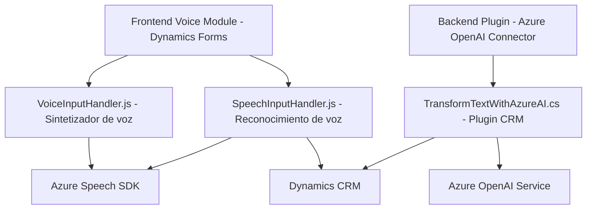

# Resumen técnico

Este repositorio define la implementación de una solución distribuida con componentes que integran reconocimiento de voz y procesamiento textual interactuando con APIs externas, principalmente Azure Speech SDK y Azure OpenAI. 

Ofrece funcionalidades de síntesis de voz, reconocimiento de voz y transformación textual avanzadas que pueden optimizar la accesibilidad y la generación de datos estructurados en plataformas relacionadas a Dynamics 365 CRM.

---

# Descripción de la arquitectura

La arquitectura emplea un enfoque **modular distribuido** estructurado en 2 capas:
1. **Frontend/JS**: Scripts del lado del cliente para manejar voz y formularios dinámicos usando Azure Speech SDK y funcionalidad basada en eventos.
2. **Backend/Plugins**: Plugin alojado en Dynamics CRM que utiliza el servicio de Azure OpenAI para transformar datos textuales en información dirigida.

Patrones clave:
- **Event Driven**: Scripts JS reaccionan a acciones del usuario (grabación o síntesis de voz).
- **Integración con APIs externas**: Central en la arquitectura con Azure SDK.
- **Plugin extensible**: Permite incorporar reglas específicas dinámicas para transformar lógica textual.

Tipo general de arquitectura: **n capas** (Frontend y Backend con integración directa a APIs externas).

---

# Tecnologías usadas

1. **Frontend:**
   - JavaScript para lógica de aplicación cliente.
   - Azure Speech SDK: Lógica de síntesis y reconocimiento de voz.
   - Formularios en Dynamics CRM.

2. **Backend:**
   - C# y Dynamics CRM SDK (`IPlugin`): Desarrollo del plugin.
   - Azure OpenAI Service: Procesamiento textual.

---

# Dependencias o componentes externos

1. **Azure Speech SDK**: Requerido en el frontend para la síntesis de voz y reconocimiento de voz.
2. **Azure OpenAI Service**: Usado en el plugin para transformar texto en JSON estructurado.
3. **Dynamics CRM SDK**: Para manipular datos en Dynamics 365 y extender funcionalidad usando plugins.
4. **Librerías auxiliares**:
   - `Newtonsoft.Json` y `System.Text.Json`: Procesamiento de JSON.
   - `HttpClient`: Para consumir APIs en el backend.

---

# Diagrama Mermaid

---

# Conclusión final

El repositorio implementa una solución **accesible y avanzada** con reconocimiento de voz y generación de datos JSON estructurados, integrada directamente en plataformas Dynamics CRM. Utiliza tecnologías modernas de Microsoft (Azure Speech y Azure OpenAI), en una arquitectura **modular de n capas** basada en event-driven y micro-integraciones con APIs externas.

Esta solución es ideal para escenarios que requieren accesibilidad mediante voz, transformación textual, y almacenamiento estructurado de datos en sistemas empresariales.