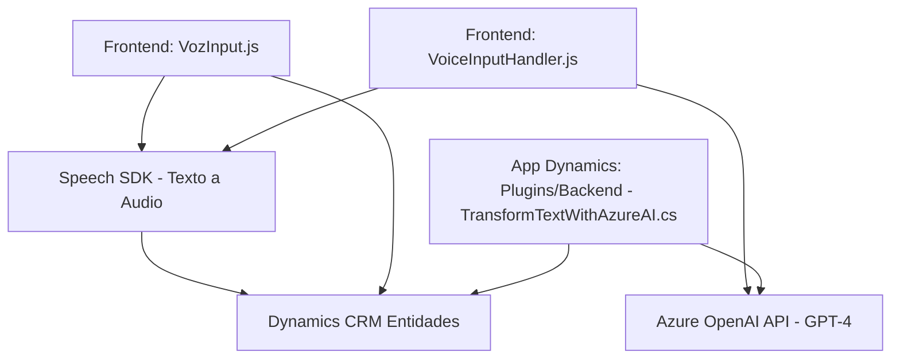

### Breve resumen técnico
El repositorio contiene solución basada en tres capas principales: un **frontend** desarrollado en JavaScript para interacción por voz, un **backend** plugin en C# para integración con Microsoft Dynamics CRM, y una **API externa** para inteligencia artificial a través de Azure Speech SDK y Azure OpenAI. Es una solución orientada a accesibilidad y optimización de formulación dinámica mediante voz y transformaciones basadas en IA.

---

### Descripción de arquitectura
La solución está compuesta por los siguientes elementos:
1. **Frontend**: JavaScript, actúa como manejador de datos de formulario y síntesis/reconocimiento de voz mediante Azure Speech SDK.
2. **Middleware/Plugin**: Un plugin en C# junto con Dynamics CRM SDK que procesa reglas y responde eventos del formulario y envía solicitudes a Azure OpenAI.
3. **Servicios Externos**: Integración con Azure Speech (para voz a texto y síntesis) y Azure OpenAI GPT-4 (para transformación de texto estructurado).

**Tipo de arquitectura:** Mixta
- **N capas:** Para el frontend y plugin basado en MVC.
- **Hexagonal/Microservicios:** Por la dependencia de servicios externos integrados mediante APIs (Azure SDK, Dynamics Web API).

---

### Tecnologías usadas
#### Frontend:
- **JavaScript (JS)**: Manejo de DOM, conexión con Azure Speech SDK.
- **Azure Speech SDK**: Para reconocimiento de voz y síntesis de texto.

#### Backend/Plugin:
- **C# .NET Framework**, con:
  - **Dynamics CRM SDK** (`IPlugin`, `IOrganizationService`) para interacción interna con CRM.
  - **Azure OpenAI API**: Procesamiento de texto con GPT-4.

#### Externas:
- **HTTP Requests (REST)**: Usado en el plugin para consumir OpenAI GPT-4.
- **JSON Serialización**: Formato estándar de entrada/salida para APIs.

**Patrones empleados**:
- **Facade**: Abstracción de lógica específica (ejemplo, SDK de Azure en el frontend).
- **Command**: En el plugin, encapsula operaciones CRM con métodos rápidos.
- **Adapter**: Comunicación entre Dynamics y OpenAI con transformaciones.

---

### Dependencias y componentes externos
1. **Azure Speech SDK (JS)**: Para manejo de síntesis y reconocimiento de voz.
2. **Azure OpenAI API (REST)**: Para generación inteligente por GPT-4.
3. **Dynamics CRM SDK**: Para manipulación de datos y eventos de formulario en el entorno Dynamics.
4. **HTTP y JSON Libraries (.NET)**: Manejo de serialización y consumo de servicios externos.

---

### Diagrama Mermaid

---

### Conclusión final
El repositorio implementa una solución híbrida, integrando procesamiento de voz y transformación de texto mediante servicios externos. Utiliza Azure Speech para sintetizar y reconocer datos de formularios accesibles, mientras que emplea Dynamics CRM como base del manejo de datos estructurados. Estos datos están complementados con Azure OpenAI para generar resultados transformados en formatos JSON definidos.

La arquitectura destaca por combinar enfoques de **n capas** y **microservicios**, haciendo eficiente la interacción entre dependencias y API mediante patrones de diseño como Facade y Adapter.