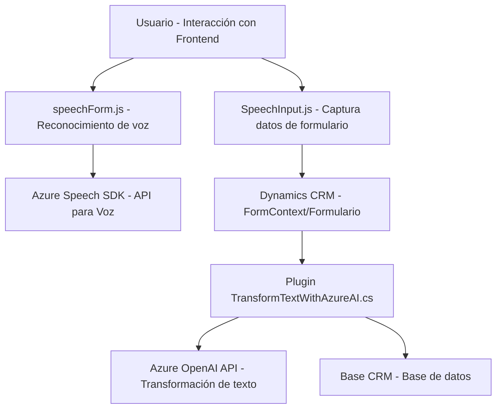

# Análisis completo del repositorio

---

## Breve resumen técnico
Este repositorio contiene una solución híbrida que integra funcionalidades de entrada y salida de voz basadas en **Azure Speech SDK**, junto con una lógica de procesamiento avanzada que utiliza **Azure OpenAI**. La solución parece ser parte de un sistema más grande (como un CRM, específicamente Dynamics CRM) y usa tanto JavaScript en el frontend como C# en plugins del backend.

---

## Descripción de arquitectura
### Tipo de solución:
La solución parece ser diseñada como un conjunto **modular y extensible de componentes**, orientados a proporcionar **integración entre un sistema CRM (Dynamics 365)** y funciones avanzadas de voz e inteligencia artificial. En detalle:

1. **Frontend**: Proporciona funcionalidades específicas para capturar, procesar y convertir datos en formularios usando tecnologías de navegador y APIs externas (Speech SDK).
2. **Backend (plugin en C#)**: Procesa el texto generado por el frontend y lo transforma usando **Azure OpenAI**, asegurando que se cumplan normas específicas.

### Arquitectura:
La arquitectura es **híbrida**:

1. **Cliente-Servicio**: El frontend actúa como cliente que pide procesamiento de voz y usa servicios externos (Azure Speech SDK y OpenAI API).
2. **Integración de Microservicios externos**: El backend depende de servicios en la nube para transformar datos, siguiendo una estructura típica de servicios REST.
3. **Patrón n-capas**: La solución tiene una división de responsabilidades natural entre frontend (usuario e interacción), backend del CRM (procesamiento lógico), y las dependencias externas (servicios de Azure).

---

## Tecnologías usadas
1. **Frontend**:
   - Idioma: **JavaScript**.
   - **Azure Speech SDK**: Para reconocimiento de voz y síntesis de audio.
   - **HTML DOM**: Carga dinámica del SDK y manipulación de datos en formularios.
   - Entorno de ejecución: **Browser/CRM Dynamics**

2. **Backend**:
   - Idioma: **C#** (*.NET Framework* o *.NET Core*).
   - **Microsoft Dynamics CRM SDK**: Usado para desarrollar plugins en el contexto del CRM.
   - **Azure OpenAI API**: Para manipular y transformar texto mediante inteligencia artificial.
   - **JSON**: Manejo de datos estructurados.

3. **General**:
   - Servicios REST a través de HTTP (usados en Speech SDK y para integrar Azure OpenAI).
   - Comunicación con Dynamics CRM mediante clases específicas (`IPlugin`, `IServiceProvider`).

### Patrones:
1. **Modularidad**: Los archivos JavaScript están altamente divididos por responsabilidades.
2. **AJAX dinámico**: SDK y API cargados solo cuando son necesarios.
3. **Cliente-Servidor**: División clara entre frontend que genera datos y backend que los transforma.
4. **Adaptación dinámica**: Traducción de texto reconocido hacia los campos de formularios.

---

## Dependencias externas
1. **Azure Speech SDK**: Servicio integrado para reconocimiento y síntesis de voz.
2. **Azure OpenAI API**: Servicio externo para la transformación inteligente de texto.
3. **Dynamics 365 CRM (Xrm.WebApi)**: API para manejar formularios y datos del CRM.
4. **Es posible la dependencia de librerías adicionales** (como `Newtonsoft.Json` o similares) para el manejo de datos en el backend.

---

## Diagrama Mermaid
El siguiente diagrama representa la interacción de los sistemas y componentes explicados:

---

## Conclusión final
El repositorio contiene una solución bien estructurada que combina procesamiento de voz en **frontend** con capacidades de inteligencia artificial en el **backend**, integrándose con un **CRM** (Dynamics 365). La arquitectura es ideal para entornos empresariales que buscan aprovechar la IA y comandos por voz para interactuar con formularios y datos estructurados.

### Recomendaciones:
1. **Seguridad**:
   - Las claves sensibles deben almacenarse en configuraciones seguras y no directamente en el código.
2. **Escalabilidad**:
   - El uso intensivo de servicios externos puede necesitar un sistema de caché o cola de procesamiento (si aplica alta demanda).
3. **Mantenimiento**:
   - Es clave menos acoplamiento entre módulos y más documentación sobre la interacción específica con APIs externas.