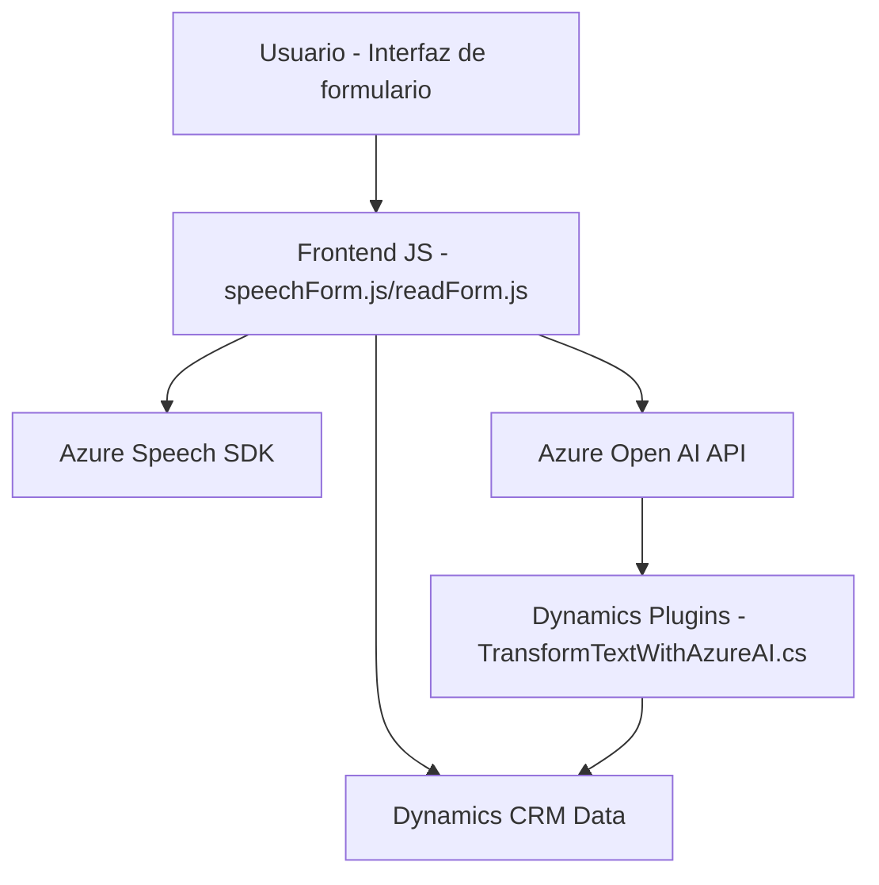

## Breve resumen técnico
El repositorio presenta una solución centrada en el uso de servicios de Azure AI, específicamente **Azure Speech SDK** y **Azure OpenAI**, para habilitar la interacción con formularios en una interfaz visual. La funcionalidad principal incluye:
1. Síntesis de voz y reconocimiento de habla utilizando **Azure Speech SDK**.
2. Transformación avanzada de texto mediante **Azure OpenAI**.
3. Plugins para Dynamics 365 que actúan como intermediarios entre los datos del sistema y los servicios de Azure.

---

## Descripción de arquitectura
La arquitectura combina un enfoque **modular** en el frontend con un patrón **event-driven** para manejar eventos asíncronos de voz y texto. Además, hay integración de **plugins basados en servicio** en Dynamics 365 que extienden su funcionalidad. El flujo es parcialmente dividido en capas:
1. **Frontend**: Actúa como capa de presentación, utilizando JavaScript para gestionar sínesis y transcripción de voz.
2. **Plugins**: Capa de lógica de negocio personalizada con transformación de datos mediante Azure AI.
3. **Servicios externos**: Dependencia explícita en APIs de Azure como Speech SDK y OpenAI.

Esta arquitectura se encuentra en un ecosistema **n-capas** debido a la separación del frontend, lógica de negocio (en plugins) y servicios externos. También utiliza **patrones de integración** con plataformas como Dynamics 365 y Azure AI, pero no llega a un diseño orientado completamente a microservicios.

---

## Tecnologías usadas
1. **Lenguajes y plataformas**:
   - **JavaScript** para lógica de interacción frontend.
   - **C#** para plugins de Dynamics 365.
2. **Servicios y SDKs**:
   - **Azure Speech SDK**: Para síntesis y reconocimiento de voz.
   - **Azure OpenAI**: Para transformación de texto avanzado.
3. **Frameworks y librerías**:
   - **Microsoft Dynamics 365 CRM SDK**.
   - **Newtonsoft.Json** y **System.Text.Json** para manejo de JSON en el backend.
4. **Patrones arquitectónicos**:
   - **Modularidad**: Dividir las funcionalidades en funciones encapsuladas.
   - **Event-Driven**: Llamadas asíncronas con manejo de eventos desde APIs externas.
   - **Plugin-Based Architecture**: Para la integración con Dynamics.

---

## Diagrama Mermaid válido para GitHub

---

## Conclusión final
El repositorio presenta una solución híbrida de arquitecturas orientada a la interacción del usuario mediante voz y texto con formularios. Explota las capacidades de **Azure Speech SDK** y **Azure OpenAI** para proporcionar una experiencia inteligente que habilita funcionalidades avanzadas de síntesis y transformación del lenguaje natural. Mientras que el frontend opera como una capa independiente de presentación, los plugins en Dynamics 365 articulan la lógica de negocio en conjunto con APIs externas. El diseño es flexible para integrarse en sistemas empresariales existentes, aunque podría beneficiarse de mejoras en la abstracción de dependencias hacia un enfoque más desacoplado.