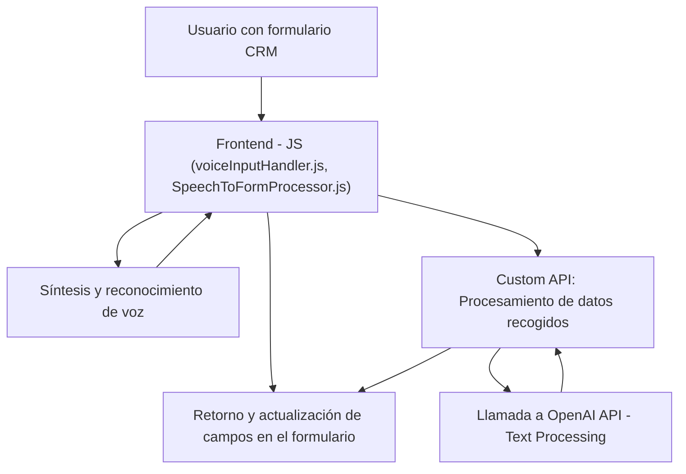

# Análisis detallado de la solución proporcionada:

## Breve resumen técnico:
La solución es un sistema para interacción con formularios en un entorno **Dynamics 365 CRM**, que utiliza entrada por voz y procesamiento avanzado de lenguaje natural. La arquitectura combina un **frontend basado en JavaScript** con una **capa de integración en backend (plugin en C#)** que conecta Dynamics CRM con la **API Azure OpenAI**. También utiliza el **Azure Speech SDK** para síntesis y reconocimiento de voz, facilitando la conversión entre texto y audio.

---

## Descripción de arquitectura:
El sistema puede clasificarse como un **arquitectura multicapa**, con las siguientes características:
1. **Frontend**: Compuesto por scripts JS que interactúan con la interfaz de Dynamics 365, extrayendo campos visuales del formulario y soportando síntesis/reconocimiento de voz.
2. **Integración de capas**: Comunicación entre frontend (JavaScript) y backend (C# Plugin) basado en la arquitectura de **Dynamics Plugins**.
3. **Servicios en la nube**:
   - **Azure Speech SDK**: Interacción directa desde el frontend para la síntesis y reconocimiento de voz.
   - **Azure OpenAI**: Integrado mediante una API personalizada del plugin para procesamiento de texto avanzado.

### Componentes arquitectónicos:
- **Frontend/JS** incluye:
  - Conversión de texto plano a voz hablada (usando `voiceInputHandler.js`).
  - Procesamiento de transcripciones de voz para rellenar formularios (usando `SpeechToFormProcessor.js`).

- **Backend (.NET/C#)**: Plugin basado en arquitectura **IPlugin** de **Dynamics CRM**, con integración del modelo GPT mediante servicio REST.

La arquitectura no cumple con **hexagonal architecture**, ya que las capas están directamente acopladas mediante APIs externas y dependencias CRM. Sin embargo:
- Existe separación entre la capa de frontend (interacción con usuarios) y backend (lógica de negocio y conectividad).
- El sistema expone operaciones específicas ligadas al negocio CRM.

---

## Tecnologías usadas:
1. **Frontend:**
   - **JavaScript** para manipulación de formularios y lógica de evento.
   - **Azure Speech SDK** (script externo) para conversión de texto a voz y reconocimiento de voz.
   - Interacciones con **Dynamics 365 Form Context API** para obtener y modificar datos.

2. **Backend:**
   - **Microsoft Xrm SDK** para extensibilidad de Dynamics 365 mediante plugins.
   - **C#** como lenguaje de programación en .NET.

3. **Integraciones externas:**
   - **Azure OpenAI**: Reconocimiento de lenguaje natural y procesamiento.
   - **Azure Speech SDK**: Síntesis y reconocimiento de voz basado en la nube.

### Patrones utilizados:
1. **Lazy Loading**: Carga condicional del SDK.
2. **Responsabilidad Única (SRP)**: Métodos específicos tienen una única responsabilidad en operaciones como carga de SDK, asignación de valores, transformación del texto, etc.
3. **API Gateway**: Los plugins actúan como la capa de integración entre Dynamics CRM y servicios en la nube.
4. **Facade Pattern**: Simplificación del acceso a APIs como OpenAI desde el plugin, ocultando la lógica detrás de la clase de plugin.

---

## Dependencias externas:
1. **Azure Speech SDK**:
   - Interacción directa desde el frontend en tiempo de ejecución.
   - Permite síntesis y reconocimiento de voz en español.

2. **Azure OpenAI API**:
   - Llamada a servicios basados en modelos GPT para procesar texto en el backend.
   - Configuración: Clave API y URL del servidor.

3. **Dynamics 365 APIs**:
   - Acceso a datos y operación directa mediante SDK y APIs internas (`Xrm.WebApi.online`).

4. Librerías:
   - **System.Text.Json**: Procesamiento JSON en el backend.
   - **Microsoft.Xrm.Sdk** para integración directa con Dynamics CRM.
   - **Newtonsoft.Json.Linq** para manipulación de objetos JSON.

---

## Diagrama Mermaid válido para GitHub:

---

## Conclusión final:
La solución presentada combina elementos de un **frontend (JavaScript)** para interacción directa con usuarios y un **backend (C# Plugin)** que sirve como punto de integración con servicios externos de Azure. La arquitectura es típicamente de tipo **n-capas**, con funcionalidad clara y uso efectivo de patrones como **lazy loading**, **responsabilidad única**, y **API Gateway**. Sin embargo, aunque bastante moderna, su dependencia del entorno CRM lo hace firmemente acoplado a la estructura de Dynamics 365. Una potencial mejora sería encapsular las dependencias en servicios desacoplados, lo que podría acercar este diseño hacia una arquitectura **hexagonal** que facilite adaptaciones futuras y pruebas unitarias.