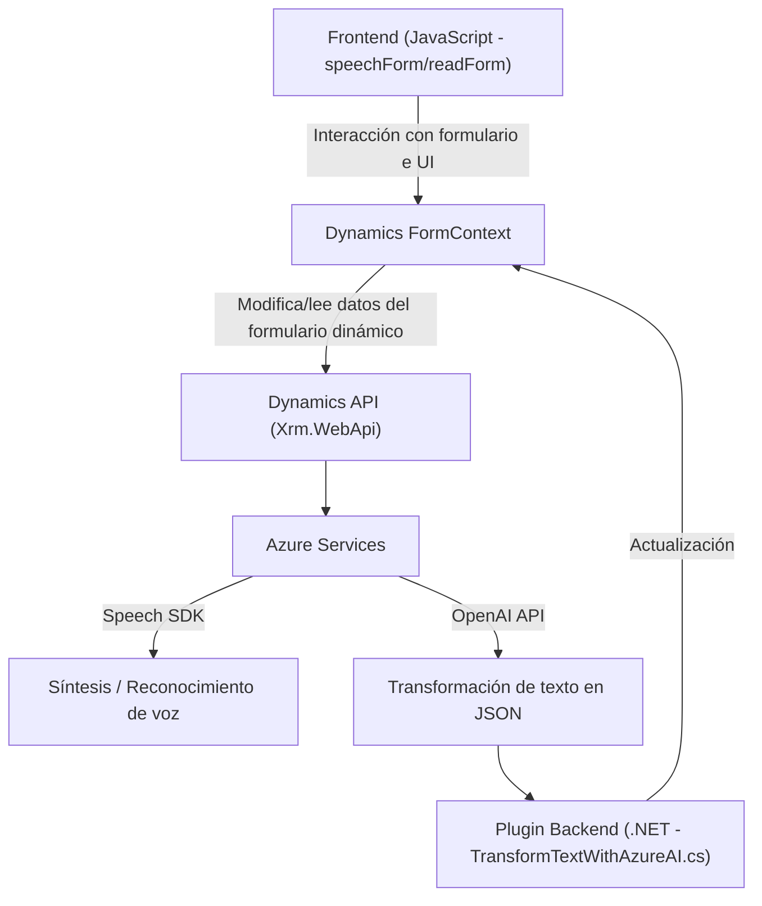

### Breve resumen técnico

El repositorio es una solución que claramente combina una interfaz frontend y lógica de negocio mediante integración directa con Dynamics 365, APIs personalizadas y Azure AI/Voice SDKs. Está orientada a extender funcionalidades empresariales de Dynamics utilizando procesamiento de voz, texto y corrección basada en inteligencia artificial.

---

### Descripción de arquitectura

La arquitectura general es **modular de varias capas** con los siguientes componentes principales:

1. **Frontend**:
   - Scripts JavaScript (`readForm.js`, `speechForm.js`, etc.) que interactúan con formularios HTML integrados en plataformas empresariales, como Dynamics 365.
   - Dependen de SDKs externos (Azure Speech SDK, Dynamics SDK).

2. **Logic Layer (Backend)**:
   - Plugins desarrollados en .NET (`TransformTextWithAzureAI.cs`) que extienden la funcionalidad del CRM (Dynamics 365) mediante una capa de negocio robusta.
   - Dependencia explícita de Azure OpenAI para transformación de texto en JSON estructurado.

3. **API personalizada**:
   - Llamadas a APIs de Dynamics (ejemplo en `callCustomApi`) para realizar operaciones específicas como potenciar una transcripción o actualizar datos en formularios.

La arquitectura general parece distribuir las responsabilidades en capas claras (frontend para interacción, backend para extensión lógica y APIs externas para procesamiento).

Patrones aplicados:
- **Arquitectura en capas (N-Capas)**: Cada script o plugin tiene roles bien definidos; comunicación principal mediante formularios visuales y plugins en Dynamics.
- **Composición Modular**: Cada archivo cumple una función específica y modular, simplificando el desarrollo y mantenimiento.
- **Uso de servicios externos**: Alta dependencia de Azure servicios en el sector de procesamiento de voz y OpenAI para IA.

---

### Tecnologías usadas

#### Frontend:
- **JavaScript**: Core para interactuar con formularios HTML.
- **Azure Speech SDK**:
  - Sintetización de voz y reconocimiento de entrada por voz.
  - Punto de acceso: `https://aka.ms/csspeech/jsbrowserpackageraw`.
- **Dynamics CRM JavaScript API** (`Xrm.WebApi`) para acceso al contexto del formulario y entidades.

#### Backend Plugins:
- **C# .NET Framework**:
  - Usado para desarrollar plugins en Dynamics CRM usando la interfaz `IPlugin`.
- **Azure OpenAI**:
  - Servicio de generación de texto basado en IA para estructuración y procesamiento de texto.
- **Newtonsoft.Json** y **System.Text.Json**:
  - Procesamiento de objetos JSON.
- **System.Net.Http**:
  - Realización de peticiones HTTP a servicios externos.

#### Dependencias externas o componentes presentes:
- Azure OpenAI
- Azure Speech SDK
- Dynamics 365 Custom API

---

### Diagrama Mermaid

---

### Conclusión final

Este repositorio implementa una solución para automatización en sistemas empresariales habilitando capacidades como reconocimiento de voz y procesamiento de transcripciones. Combina tecnologías inteligentes de Microsoft (Dynamics, OpenAI, Azure Speech) con componentes distribuidos en frontend y backend que trabajan en conjunto mediante patrones de arquitectura N-Capas.

Sin embargo, hay áreas para mejorar, como una gestión más segura de las configuraciones (`apiKey` en el plugin `.cs`) y ajustes de modularidad en el manejo de servicios HTTP para delegar funciones específicas.

Estas implementaciones son propicias para sistemas CRM, entornos empresariales que necesitan interacción mediante voz y texto semiestructurado, así como plataformas adaptadas que requieran extensibilidad accesible con backend y frontend desacoplados.